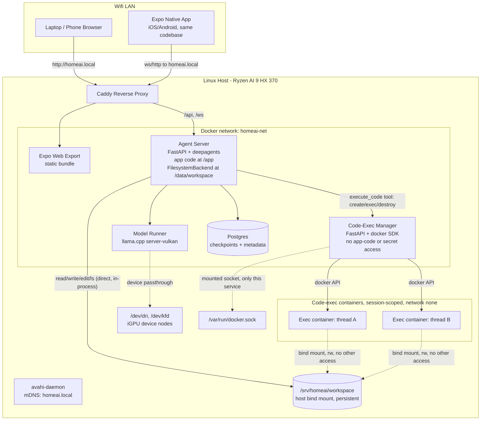
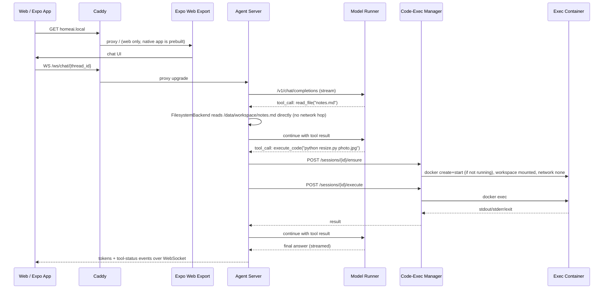
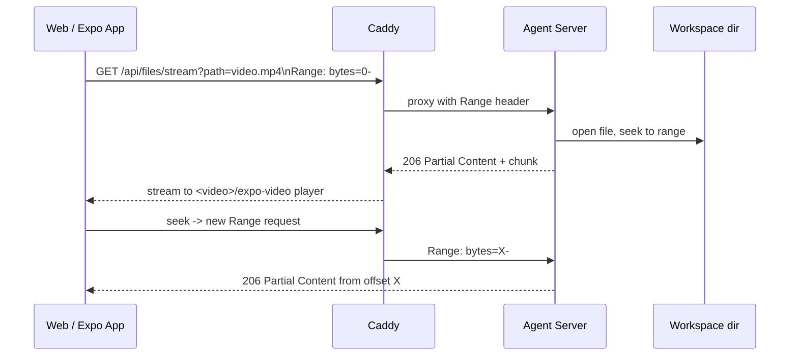

# Home Server AI Agent Platform — Architecture & Delivery Plan

## Architecture decisions

- **Host OS**: this machine runs **native Linux** (not Windows/WSL2). On the Radeon 890M (gfx1150/RDNA 3.5), Vulkan (RADV/Mesa) beats ROCm on token generation by 9–48% and avoids ROCm's GTT allocation bug (ROCm only sees ~48GB VRAM; Vulkan sees VRAM+GTT ≈ 88GB via `VK_MEMORY_PROPERTY_HOST_VISIBLE_BIT`). Native Linux + Docker `--device /dev/dri` passthrough is the mature, well-documented path for this GPU.
- **Model**: **Gemma 4 26B-A4B (MoE, 25.2B total / 3.8B active params, 8+1 experts, 256K context)**, Apache 2.0, GGUF checkpoints. Fits easily in 96GB RAM / ~48GB+GTT VRAM even at high quant. Default quant is **Q4_K_M** (~13-14GB, fast), configurable to Q5_K_M/Q6_K/Q8_0 via a config swap.
- **Inference engine**: `llama.cpp` **Vulkan** build (`ghcr.io/ggml-org/llama.cpp:server-vulkan`, +libglvnd/libgl1/libegl1 fix layer per known GH issue #17761), OpenAI-compatible `/v1/chat/completions` endpoint, `--jinja` for Gemma 4's chat template.
- **Agent framework**: `deepagents` (`create_deep_agent`) on top of LangGraph — provides planning/todo tool, sub-agent spawning, filesystem tools, context/summarization middleware.
- **Agent filesystem access is direct and persistent.** The agent-server container has a **`FilesystemBackend`** (deepagents' real-disk backend) rooted at a bind-mounted, persistent directory — host `/srv/homeai/workspace` mounted into agent-server at `/data/workspace`. `ls`/`read_file`/`write_file`/`edit_file`/`glob`/`grep` run directly in the agent-server process against that mount. It is a normal Docker bind mount, so file state persists across container restarts/recreates as long as the host directory and the compose volume mapping aren't deleted (`docker compose down`, not `down -v` / manual `rm`).
- **Code execution is a separate, sandboxed concern.** Running code (shell/Python/etc.) is handled by a single custom tool — `execute_code(command)` — registered alongside the FilesystemBackend on `create_deep_agent`. That tool calls a dedicated **code-exec-manager** service (Phase 2), which runs the command inside a locked-down container that: (a) bind-mounts the **same** `/srv/homeai/workspace` directory read-write, so code can operate on the user's real media/text files, but (b) has *no* mount, network path, or credential that reaches agent-server's own application code, environment/secrets, the Docker socket, Postgres, or the model runner. Isolation is by construction: agent-server's app code lives at `/app` (baked into its image), entirely outside the mounted workspace path, so nothing written or executed by code-exec containers — or by the agent's own file writes — can ever land on a path agent-server treats as code or config.
- **Code-exec container lifecycle**: session-scoped — one container per active chat thread, reused for that thread's tool calls and idle-reaped afterward, so repeated calls in one turn don't pay container-startup cost every time.
- **Network isolation**: no port-forwarding, no router VLAN work. The server itself keeps normal internet access (for `docker pull`, model downloads); only the app is LAN-scoped. Enforced by (a) only the reverse proxy publishes a host port, (b) host firewall (`ufw`) allows that port only from the LAN subnet, (c) mDNS (`avahi-daemon` on the host) advertises `homeai.local` so phones/laptops can reach it by name without router DNS changes.
- **Code-exec network access**: `--network none` on code-exec containers, with a pre-baked "toolbox" image (Python data/sci stack, Node, common CLIs, `git`, `curl`, `pandoc`, `pillow`, etc.) so most tasks never need a runtime `pip`/`npm install`. Packages are added by editing the toolbox Dockerfile and rebuilding, rather than granting runtime internet access.
- **Frontend framework**: **Expo (React Native + Expo Router)**, single codebase, exported to Web, iOS, and Android — the standard "write once, ship web + iOS + Android" path in the current JS ecosystem. `expo export --platform web` produces a static bundle served by Caddy for browser access (`http://homeai.local` on a phone browser); native iOS/Android access is via Expo Go, with EAS Build available for a standalone installable app.
- **Streaming transport**: chat token streaming uses a **WebSocket** at `agent-server` (`/ws/chat/{thread_id}`) — the one transport that behaves identically on web, iOS, and Android via Expo. Media (video/audio) files are streamed separately over plain **HTTP with `Range` request support** (206 Partial Content), which native `<video>`/`<audio>` (web) and `expo-video`/`expo-audio` (native) all consume directly for seek/scrub without full-file download.

## System architecture



### Chat + tool-call flow (direct file ops vs. code execution)



### Media file playback flow



## Repository layout

```
unnamed_local_ai/
  docker-compose.yml
  .env.example
  infra/
    caddy/Caddyfile
    host/ (setup-avahi.sh, setup-ufw.sh, setup-gpu-drivers.md)
  services/
    model-runner/
      Dockerfile              # server-vulkan base + libglvnd fix
      models/                 # gitignored, GGUF files or download script
    code-exec-manager/
      Dockerfile
      app/main.py              # FastAPI: /sessions, /sessions/{id}/execute, reaper task
      exec-image/Dockerfile     # pre-baked toolbox image used for exec containers themselves
    agent-server/
      Dockerfile               # app code baked in at /app; workspace mounted separately at /data/workspace
      pyproject.toml
      app/
        main.py
        core/config.py
        agent/
          build.py             # create_deep_agent(model=..., backend=FilesystemBackend(...), tools=[execute_code])
          execute_code_tool.py   # plain tool fn -> code-exec-manager HTTP client
          model_client.py       # ChatOpenAI pointed at model-runner
        api/
          chat.py               # threads, messages (REST for history)
          chat_ws.py             # WebSocket endpoint: token + tool-status streaming
          files.py               # upload/download/rename/move/copy/list/mkdir
          media.py                # Range-request byte-streaming for video/audio
          health.py
        db/
          checkpointer.py       # langgraph-checkpoint-postgres wiring
    frontend/
      app.json / eas.json
      Dockerfile                # builds `expo export --platform web`, served by Caddy
      app/                       # Expo Router screens
        (tabs)/chat.tsx
        (tabs)/files.tsx
      components/
        ChatStream.tsx           # WebSocket chat client, works web+native
        MediaPlayer.tsx           # expo-video/expo-audio wrapper, falls back to HTML5 on web
      lib/
        api.ts                   # fetch/WS client pointed at same-origin /api, /ws
  docs/
    ARCHITECTURE.md
    NETWORKING.md
```

## Key design notes

- **One shared workspace directory, three consumers, one source of truth.** `/srv/homeai/workspace` on the host is bind-mounted into: (a) agent-server at `/data/workspace` as the deepagents `FilesystemBackend` root, (b) every code-exec container at `/workspace` (rw), and (c) read directly by agent-server's `files.py` router for user-facing upload/download/rename/move/copy. All three see the same files immediately — the agent writes a file, the user sees it in the files screen; the user uploads a file, the agent's next `ls` sees it; code run by the agent can read/write the same files too.
- **Persistence**: this is a plain Docker bind mount to a real host directory, not a container-local filesystem or tmpfs — it survives `docker compose restart`, `stop`/`up`, and image rebuilds by construction. The only ways to lose it are deleting the host directory or explicitly removing the volume mapping; document this clearly (and consider a simple periodic `tar`/rsync backup of `/srv/homeai/workspace` as an easy fast-follow).
- **Isolation boundary for code execution**: code-exec containers get *only* the workspace bind mount — never agent-server's `/app` (its own source code), never its env/secrets, never `docker.sock`, never a network path to any other service (`--network none`). Agent-server's own source code is baked into its image at build time and lives outside `/data/workspace` entirely, so nothing the agent writes via `FilesystemBackend`, and nothing code run in an exec container does, can ever touch a path agent-server treats as code or config. The code-exec-manager is the *only* service with the Docker socket mounted, and it hardcodes all container-creation parameters — the agent's `execute_code` tool only ever sends a command string, never a container spec.
- **Code-exec hardening (v1, cheap)**: `--network none`, fixed memory/CPU limits, non-root fixed UID matching workspace ownership, read-only rootfs + tmpfs `/tmp` and `$HOME`, timeout-based kill on every `execute` call, `--cap-drop=ALL`, no `--privileged`.
- **Documented future hardening (not v1)**: swap direct `docker.sock` mount for a `docker-socket-proxy` (Tecnativa) restricting the API surface further; scoped egress (allowlisted PyPI/npm proxy) if the toolbox-image approach proves too limiting; add TLS via Caddy internal CA + `mkcert` trust on devices; add simple shared-password auth at the proxy.
- **Model swap-ability**: model path/quant and llama-server flags live in `.env` / compose args, so trying Q5/Q6/Q8 or a different GGUF is a one-line change + restart, no rebuild.
- **Tool-calling risk**: Gemma 4 + llama.cpp function-calling via `--jinja` needs a validation pass early (Phase 2 ticket) — if native tool-calling proves flaky, fall back to a ReAct-style prompted tool loop (LangChain supports structured-output parsing as a fallback) before deep-agents integration work depends on it.
- **Auth**: none for v1 (trusted LAN, matches "quick and dirty" + no-internet-exposure). Documented as a fast-follow if you ever want multi-user or remote access via VPN later.
- **One codebase, three targets**: Expo Router screens/components are shared as-is across web, iOS, and Android. Platform differences (e.g. media player backend) are isolated behind small wrapper components (`MediaPlayer.tsx` picks `expo-video` on native, an HTML5 `<video>`/`<audio>` element on web via `react-native-web`) rather than branching entire screens.
- **Native app distribution is a fast-follow, dev usage is immediate**: for v1, native iOS/Android access is via the Expo Go app (scan a QR code, points at the LAN dev server or a published Expo update) — zero build pipeline needed. A "real" standalone app (custom icon, no Expo Go dependency, installable .apk/.ipa) needs EAS Build, which is a Phase 6 fast-follow, not required to use the tool from your phone.
- **Media streaming is direct HTTP Range, not a media server**: `api/media.py` streams files straight from the workspace directory with `Range`/`206 Partial Content` support (Starlette/FastAPI `FileResponse` or a small custom range handler) — no transcoding, no separate Plex/Jellyfin-style service. This works for browser-native formats (mp4/h264+aac, mp3, webm, etc.). Non-browser-native formats needing transcoding (e.g. exotic codecs, 4K HDR) are an explicit non-goal for v1, noted as a Phase 6 fast-follow (ffmpeg transcode sidecar) if it comes up.
- **Chat streaming is WebSocket end-to-end**: `chat_ws.py` relays token-by-token model output and tool-call/status events (`{"type": "token", ...}`, `{"type": "tool_start"/"tool_end", ...}`) as JSON frames over one WebSocket per active thread view, consumed identically by the web build and the native app.

## Delivery phases and tickets

### Phase 0 — Host & repo foundations

- **P0-1**: Provision/confirm native Linux install (recent kernel + Mesa for best RADV/Vulkan perf), Docker Engine + Compose plugin, verify `/dev/dri` present and current user in `render`/`video` groups.
- **P0-2**: Scaffold repo layout above; root `docker-compose.yml` with `homeai-net` network, `.env.example`.
- **P0-3**: `infra/host/setup-avahi.sh` (installs/enables `avahi-daemon`, sets hostname `homeai`) and `infra/host/setup-ufw.sh` (allow 80/tcp from LAN subnet only, deny elsewhere); manual run for v1 (not automated in compose).

### Phase 1 — Model runner

- **P1-1**: `services/model-runner/Dockerfile` from `ghcr.io/ggml-org/llama.cpp:server-vulkan` + libglvnd/libgl1/libegl1/libgles2 fix layer.
- **P1-2**: Download Gemma 4 26B-A4B GGUF (Q4_K_M start) into `services/model-runner/models/` (gitignored) via a fetch script.
- **P1-3**: Compose service with `devices: /dev/dri, /dev/kfd`, `group_add` render/video GIDs, `ipc: host`, `--n-gpu-layers 999 --jinja`, `--host 0.0.0.0 --port 8080`; verify `--list-devices` shows the Vulkan device and `/v1/chat/completions` responds.
- **P1-4**: Benchmark pp/tg across 2-3 quants with `llama-bench`; record numbers in `docs/ARCHITECTURE.md`; pick default quant.
- **P1-5**: Validate tool/function-calling output shape against what LangChain's OpenAI-compatible tool-calling client expects; note fallback plan if unreliable.

### Phase 2 — Code-exec manager

- **P2-1**: `exec-image/Dockerfile` — pre-baked toolbox image (Python + common data/sci libs, Node, `git`/`curl`/`pandoc`/`pillow`/etc.), fixed non-root UID matching host workspace ownership.
- **P2-2**: FastAPI app with `POST /sessions/{id}/ensure` (create+start if absent, bind-mount `/srv/homeai/workspace` rw at `/workspace`, `--network none`, `--cap-drop=ALL`, no `--privileged`, memory/CPU limits, read-only rootfs + tmpfs `/tmp`+`$HOME`), `POST /sessions/{id}/execute` (docker exec with timeout, capture stdout/stderr/exit), `DELETE /sessions/{id}`.
- **P2-3**: Idle-reaper background task (stop+remove containers idle > N minutes).
- **P2-4**: Compose service with `/var/run/docker.sock` mounted — verify this is the *only* service in the stack with socket access; explicitly verify (e.g. `docker exec` into an exec container and confirm no route/mount reaches agent-server, Postgres, or the socket) that a shell inside an exec container cannot reach anything but `/workspace`.
- **P2-5**: Smoke-test create/exec/destroy end-to-end via curl, including a test that writes/reads a file under `/workspace` and confirms it's visible from the host path.

### Phase 3 — Agent server

- **P3-1**: FastAPI skeleton, config/env loading, health endpoint; Dockerfile places app code at `/app` and declares `/data/workspace` as a separate mount point (compose maps host `/srv/homeai/workspace` there) — confirm the two paths are disjoint (nothing under `/app` is inside `/data/workspace`).
- **P3-2**: `model_client.py` — `ChatOpenAI`/`init_chat_model` pointed at model-runner's base URL.
- **P3-3**: Wire deepagents' `FilesystemBackend` rooted at `/data/workspace` for `ls`/`read_file`/`write_file`/`edit_file`/`glob`/`grep`; verify restart persistence (write a file, `docker compose restart agent-server`, confirm it's still there).
- **P3-4**: `execute_code_tool.py` — plain tool function calling code-exec-manager's HTTP API (`ensure` + `execute` + reuse a session id per thread); registered on `create_deep_agent(model=..., backend=FilesystemBackend(...), tools=[execute_code])`.
- **P3-5**: `agent/build.py` — assemble the above into `create_deep_agent(...)`; wire `langgraph-checkpoint-postgres` for thread persistence.
- **P3-6**: `api/chat.py` — create/list threads, get history (REST, for initial page load / thread switching).
- **P3-7**: `api/chat_ws.py` — `WS /ws/chat/{thread_id}`: accepts a user message, streams back JSON frames for tokens and tool-call start/end/result events (distinguishing file-tool calls from `execute_code` calls in the event payload) until turn completion.
- **P3-8**: `api/files.py` — list/upload/download/rename/move/copy/delete/mkdir against `/data/workspace`, with path-traversal guarding (resolve + enforce root prefix).
- **P3-9**: `api/media.py` — `GET /api/media/stream?path=...` with `Range` header parsing, `206 Partial Content` responses, correct `Content-Type`/`Accept-Ranges` headers for video/audio seek support.
- **P3-10**: Postgres compose service; run checkpointer migrations on startup.
- **P3-11**: End-to-end test: chat message over WebSocket that (a) has the agent directly write/edit a file via `FilesystemBackend` and (b) separately runs `execute_code` against a shell command touching the same workspace; confirm both are visible via the files API, and confirm from inside an exec container that agent-server's app code/secrets are unreachable.

### Phase 4 — Frontend (Expo, single codebase)

- **P4-1**: `npx create-expo-app` with Expo Router, TypeScript template; enable web output (`expo export --platform web`); Dockerfile that builds the web export and hands it to Caddy as static files; confirm `expo start` + Expo Go on a phone connects to the LAN dev server.
- **P4-2**: `lib/api.ts` — shared fetch client (threads/files REST) + WebSocket client (`chat_ws`), same-origin on web, configurable host (`homeai.local`) on native.
- **P4-3**: Chat screen — thread list, message stream via the WebSocket client, render tool-call/execution status inline; verify identical behavior on web browser and Expo Go (iOS + Android).
- **P4-4**: Files screen — directory browser, upload, download, rename, move, copy, delete, new folder, calling `files.py`; tapping a video/audio file opens `MediaPlayer.tsx`.
- **P4-5**: `MediaPlayer.tsx` — `expo-video`/`expo-audio` on native, HTML5 `<video>`/`<audio>` on web (via `react-native-web` platform-specific file or `Platform.select`), pointed at `/api/media/stream`; verify seek/scrub works on both.
- **P4-6**: Responsive layout (phone-first, since that's the primary use case) using Expo Router's tab/stack navigation, tested at phone and desktop-browser widths.

### Phase 5 — Networking & integration

- **P5-1**: `infra/caddy/Caddyfile` — route `/` to the Expo web export, `/api/*` and `/ws/*` (with WebSocket upgrade support) to agent-server; only this service publishes host port 80.
- **P5-2**: Wire avahi + ufw scripts into a documented one-time host setup in `docs/NETWORKING.md`; verify `http://homeai.local` resolves from a phone browser on WiFi and is unreachable from outside the LAN/router; verify Expo Go on the same phone can reach the same host/APIs.
- **P5-3**: Full docker-compose up on host; run through: phone browser -> chat over WebSocket -> agent lists/edits a file -> agent runs a shell command -> file visible/downloadable/playable from files screen; repeat the chat + files flow once from Expo Go to confirm native parity.
- **P5-4**: `docs/ARCHITECTURE.md` write-up (diagrams above, decisions, how to swap model/quant, how to extend sandbox hardening later).

### Phase 6 — Documented fast-follows (not built now)

- Docker-socket-proxy in front of code-exec-manager's docker.sock access.
- HTTPS via Caddy internal CA + device trust, or a real cert if a domain is ever added.
- Simple shared-password auth at the proxy if the network trust model changes.
- Multi-user thread ownership (currently single-user/home-trusted).
- GPU-sharing/queueing if multiple concurrent chats saturate the iGPU.
- EAS Build for a standalone, app-icon-branded iOS/Android app (no Expo Go dependency); app-store or sideload distribution.
- ffmpeg transcode sidecar if you ever need to play back non-browser-native media formats (e.g. exotic codecs, HDR).
