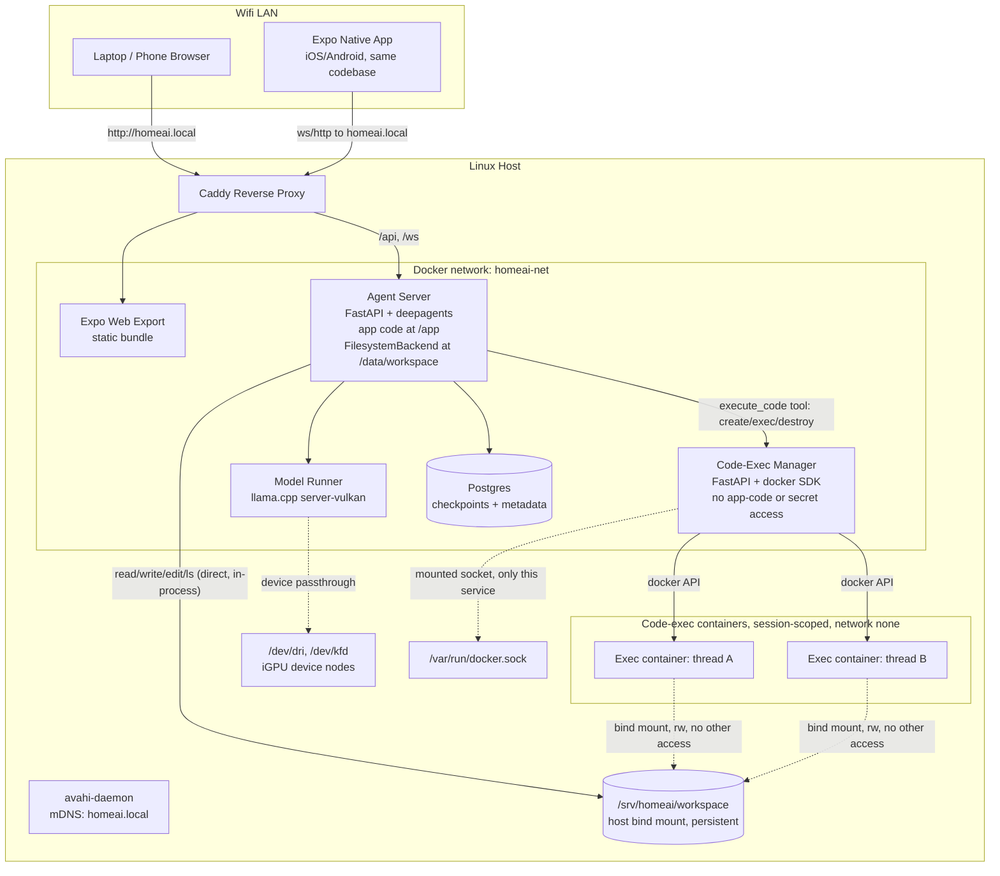
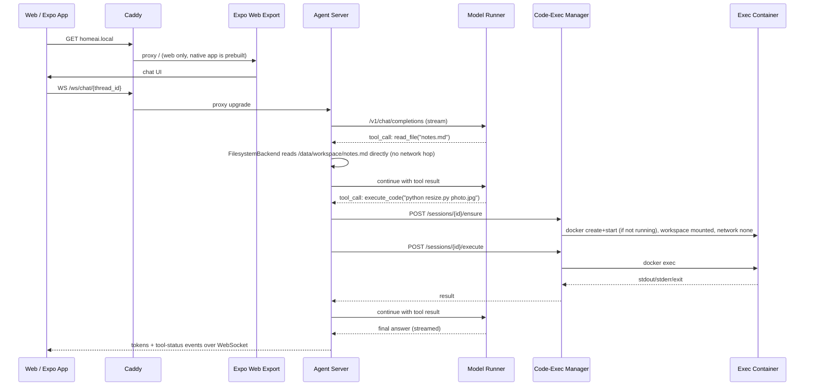
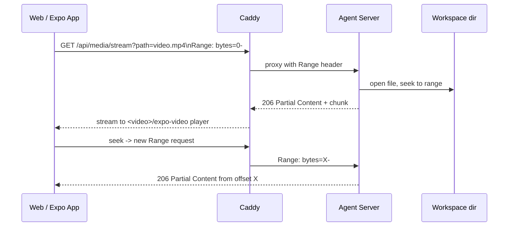

# Home AI Agent

A private, local, always-on AI agent for your home network — a chat assistant with real file access and sandboxed code execution, plus a media-aware file browser, all served from one address to every device on your WiFi.

> **Status: planning / pre-implementation.** The architecture and full delivery backlog are written as [GitHub issues](../../issues); no services are built yet. See [Project status & roadmap](#project-status--roadmap).

## Table of contents

- [Overview](#overview)
- [Why](#why)
- [Guiding principles](#guiding-principles)
- [Architecture](#architecture)
- [System diagrams](#system-diagrams)
- [Repository layout](#repository-layout)
- [Project status & roadmap](#project-status--roadmap)
- [Working with the GitHub issues](#working-with-the-github-issues)
- [Getting started](#getting-started)
- [Backups](#backups)
- [License](#license)

## Overview

This repo builds a personal AI agent that lives on your own hardware and your own network. It's a single system, reachable from any device on your WiFi at one address, that combines:

- A private, local chat assistant — no cloud API, no internet dependency, no per-message cost.
- A real file-management partner that can create, edit, organize, rename, move, and clean up files for you, and remembers the state of your files across sessions because it works on the same persistent disk every time.
- The ability to actually run code to get things done (batch-processing files, writing small scripts, transforming data), contained so it can't damage the machine it runs on.
- A media-aware file browser so you can play back your videos and audio straight from the same interface, on your phone or your laptop.

In short: a private, always-on "computer-use" assistant for your home network, with hands (file access) and a sandboxed toolbox (code execution), instead of just a chat window.

**Who it's for**: you, on your home network. A single-user, trusted-LAN tool, not a multi-tenant product, not exposed to the internet.

**What using it looks like**:

- *"Organize my Downloads folder — group by type, get rid of obvious junk."*
- *"Rename these photos to their capture dates and put them in folders by month."*
- *"Summarize these PDFs and save the summary as a new file next to them."*
- *"Convert this batch of videos to a smaller format."*
- *"Pull up that video from last week's project on my phone."*
- *"Help me write and test a small script."*

## Why

- **Your data stays yours.** Files, conversations, and anything the agent touches never leave your network.
- **No usage limits, no subscription, no metering.** Once it's running, ten things or ten thousand things cost the same: electricity.
- **It can actually do things, not just describe them.** It edits your real filesystem directly and shows you the result in the same UI.
- **It's safe to let it run code.** Code execution happens in a locked-down, disposable container that can touch your files but nothing else on the machine.
- **It's available anywhere on your network.** Same address, same app, from your phone on the couch or your laptop at the desk — including media playback.
- **It's a foundation, not a toy.** Swappable model, swappable quant, a real API layer, a real sandbox boundary — built to grow instead of dead-ending as a weekend hack.

## Guiding principles

- **Local-first, always.** Inference, file storage, and code execution all happen on this machine. Internet access (if any) is incidental — for pulling container images or model files — never required day to day.
- **Give it real capability, then contain the risk.** Genuine, persistent file access, because that's the point of the tool. Anything riskier — arbitrary code execution — is isolated behind a hard boundary instead of being restricted into uselessness.
- **One address, every device.** `homeai.local` (or wherever it lands) is the whole interface, from any device on the network.
- **Minimum viable now, room to grow later.** Get the core loop (chat, files, code, media) working end to end, with a documented path to add polish and hardening later without rearchitecting.

## Architecture

- **Host OS**: native Linux (not Windows/WSL2). On a Radeon 890M (gfx1150/RDNA 3.5), Vulkan (RADV/Mesa) beats ROCm on token generation and avoids ROCm's GTT allocation bug (ROCm only sees VRAM; Vulkan sees VRAM+GTT via `VK_MEMORY_PROPERTY_HOST_VISIBLE_BIT`). Native Linux + Docker `--device /dev/dri` passthrough is the mature, well-documented path for this class of GPU.
- **Model**: Gemma 4 26B-A4B (MoE, 25.2B total / 3.8B active params, 8+1 experts, 256K context), Apache 2.0, GGUF checkpoints. `ggml-org/gemma-4-26B-A4B-it-GGUF` publishes no K-quants — only legacy `Q4_0` (~14.6GB), `Q8_0` (~26.9GB), and `BF16` (~50.5GB). Default quant is **Q4_0** (fast, interim pick from M1-02), configurable to `Q8_0`/`BF16` via a config swap; M1-04 benchmarks all three and may change the default.
- **Inference engine**: `llama.cpp` **Vulkan** build (`ghcr.io/ggml-org/llama.cpp:server-vulkan`), OpenAI-compatible `/v1/chat/completions` endpoint, `--jinja` for the chat template.
- **Agent framework**: `deepagents` (`create_deep_agent`) on top of LangGraph — provides planning/todo tool, sub-agent spawning, filesystem tools, context/summarization middleware.
- **Agent filesystem access is direct and persistent.** The agent-server container has a `FilesystemBackend` (deepagents' real-disk backend) rooted at a bind-mounted, persistent directory — host `/srv/homeai/workspace` mounted into agent-server at `/data/workspace`. `ls`/`read_file`/`write_file`/`edit_file`/`glob`/`grep` run directly in the agent-server process against that mount, so file state persists across container restarts as long as the host directory and the compose volume mapping aren't deleted.
- **Code execution is a separate, sandboxed concern.** Running code (shell/Python/etc.) is handled by a single custom tool — `execute_code(command)` — registered alongside the `FilesystemBackend`. That tool calls a dedicated **code-exec-manager** service, which runs the command inside a locked-down container that: (a) bind-mounts the *same* workspace directory read-write, so code can operate on the user's real files, but (b) has *no* mount, network path, or credential that reaches agent-server's own application code, environment/secrets, the Docker socket, Postgres, or the model runner. Agent-server's app code lives at `/app` (baked into its image), entirely outside the mounted workspace path, so nothing written or executed by code-exec containers — or by the agent's own file writes — can ever land on a path agent-server treats as code or config.
- **Code-exec container lifecycle**: session-scoped — one container per active chat thread, reused for that thread's tool calls and idle-reaped afterward.
- **Network isolation**: no port-forwarding, no router VLAN work. The server itself keeps normal internet access (for `docker pull`, model downloads); only the app is LAN-scoped. Enforced by (a) only the reverse proxy publishes a host port, (b) host firewall (`ufw`) allows that port only from the LAN subnet, (c) mDNS (`avahi-daemon`) advertises `homeai.local` so phones/laptops can reach it by name without router DNS changes.
- **Code-exec network access**: `--network none` on code-exec containers, with a pre-baked "toolbox" image (Python data/sci stack, Node, common CLIs, `git`, `curl`, `pandoc`, `pillow`, etc.) so most tasks never need a runtime `pip`/`npm install`. Packages are added by editing the toolbox Dockerfile and rebuilding, rather than granting runtime internet access.
- **Frontend framework**: Expo (React Native + Expo Router), single codebase, exported to Web, iOS, and Android. `expo export --platform web` produces a static bundle served by Caddy for browser access; native iOS/Android access is via Expo Go, with EAS Build available for a standalone installable app later.
- **Streaming transport**: chat token streaming uses a **WebSocket** at `agent-server` (`/ws/chat/{thread_id}`) — the one transport that behaves identically on web, iOS, and Android via Expo. Media (video/audio) files are streamed separately over plain **HTTP with `Range` request support** (206 Partial Content), which native `<video>`/`<audio>` (web) and `expo-video`/`expo-audio` (native) all consume directly for seek/scrub without full-file download.

### Key design notes

- **One shared workspace directory, three consumers, one source of truth.** `/srv/homeai/workspace` on the host is bind-mounted into: (a) agent-server as the deepagents `FilesystemBackend` root, (b) every code-exec container (rw), and (c) read directly by agent-server's files router for user-facing upload/download/rename/move/copy. All three see the same files immediately.
- **Persistence**: a plain Docker bind mount to a real host directory, not a container-local filesystem or tmpfs — it survives `docker compose restart`, `stop`/`up`, and image rebuilds by construction. The only ways to lose it are deleting the host directory or explicitly removing the volume mapping.
- **Isolation boundary for code execution**: code-exec containers get *only* the workspace bind mount — never agent-server's `/app`, never its env/secrets, never `docker.sock`, never a network path to any other service (`--network none`). The code-exec-manager is the *only* service with the Docker socket mounted, and it hardcodes all container-creation parameters — the agent's `execute_code` tool only ever sends a command string, never a container spec.
- **Code-exec hardening (v1, cheap)**: `--network none`, fixed memory/CPU limits, non-root fixed UID matching workspace ownership, read-only rootfs + tmpfs `/tmp` and `$HOME`, timeout-based kill on every `execute` call, `--cap-drop=ALL`, no `--privileged`.
- **Documented future hardening (not v1)**: swap direct `docker.sock` mount for a `docker-socket-proxy` (Tecnativa) restricting the API surface further; scoped egress (allowlisted PyPI/npm proxy) if the toolbox-image approach proves too limiting; add TLS via Caddy internal CA + `mkcert` trust on devices; add simple shared-password auth at the proxy.
- **Model swap-ability**: model path/quant and llama-server flags live in `.env` / compose args, so trying `Q8_0`/`BF16` or a different GGUF is a one-line change + restart, no rebuild.
- **Tool-calling risk**: Gemma 4 + llama.cpp function-calling via `--jinja` needs a validation pass early — if native tool-calling proves flaky, fall back to a ReAct-style prompted tool loop before deep-agents integration work depends on it.
- **Auth**: none for v1 (trusted LAN, matches "quick and dirty" + no-internet-exposure). A fast-follow if you ever want multi-user or remote access via VPN later.
- **One codebase, three targets**: Expo Router screens/components are shared as-is across web, iOS, and Android. Platform differences (e.g. media player backend) are isolated behind small wrapper components rather than branching entire screens.
- **Native app distribution is a fast-follow, dev usage is immediate**: for v1, native iOS/Android access is via the Expo Go app (scan a QR code) — zero build pipeline needed. A standalone app (custom icon, no Expo Go dependency, installable .apk/.ipa) needs EAS Build, which is a later fast-follow.
- **Media streaming is direct HTTP Range, not a media server**: streams files straight from the workspace directory with `Range`/`206 Partial Content` support — no transcoding, no separate Plex/Jellyfin-style service. Non-browser-native formats needing transcoding are an explicit non-goal for v1.
- **Chat streaming is WebSocket end-to-end**: token-by-token model output and tool-call/status events are relayed as JSON frames over one WebSocket per active thread view, consumed identically by the web build and the native app.

### Documented fast-follows (not built for v1)

- Docker-socket-proxy in front of code-exec-manager's docker.sock access.
- HTTPS via Caddy internal CA + device trust, or a real cert if a domain is ever added.
- Simple shared-password auth at the proxy if the network trust model changes.
- Multi-user thread ownership (currently single-user/home-trusted).
- GPU-sharing/queueing if multiple concurrent chats saturate the iGPU.
- EAS Build for a standalone, app-icon-branded iOS/Android app; app-store or sideload distribution.
- ffmpeg transcode sidecar if you ever need to play back non-browser-native media formats (e.g. exotic codecs, HDR).

## System diagrams



### Chat + tool-call flow (direct file ops vs. code execution)



### Media file playback flow



## Repository layout

Target tree (built incrementally by the milestones in [Project status & roadmap](#project-status--roadmap)):

```
unnamed_local_ai/
  docker-compose.yml
  .env.example
  infra/
    caddy/Caddyfile
    host/ (setup-avahi.sh, setup-ufw.sh, setup-gpu-drivers.md)
  services/
    model-runner/
      Dockerfile              # server-vulkan base + libglvnd fix
      models/                 # gitignored, GGUF files or download script
    code-exec-manager/
      Dockerfile
      app/main.py              # FastAPI: /sessions, /sessions/{id}/execute, reaper task
      exec-image/Dockerfile     # pre-baked toolbox image used for exec containers themselves
    agent-server/
      Dockerfile               # app code baked in at /app; workspace mounted separately at /data/workspace
      pyproject.toml
      app/
        main.py
        core/config.py
        agent/
          build.py             # create_deep_agent(model=..., backend=FilesystemBackend(...), tools=[execute_code])
          execute_code_tool.py   # plain tool fn -> code-exec-manager HTTP client
          model_client.py       # ChatOpenAI pointed at model-runner
        api/
          chat.py               # threads, messages (REST for history)
          chat_ws.py             # WebSocket endpoint: token + tool-status streaming
          files.py               # upload/download/rename/move/copy/list/mkdir
          media.py                # Range-request byte-streaming for video/audio
          health.py
        db/
          checkpointer.py       # langgraph-checkpoint-postgres wiring
    frontend/
      app.json / eas.json
      Dockerfile                # builds `expo export --platform web`, served by Caddy
      app/                       # Expo Router screens
        (tabs)/chat.tsx
        (tabs)/files.tsx
      components/
        ChatStream.tsx           # WebSocket chat client, works web+native
        MediaPlayer.tsx           # expo-video/expo-audio wrapper, falls back to HTML5 on web
      lib/
        api.ts                   # fetch/WS client pointed at same-origin /api, /ws
  docs/
    ARCHITECTURE.md
    NETWORKING.md
    HOST-CHECKS.md
  scripts/
    e2e/
```

## Project status & roadmap

Delivery is organized into seven milestones, each ending in a **gate** — a scripted + human-verified checkpoint before the next milestone starts:

| Milestone | Value delivered | Gate |
|---|---|---|
| M0 — Foundations | Repo + compose skeleton + host scripts + reverse proxy | Stack boots, placeholder page served |
| M1 — Model runner | Real local GPU inference, tool-calling verdict | `/v1/chat/completions` streams on GPU |
| M2 — Agentic chat | Chat with a deepagents agent (file tools live) from a browser | Browser chat writes a real workspace file |
| M3 — Persistence + files | Threads survive restarts; full file manager UI | Restart-persistence + files round-trip |
| M4 — Code execution | Sandboxed `execute_code` with hard isolation | Agent runs a script on real files; isolation suite green |
| M5 — Media | Video/audio playback with seek from the files UI | Phone-browser seek/scrub |
| M6 — LAN + integration | `homeai.local`, native parity, docs, backup | Full product scenario works from a phone |

Track live progress on the [Milestones](../../milestones) and [Issues](../../issues) pages.

## Working with the GitHub issues

This repo's issue tracker **is** the project plan — there are no separate local planning files. Two pinned reference issues hold the cross-cutting rules that every other issue assumes:

- **[Reference: Shared Conventions & Contracts](../../issues?q=is%3Aissue+label%3Areference)** — binding environment variables, service topology, HTTP/WebSocket API shapes, toolchain pins, path-traversal guard, and testing/definition-of-done rules. If an issue ever conflicts with this one, the reference issue wins — flag the conflict in your PR description.
- **[Reference: Backlog — Ordering, Dependencies & Gates](../../issues?q=is%3Aissue+label%3Areference)** — the full dependency graph, ordered backlog table, parallel work lanes, gate procedure, and risk register.

(Both are pinned at the top of the [Issues](../../issues) list and carry the `reference` label.)

- **Milestones** map 1:1 to the phases in the table above (`M0 - Foundations` … `M6 - LAN + integration`). A milestone isn't done until its gate issue passes.
- **Labels**:
  - `ticket` — a unit of implementation work.
  - `size:S` / `size:M` / `size:L` — rough effort sizing.
  - `gate` — a milestone gate issue (ends with an automated script *and* a human/host checklist). A gate blocks the next milestone's gate from starting, though later-milestone implementation issues may start early if their own dependencies are met.
  - `reference` — cross-cutting rules (conventions, backlog) rather than a unit of work.
- **Dependencies**: each ticket issue body states its `Depends on` / `Blocks` tickets by ID (e.g. `M2-04`, which matches that issue's title prefix). Don't start an issue until its dependencies are closed. The Backlog reference issue has the full dependency graph and the **parallel lanes** — independent tracks of work that can run simultaneously.
- **Definition of done**: each ticket issue lists
  - **Tier A** — automated checks (lint, tests, `docker compose config -q`, any named e2e script) — required to close the issue.
  - **Tier B** (gate issues only) — a human/host checklist (needs the real machine, a phone, or a LAN device). Append these items to `docs/HOST-CHECKS.md` rather than attempting them yourself if you can't reach the physical host.
- **Suggested workflow**: pick the next unblocked issue in dependency order (or any issue in an open parallel lane), implement it to spec, satisfy Tier A locally, open a PR referencing the issue number, and close the issue once Tier A is green (append any Tier B items to `docs/HOST-CHECKS.md` for the PM to verify on-host).
- **Out of scope for v1** (don't build these, even if tempting): TLS/HTTPS, auth, docker-socket-proxy, transcoding, EAS builds, multi-user, GPU queueing, runtime `pip`/`npm` in exec containers, exposing anything to the internet.

## Getting started

Repo scaffold and host scripts (milestone M0) are landing incrementally — see the [issues](../../issues) for what's done. The intended quickstart:

```bash
git clone git@github.com:cucucachu/unnamed_local_ai_server.git
cd unnamed_local_ai_server
cp .env.example .env   # fill in POSTGRES_PASSWORD, RENDER_GID/VIDEO_GID, LAN_SUBNET

./services/model-runner/fetch-model.sh   # downloads the default GGUF quant (~14.6 GB) into services/model-runner/models/

# One-time host prep (idempotent, safe to re-run) — see infra/host/setup-gpu-drivers.md first
sudo infra/host/setup-workspace.sh
sudo infra/host/setup-avahi.sh
sudo infra/host/setup-ufw.sh

# Exec toolbox image — a plain `docker build`, not a compose service (compose
# can't build an image it never runs itself; code-exec-manager, M4-02, spins
# up short-lived containers from this image on demand).
./services/code-exec-manager/build-exec-image.sh

docker compose up -d
```

Everything runs directly on the target Linux host (native, no cloud) — real `docker compose`, the real GPU, the real model. Only phone/LAN-device checks are deferred to a human host checklist ([`docs/HOST-CHECKS.md`](docs/HOST-CHECKS.md)). Networking details (mDNS, firewall, LAN-only isolation) are in [`docs/NETWORKING.md`](docs/NETWORKING.md).

## Backups

**What's covered**: the workspace directory (`WORKSPACE_DIR` — every file the agent/you create, upload, or edit) and the Postgres database (thread/message history). Together these are the only genuinely irreplaceable state this stack holds.

**What's not covered**: model weights (`services/model-runner/models/*.gguf` — multi-GB, re-downloadable any time via `./services/model-runner/fetch-model.sh`, not user data) and `.env` (holds `POSTGRES_PASSWORD` — a secret, deliberately not swept into a backup dir; back it up yourself, out of band, if you want to). v1 backup is a full local mirror only — no off-site/cloud copy, no encryption, no incremental snapshots (see `infra/host/backup-workspace.sh`'s docstring and M6-03's ticket for the explicit out-of-scope list).

**Manual run**:

```bash
sudo infra/host/backup-workspace.sh
```

Mirrors `WORKSPACE_DIR` into `$BACKUP_DIR/workspace` (`rsync -a --delete` — exact mirror, not additive) and, if the stack is up, dumps Postgres into `$BACKUP_DIR/pg/homeai-<date>.sql.gz` (keeps the last 14 by count; skipped with a warning, not an error, if the stack is down). `BACKUP_DIR` defaults to `/srv/homeai/backups` — override in `.env`.

**Automatic daily backups** (03:00, via a systemd timer):

```bash
sudo infra/host/install-backup-timer.sh              # install + enable
sudo infra/host/install-backup-timer.sh --uninstall  # remove
systemctl list-timers homeai-backup.timer            # check it's scheduled
```

**Restoring**:

```bash
# Workspace: rsync back (stop the stack first so nothing's writing to it mid-restore)
docker compose down
sudo rsync -a --delete "$BACKUP_DIR/workspace/" "$WORKSPACE_DIR/"
docker compose up -d

# Postgres: gunzip the dump into a fresh/scratch database via psql
gunzip -c "$BACKUP_DIR/pg/homeai-<date>.sql.gz" | docker compose exec -T postgres psql -U "$POSTGRES_USER" -d "$POSTGRES_DB"
```

## License

Not yet decided — this is a personal home-server project. No license is currently granted for reuse.
