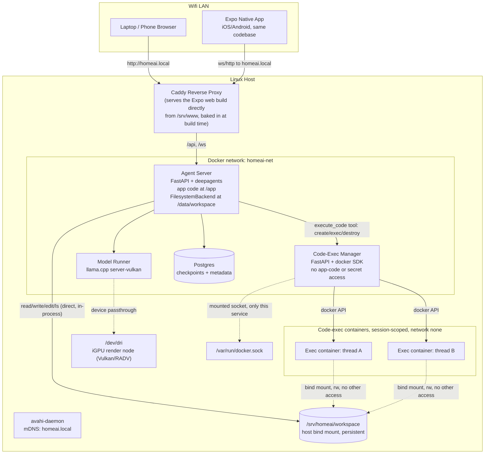
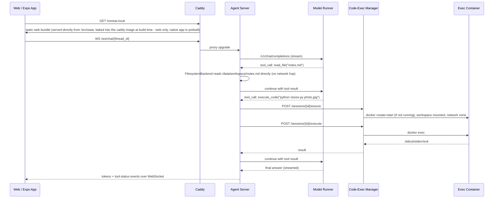
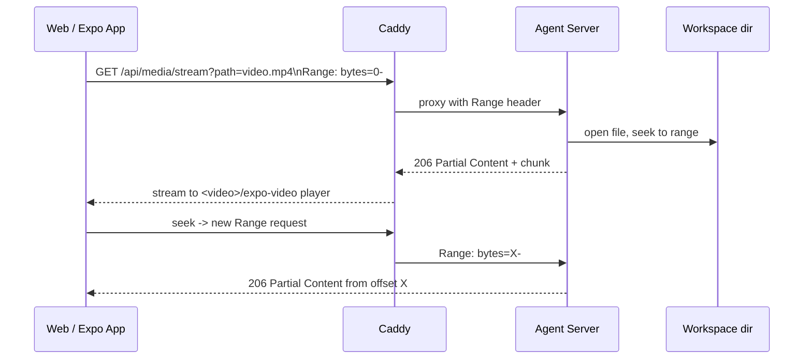

# Architecture

The as-built architecture of the Home AI Agent stack — what's actually
running, not just what was planned. This is the canonical, maintained copy;
`README.md`'s own `## Architecture` section is now a short summary that
points back here. If anything below ever conflicts with a GitHub issue,
this document (checked against the live `docker compose config` output and
the real code) wins — the issue was the plan, this is the result.

Six sections:

1. [System overview](#1-system-overview)
2. [Service catalog](#2-service-catalog)
3. [Contracts](#3-contracts)
4. [Model operations](#4-model-operations)
5. [Security model](#5-security-model)
6. [Operations](#6-operations)

---

## 1. System overview

The system diagrams below are copied from `README.md`'s original "System
diagrams" section and corrected against the real `docker-compose.yml` and
code, with an explicit "(corrected: ...)" note wherever something drifted
during implementation.



**(corrected: removed the separate `frontend` node.)** The original README
version showed `proxy --> frontend` as if the Expo web export were its own
compose service reachable over `homeai-net`. In reality there is no
`frontend` service in `docker-compose.yml` — `infra/caddy/Dockerfile` is a
multi-stage build: stage 1 (`node:22-alpine`) runs `npx expo export
--platform web` against `services/frontend/`, then stage 2 (`caddy:2-alpine`)
`COPY --from=frontend-build /out /srv/www` bakes the static bundle directly
into the final Caddy image. Caddy serves it straight off local disk
(`infra/caddy/Caddyfile`'s `handle { root * /srv/www; file_server }`) — no
network hop, no second container.

**(corrected: dropped `/dev/kfd`.)** The original README version listed
`/dev/dri, /dev/kfd` as the passed-through iGPU device nodes. The real
`model-runner` service in `docker-compose.yml` only passes through
`/dev/dri:/dev/dri` (plus `group_add: [RENDER_GID, VIDEO_GID]` and `ipc:
host`) — no `/dev/kfd`. `/dev/kfd` is the ROCm/KFD compute-queue device node;
this project deliberately runs the **Vulkan** (RADV/Mesa) backend instead of
ROCm (see "Model operations" below for why), and Vulkan only needs the
render node at `/dev/dri`, never `/dev/kfd`. Listing it in the diagram was
carried over from an earlier, ROCm-flavored draft and never removed.

**Note on the Docker network name**: the diagram labels it `homeai-net` —
that's the compose-file key (`docker-compose.yml`'s `networks:` block) and
the name every script in this repo treats as canonical, but the actual
resulting Docker network name on the host is project-prefixed:
`homeai_homeai-net` (compose project name `homeai` + `homeai-net`,
confirmed via `docker network ls` — see `scripts/verify_isolation.sh`'s own
header comment for the same finding). Scripts resolve this dynamically via
`docker compose config --format json` rather than hardcoding either name;
nothing here needed correcting, just worth knowing if you go looking for
the network by its literal Docker name.

### Chat + tool-call flow (direct file ops vs. code execution)



**(corrected: removed the separate `F` / "Expo Web Export" participant.)**
Same underlying drift as the flowchart above — Caddy answers `GET
homeai.local` directly from its own baked-in static files, it doesn't proxy
to a second process. Everything else in this sequence (the WS upgrade, the
tool-call round trips through `model-runner` and `code-exec-manager`)
matches the real `app/api/chat_ws.py` / `app/agent/execute_code_tool.py` /
`app/sessions.py` flow as implemented, and the `code-exec-manager` API
calls (`POST /sessions/{id}/ensure`, `POST /sessions/{id}/execute`) match
the real contract in [issue #34 §7](https://github.com/cucucachu/unnamed_local_ai_server/issues/34).

### Media file playback flow



No drift found here — checked against the real `app/api/media.py`
implementation: it parses `Range` per RFC 9110 §14.1.2, streams in 1 MiB
chunks via `anyio.to_thread`, and returns `206`/`Content-Range` exactly as
diagrammed (plus a `HEAD` path and a `416` path for unsatisfiable ranges,
both omitted here as diagram-level detail).

---

## 2. Service catalog

One subsection per real compose service, plus the exec-toolbox build
artifact and the host-level (non-container) pieces. Every port/mount/env
claim below was cross-checked against a real `docker compose config` run
and each service's `Dockerfile` / `app/core/config.py` — not just against
what another doc says it should be.

### `caddy`

- **Purpose**: the single ingress point for the whole LAN — reverse proxy
  for `/api`/`/ws` to `agent-server`, and static file server for the Expo
  web build. The only service that publishes a host port.
- **Image/base**: multi-stage — build stage `node:22-alpine` (`npm ci` +
  `npx expo export --platform web` against `services/frontend/`), final
  stage `caddy:2-alpine`. Dockerfile: `infra/caddy/Dockerfile`.
- **Published port**: `80` — confirmed via `docker compose config`
  (`ports: [{target: 80, published: "80"}]`); the *only* service in the
  stack with a `ports:` entry.
- **Internal port**: `80` (same — it's the entry point, not proxied to
  from anything else).
- **Mounts**: none at runtime. `infra/caddy/Caddyfile` and the exported
  static bundle (`/srv/www`) are both baked into the image at build time,
  not bind-mounted.
- **Env vars consumed**: none.
- **Tests**: no dedicated unit tests for Caddy itself (it's a stock image +
  a static Caddyfile). Verified indirectly by every browser e2e smoke
  script that goes through it (`scripts/e2e/chat_browser_smoke.sh`,
  `files_browser_smoke.sh`, `media_browser_smoke.sh`) and by
  `scripts/verify_network.sh`'s "end-to-end reachability" check. The
  frontend code it serves has its own unit tests — see `services/frontend/`:
  run with `cd services/frontend && npm test` (`check-platform.mjs` +
  `jest`/`jest-expo`; suites live under `lib/__tests__/`,
  `components/__tests__/`, `src/app/**/__tests__/`).

### `agent-server`

- **Purpose**: the FastAPI app hosting the `deepagents`-based chat agent —
  REST APIs for threads/files, the WebSocket chat stream, Range-based media
  streaming, and the `execute_code` tool's HTTP client to
  `code-exec-manager`.
- **Image/base**: `python:3.12-slim` + `uv` (astral's static binary
  copied in). Dockerfile: `services/agent-server/Dockerfile`.
- **Published port**: none.
- **Internal port**: `8000` (`CMD`'s `uvicorn app.main:app --port 8000`,
  matches [issue #34 §2](https://github.com/cucucachu/unnamed_local_ai_server/issues/34)'s topology table).
- **Mounts**: `${WORKSPACE_DIR}:/data/workspace` (rw bind; host default
  `/srv/homeai/workspace`) — confirmed in `docker compose config`'s
  `volumes:` block for this service.
- **Runs as**: `user: "${HOMEAI_UID}:${HOMEAI_GID}"` (non-root).
- **Env vars consumed** (compose `environment:` block, cross-checked
  against `app/core/config.py`'s `Settings` class): `MODEL_BASE_URL`,
  `MODEL_NAME`, `EXEC_MANAGER_URL`, `EXEC_DEFAULT_TIMEOUT_S`,
  `POSTGRES_USER`, `POSTGRES_PASSWORD`, `POSTGRES_DB`, and `TEST_PG_DSN`
  (only read by `tests/test_checkpointer_pg.py`'s integration fixture, not
  by the application itself — compose's own comment on this line says so).
  **Nuance, not a bug**: `HOMEAI_UID`/`HOMEAI_GID`/`WORKSPACE_DIR` are used
  by *compose* to set this service's `user:` field and bind-mount source —
  they are never actually injected into the container's own environment,
  and `Settings.workspace_root` is a hardcoded `/data/workspace` default,
  not read from a `WORKSPACE_DIR`/`WORKSPACE_ROOT` env var. `.env.example`'s
  own "Consumed by" comments already reflect this (they don't list
  `agent-server` for `WORKSPACE_DIR`), so there's no drift to fix — just
  worth spelling out here since it's easy to assume otherwise.
- **Tests**: `services/agent-server/tests/` — `test_health.py`,
  `test_chat.py`, `test_chat_ws.py`, `test_files_rest.py`,
  `test_media_stream.py`, `test_paths.py`, `test_agent_build.py`,
  `test_execute_code_tool.py`, `test_execute_code_integration.py`,
  `test_checkpointer_pg.py`, `test_threads_pg.py`, `test_fake_model.py`,
  plus the `fake_model/`/`fake_exec_manager/` test doubles used to keep
  most of the suite deterministic and independent of the real model/Docker.
  Run: `cd services/agent-server && uv run ruff check . && uv run pytest`
  (the default marker selection skips the `integration` tests). The
  Postgres-backed integration tests need a real reachable Postgres via
  `TEST_PG_DSN`: `uv run pytest -m integration`, or the already-wired
  container form `docker compose exec agent-server uv run pytest -m
  integration` (per `docker-compose.yml`'s own comment on `TEST_PG_DSN`).

### `model-runner`

- **Purpose**: serves the local LLM on the iGPU via `llama.cpp`'s
  OpenAI-compatible `/v1/chat/completions` endpoint.
- **Image/base**: `ghcr.io/ggml-org/llama.cpp` pinned by digest
  (`server-vulkan` build, confirmed newer than the April 2026 Gemma 4
  chat-template fix via its `org.opencontainers.image.created` label) +
  an `apt-get install libglvnd0 libgl1 libegl1 libgles2` fix for a known
  missing-GL-loader issue in the upstream image. Dockerfile:
  `services/model-runner/Dockerfile`.
- **Published port**: none.
- **Internal port**: `8080`.
- **Mounts**: `./services/model-runner/models:/models:ro` (ro bind).
- **Devices**: `/dev/dri:/dev/dri` passthrough, `group_add:
  [${RENDER_GID}, ${VIDEO_GID}]`, `ipc: host`.
- **Env vars consumed**: none directly by the `llama-server` process —
  `MODEL_FILE`/`MODEL_CTX_SIZE`/`MODEL_EXTRA_ARGS` are substituted into the
  compose `command:` argument list at parse time (confirmed in `docker
  compose config`'s fully-expanded `command:` array), and
  `RENDER_GID`/`VIDEO_GID` only ever feed the compose `group_add:` field —
  none of the four are read as env vars *inside* the container.
- **Tests**: no automated unit-test suite of its own — it's a pinned
  upstream binary, not this repo's code. Verified via the real
  `llama-bench` procedure documented in "Model operations" below, and
  exercised live end-to-end by the `scripts/e2e/gate_m*.sh` chain (which
  drives real chat completions through `agent-server`).

### `code-exec-manager`

- **Purpose**: the sole `docker.sock` holder — creates, execs into, and
  destroys session-scoped sandboxed exec containers on behalf of
  `agent-server`'s `execute_code` tool, and idle-reaps them.
- **Image/base**: `python:3.12-slim` + `uv`. Dockerfile:
  `services/code-exec-manager/Dockerfile`. Runs as the image's default
  **root** user (deliberately, unlike `agent-server`) — it's the one
  service that needs unrestricted access to a root/`docker`-group-owned
  socket, per the Dockerfile's own comment.
- **Published port**: none.
- **Internal port**: `8090` (`EXPOSE 8090`, `uvicorn --port 8090`).
- **Mounts**: `/var/run/docker.sock:/var/run/docker.sock` — the *only*
  service in the compose file with this mount, enforced by
  `scripts/check_socket_exclusivity.sh`.
- **Env vars consumed** (compose `environment:` block, cross-checked
  against `app/core/config.py`'s `Settings`): `WORKSPACE_DIR` (aliased to
  the field `workspace_host_dir` — deliberately not named
  `workspace_root`, since this service never reads the workspace itself;
  it only tells `dockerd` where the exec-container bind-mount source
  lives), `HOMEAI_UID`, `HOMEAI_GID`, `EXEC_IDLE_MINUTES`,
  `EXEC_DEFAULT_TIMEOUT_S`.
- **Tests**: `services/code-exec-manager/tests/` — `test_api_unit.py`,
  `test_sessions_unit.py`, `test_hardening_spec.py`, `test_reaper_unit.py`
  (all use the `fake_docker.py` test double, no real Docker needed), plus
  `test_sessions_integration.py` (marked `integration` — needs a real
  `docker.sock` and the `homeai-exec-toolbox:latest` image built). Run:
  `cd services/code-exec-manager && uv run ruff check . && uv run pytest`
  for the deterministic suite, `uv run pytest -m integration` for the
  real-Docker tests. `./smoke.sh` (from that same directory) is a
  standalone ad-hoc `docker run` + curl-equivalent smoke check, independent
  of compose. `scripts/verify_isolation.sh` (from the repo root, against
  the live stack) is the full 17-check hardening-spec suite — see
  "Security model" below.

### exec-toolbox image (`services/code-exec-manager/exec-image/`)

- **Purpose**: the pre-baked image every exec container actually runs.
  Not a compose service — built standalone and spun up on demand by
  `code-exec-manager` (compose can't build an image it never runs itself).
- **Image/base**: `ubuntu:24.04` + `python3`/`nodejs`/`git`/`ffmpeg`/
  `imagemagick`/`pandoc`/`poppler-utils`/etc., plus pinned `pip` packages
  (`pandas`, `numpy`, `pillow`, `openpyxl`, `matplotlib`, `pypdf`,
  `requests`, `beautifulsoup4`, `python-dateutil`). Non-root `homeai` user
  matching `HOMEAI_UID`/`HOMEAI_GID` (the base image's own pre-existing
  `ubuntu` account at the same UID is explicitly removed first to avoid a
  collision). Dockerfile: `services/code-exec-manager/exec-image/Dockerfile`.
- **Build**: `./services/code-exec-manager/build-exec-image.sh` →
  `homeai-exec-toolbox:latest` (~1.88 GB measured).
- **Tests**: no unit tests of its own; exercised by `scripts/verify_isolation.sh`
  (drives real commands through a live exec container) and
  `services/code-exec-manager/smoke.sh`.

### `postgres`

- **Purpose**: stores LangGraph checkpoints (thread/message state) and
  thread metadata.
- **Image/base**: `postgres:17`, official/unmodified.
- **Published port**: none.
- **Internal port**: `5432`.
- **Mounts**: named volume `pgdata:/var/lib/postgresql/data` (confirmed in
  `docker compose config` — `volumes: pgdata: name: homeai_pgdata`).
- **Env vars consumed**: `POSTGRES_USER`, `POSTGRES_PASSWORD`,
  `POSTGRES_DB` — confirmed directly in `docker compose config`'s
  `postgres.environment` block.
- **Tests**: no tests of its own; exercised via `agent-server`'s
  `test_checkpointer_pg.py` / `test_threads_pg.py` (`-m integration`, needs
  `TEST_PG_DSN`) and the `scripts/e2e/gate_m3.sh` / `persistence_smoke.sh`
  scripts.

### Host-level pieces (not containers)

These aren't compose services at all — they run directly on the Linux
host and are set up/verified by scripts under `infra/host/` and `scripts/`.

- **`avahi-daemon`** — advertises `homeai.local` over mDNS so LAN devices
  can find the host by name. Installed/configured by
  `infra/host/setup-avahi.sh` (idempotent, handles the IPv6-link-local and
  Docker-bridge-address gotchas documented in `docs/NETWORKING.md`).
  Verified by `scripts/verify_network.sh` check 1.
- **`ufw` + the `DOCKER-USER` iptables rule** — LAN-only firewall for
  port 80. Installed by `infra/host/setup-ufw.sh`, which also installs a
  small systemd oneshot unit (`homeai-docker-user-fw.service`) to
  re-insert the `DOCKER-USER` rule on every boot (the rule itself doesn't
  survive a reboot or a `dockerd` restart otherwise). Verified by
  `scripts/verify_network.sh` checks 3–5.
- **`homeai-backup.timer` / `homeai-backup.service`** (systemd) — runs
  `infra/host/backup-workspace.sh` daily at 03:00. Installed/removed by
  `infra/host/install-backup-timer.sh`. See "Operations" below and
  `README.md`'s "Backups" section for the full mechanics.

---

## 3. Contracts

The binding API shapes — HTTP (`/api/*`), the WebSocket chat protocol
(`/ws/chat/{thread_id}`), the internal `code-exec-manager` REST API, and
the workspace path-traversal guard used by both the files and media
APIs — are **not duplicated in this document**. They live in
[Reference: Shared Conventions & Contracts (issue #34)](https://github.com/cucucachu/unnamed_local_ai_server/issues/34),
specifically:

- **§5 — HTTP API contract** (agent-server, all under `/api`): threads,
  files, media endpoints, request/response shapes, error format.
- **§6 — WebSocket chat contract** (`/ws/chat/{thread_id}`): the
  `turn_start`/`token`/`tool_start`/`tool_end`/`turn_end`/`error` frame
  protocol.
- **§7 — code-exec-manager API contract** (internal, port 8090): the
  `ensure`/`execute`/`DELETE`/`GET /sessions` endpoints and the exact
  container-hardening spec (`network_mode`, `cap_drop`, mounts, limits).
- **§8 — path-traversal guard**: the `resolve_workspace_path` function
  shape and the traversal cases it must reject.

That issue is the single source of truth for these shapes; if this
document or any code ever appears to disagree with it, the issue wins —
flag the conflict rather than resolving it silently.

---

## 4. Model operations

### Model

- **HF repo**: [`ggml-org/gemma-4-26B-A4B-it-GGUF`](https://huggingface.co/ggml-org/gemma-4-26B-A4B-it-GGUF)
- **File / quant actually used**: `gemma-4-26B-A4B-it-Q8_0.gguf` (see
  "Chosen default" below — updated from `Q4_0` by the M1-04 benchmark).
  - **Deviation from the original spec**: the Conventions & Contracts
    reference issue assumed a `Q4_K_M` quant (~16.8 GB). Verified against
    the live HF repo tree (`/api/models/ggml-org/gemma-4-26B-A4B-it-GGUF/tree/main`)
    on 2026-08-29: no `Q4_K_M` file exists. This repo is auto-converted (per
    its own README: "automatically converted using
    https://github.com/ggml-org/convert") and only ships legacy quant types
    — `Q4_0` (~14.6 GB), `Q8_0` (~26.9 GB), `BF16` (~50.5 GB) — plus
    unrelated siblings (`mmproj-*` vision adapter, `dflash-*`
    speculative-decode draft model, `mtp-*` multi-token-prediction heads)
    that are out of scope for this text-only v1. See
    `services/model-runner/fetch-model.sh` for the full rationale.
- **Size on disk**: `Q4_0` was 14,618,145,824 bytes (13.62 GiB / 14.62 GB
  decimal), confirmed with `stat` and matching the HF API's reported size
  for that file exactly, before the default moved to `Q8_0` (~26.9 GB).
- **Model load time**: ~4.5 seconds observed for the `Q4_0` file when it
  was still fully resident in the host's page cache (91 GB RAM) right
  after the fetch script downloaded it — expect a load time closer to the
  time it takes to read the file off disk on a cold cache (e.g. after a
  host reboot); scales with file size, so `Q8_0`'s ~26.9 GB will take
  longer than `Q4_0`'s figure above under the same cold-cache conditions.
- **GPU offload (Vulkan)**: confirmed full GPU offload, no CPU-only
  fallback. Key log lines (`docker compose logs model-runner`, requires
  `MODEL_EXTRA_ARGS` to include `--verbose` — see `.env.example` comment,
  llama-server's default log-verbosity threshold otherwise hides these):

  ```
  I cmn  common_param:   - Vulkan0 : AMD Radeon 890M Graphics (RADV STRIX1) (47275 MiB, 45557 MiB free)
  I llama_prepare_model_devices: using device Vulkan0 (AMD Radeon 890M Graphics (RADV STRIX1)) (0000:c1:00.0) - 45557 MiB free
  I load_tensors: offloading output layer to GPU
  I load_tensors: offloading 29 repeating layers to GPU
  I load_tensors: offloaded 31/31 layers to GPU
  I load_tensors:      Vulkan0 model buffer size = 13925.86 MiB
  ```

- **Why Vulkan, not ROCm**: on this Radeon 890M (gfx1150/RDNA 3.5), Vulkan
  (RADV/Mesa) beats ROCm on token generation and avoids ROCm's GTT
  allocation bug (ROCm only sees VRAM; Vulkan sees VRAM+GTT via
  `VK_MEMORY_PROPERTY_HOST_VISIBLE_BIT`). This is why `model-runner` passes
  through `/dev/dri` (the Vulkan/RADV render node), never `/dev/kfd` (the
  ROCm compute-queue node) — see the corrected system-overview diagram
  above.
- **Sampling defaults**: `--temp 1.0 --top-p 0.95 --top-k 64` (per the
  model card, in `docker-compose.yml`'s `command:`).
- **`MODEL_EXTRA_ARGS` additions**: `--verbose --reasoning-budget 0`.
  `--verbose` is required to see the Vulkan offload lines above (default
  verbosity threshold hides them). `--reasoning-budget 0` disables Gemma
  4's default "auto" thinking mode — without it, short `max_tokens`
  completions (e.g. a `max_tokens: 8` smoke test) can spend the entire
  budget on hidden `<|channel>thought` content and return an empty
  `message.content`. **This flag is load-bearing for the tool-calling GO
  verdict below — do not remove it without re-running the spike.**

### Swapping quant/model in practice

1. `./services/model-runner/fetch-model.sh <QUANT>` (e.g. `Q4_0`, `Q8_0`,
   `BF16`) — downloads the corresponding GGUF into
   `services/model-runner/models/` (skips the download if the target file
   already exists and is non-empty; pass `--force` to re-download).
2. Update `MODEL_FILE` in `.env` to the new filename (e.g.
   `gemma-4-26B-A4B-it-BF16.gguf`).
3. `docker compose up -d model-runner` — **no `--build` needed**: the
   models directory is a read-only bind mount
   (`./services/model-runner/models:/models:ro`), not baked into the
   image, so swapping the file + restarting the container is a one-line
   `.env` change, exactly as `README.md`'s "Model swap-ability" design
   note promises. `--build` only matters if the *Dockerfile itself*
   changes (e.g. a new base-image digest).
4. Confirm the new model loaded: `docker compose logs -f model-runner`
   until `llama_server: model loaded` (or the healthcheck at
   `/health` turns green — `docker compose ps model-runner`).

To benchmark a new quant yourself (the exact procedure M1-04 used, see
below): stop the serving container first
(`docker compose stop model-runner`, avoids GTT contention), then

```bash
docker compose run --rm --entrypoint /app/llama model-runner \
  bench -m /models/<file> -p 512 -n 128 -ngl 999 -r 3 --verbose
```

### Context-size tradeoffs

`MODEL_CTX_SIZE=32768` (32K tokens) in `.env`/`.env.example`, passed
straight through to `llama-server`'s `--ctx-size`. The model itself
supports up to 256K context per its model card — 32K was picked as a
generous-but-bounded middle ground for interactive chat + tool-calling
history, not from a dedicated benchmark. Unlike the quant choice below,
**context size has not been benchmarked directly in this repo** — no
ticket has measured the actual KV-cache memory cost or throughput impact
of raising `MODEL_CTX_SIZE`. The real tradeoff, documented here rather than
measured, is: KV-cache memory scales with context size and shares the same
GPU-mappable memory pool (VRAM+GTT) as the model weights themselves — the
same pool that made `BF16` fail to load in the benchmark below at the
*default* GTT cap — so a much larger context size on a large-quant model
could reduce headroom for that quant, or vice versa. If you need a bigger
context window, watch the same `Vulkan0 model buffer size` / `device lost`
signals the benchmark below used to detect memory pressure, and consider
whether `MODEL_FILE` also needs to move to a smaller quant to compensate.

### Quant benchmark (M1-04)

Real `llama-bench` numbers on this exact host (AMD Radeon 890M iGPU, Ryzen
AI 9 HX 370), used to pick the default quant instead of guessing. As noted
in `fetch-model.sh`, the model repo has no K-quants — the real choice is
between three legacy-type quants: `Q4_0` (noticeably lossy), `Q8_0`
(near-lossless), `BF16` (full precision).

#### Benchmark mechanics

- **Binary**: the `server-vulkan` image (`ghcr.io/ggml-org/llama.cpp`)
  does **not** ship a standalone `/app/llama-bench` executable — only
  `/app/llama-server` and a unified dispatcher binary `/app/llama`, which
  exposes `bench` as a subcommand (`/app/llama help all` lists it
  alongside `serve`, `cli`, `quantize`, etc.). Confirmed via `docker run
  --rm --entrypoint /bin/sh ... -c "ls /app"` (no `llama-bench` file
  present) and `docker run --rm --entrypoint /app/llama ... help all`.
- **Invocation**: `docker compose run --rm --entrypoint /app/llama
  model-runner bench -m /models/<file> -p 512 -n 128 -ngl 999 -r 3
  --verbose`. Passing `--entrypoint /app/llama` overrides the image's
  default entrypoint (`/app/llama-server`), and the `bench ...` arguments
  after the service name in `docker compose run` fully replace the
  compose file's `command:` block (which is llama-server-flavored and
  would otherwise be nonsensical for a bench run) — no compose file edits
  needed. The `-v /models:ro` volume mount and `group_add`/`devices`
  GPU-access config from the `model-runner` service definition still
  apply to `run` the same as `up`.
- **Serving container was stopped** (confirmed via `docker compose ps -a`
  showing no containers) before every benchmark run, per the ticket's
  GTT-contention warning.
- **Repetitions**: `-r 3` (3 repetitions per quant, per spec); `llama-bench`
  reports the mean ± stddev across those 3 reps directly.
- **Deviation — discarded a contaminated Q4_0 run**: an early sanity check
  (`-r 1`) was run in parallel with the still-in-progress `BF16` download
  and showed higher, misleadingly optimistic numbers (pp512 ≈ 411 t/s,
  tg128 ≈ 24.7 t/s) than the clean re-run after all downloads finished
  (pp512 ≈ 293, tg128 ≈ 17.8) — most likely explained by reduced
  memory-bandwidth contention once the download finished, on top of only
  1 rep vs. 3. All numbers in the table below are from the **clean runs**,
  with no concurrent network/disk activity and no other containers
  running.

#### Results

| Quant  | File size (decimal / GiB)     | pp512 (t/s)      | tg128 (t/s)     | Fully offloaded to Vulkan? |
| ------ | ------------------------------ | ---------------- | --------------- | --------------------------- |
| Q4_0   | 14.62 GB / 13.60 GiB           | 293.34 ± 1.77     | 17.80 ± 0.13    | Yes — `offloaded 31/31 layers to GPU`, Vulkan0 model buffer 13925.86 MiB |
| Q8_0   | 26.86 GB / 25.00 GiB           | 263.45 ± 1.94     | 12.62 ± 0.01    | Yes — `offloaded 31/31 layers to GPU`, Vulkan0 model buffer 25600.47 MiB |
| BF16   | 50.51 GB / 47.03 GiB           | 194.27 ± 1.93     | 6.68 ± 0.01     | Yes (after GTT cap raise, see below) — `offloaded 31/31 layers to GPU`, Vulkan0 model buffer 48150.36 MiB |

**Initial run: BF16 failed to load.** At the default GTT cap (Linux's
`ttm` allocator defaults to ~50% of system RAM — 45.67 GiB on this 91 GiB
host), BF16's weights alone need a `Vulkan0 model buffer size = 48150.36
MiB` (plus `Vulkan_Host model buffer size = 1408.00 MiB`) — over budget
before KV-cache/compute buffers are even added. The real, literal failure:

```
load_tensors: offloaded 31/31 layers to GPU
load_tensors:      Vulkan0 model buffer size = 48150.36 MiB
load_tensors:  Vulkan_Host model buffer size =  1408.00 MiB
load_all_data: using async uploads for device Vulkan0, buffer type Vulkan0, backend Vulkan0
radv/amdgpu: Not enough memory for command submission.
ggml_vulkan: device lost on Vulkan0
llama_model_load: error loading model: vk::Queue::submit: ErrorDeviceLost
llama_bench: error: failed to load model '/models/gemma-4-26B-A4B-it-BF16.gguf'
```

This is a hard crash (Vulkan `ErrorDeviceLost`), not a graceful CPU
fallback — `llama-bench`'s `-ngl 999` forces every layer onto the GPU
device rather than auto-balancing across CPU/GPU. (A follow-up attempt at
`-ngl 0`, immediately after the crash, also failed with the same
`ErrorDeviceLost` — the AMD/RADV Vulkan device needs a brief recovery
window after a device-lost event; a later, unrelated Q4_0 run a few
seconds after that confirmed the device had recovered and worked normally
again.)

**Follow-up: raised the GTT cap and re-benchmarked successfully.** The
~50% default is a Linux kernel (`ttm` allocator) default, not a hardware
limit — on AMD APUs, "VRAM" is just system RAM the kernel is willing to
map into the GPU's address space, tunable via `ttm.pages_limit` /
`ttm.page_pool_size` boot params. Raised to 64 GiB
(`ttm.pages_limit=16777216 ttm.page_pool_size=16777216` in
`GRUB_CMDLINE_LINUX_DEFAULT`, requires a reboot — this is a host-level
change, not something this repo's scripts manage, since it trades host RAM
for GPU-mappable RAM and the right value depends on what else runs on the
box). After rebooting and confirming `cat
/sys/module/ttm/parameters/pages_limit` read `16777216`, BF16 loaded and
fully offloaded (31/31 layers) with the same `docker compose run --rm
--entrypoint /app/llama model-runner bench ...` invocation, no other
changes.

#### Chosen default: `Q8_0`

**`Q8_0` is the default** (`MODEL_FILE` in both `.env` and `.env.example`).

Rationale: `Q8_0` fully offloads to the Vulkan GPU (same as `Q4_0`) and its
token-generation speed — **12.62 t/s** — is comfortably interactive (well
above typical reading speed) and only **~1.4x slower** than `Q4_0`'s 17.80
t/s (prompt-processing is even closer: 263 vs 293 t/s, ~1.1x). That modest
speed cost buys a near-lossless quant instead of `Q4_0`'s noticeably-lossy
legacy 4-bit quantization, and there is ample free memory (45+ GB GTT even
at the *default* cap) to afford the extra ~12 GB `Q8_0` needs on disk/GPU.

`BF16` remains excluded even though it *can* load after the GTT cap raise
(above): at **6.68 t/s** tg it's ~2.7x slower than `Q4_0` and ~1.9x slower
than `Q8_0` — noticeably less snappy for interactive chat — while costing
nearly 2x `Q8_0`'s disk/GPU footprint for a materially smaller quality gain
(BF16 vs. Q8_0 is a much smaller precision jump than Q8_0 vs. Q4_0). It
also requires a host-level GTT reconfiguration + reboot that most
deployments of this project won't want to make just to run the default
model. `Q8_0` remains the clear default; `BF16` is documented here as a
working option for anyone who's raised their GTT cap and wants maximum
quality regardless of speed.

#### Quality: perplexity & KL-divergence vs. BF16 (follow-up)

The speed numbers above say nothing about *quality* — how much worse
`Q8_0` or `Q4_0` actually behave compared to full-precision `BF16`.
Quantization quality loss is a property of the quantized weights + eval
text, not the hardware running it, so this is measurable directly with
`llama.cpp`'s bundled `perplexity` subcommand (`/app/llama perplexity`),
which supports both plain perplexity (PPL) and `--kl-divergence` mode
(compares a quant's full output probability distribution, token-by-token,
against a saved full-precision reference — the same methodology the
`llama.cpp` project itself uses to publish quant-quality numbers).

**Methodology**: standard `wikitext-2-raw-v1` corpus (the community-standard
eval set for these comparisons). `BF16` was run first with
`--kl-divergence-base <file>` to save its per-token output distributions as
the reference; `Q8_0` and `Q4_0` were then each run with
`--kl-divergence --kl-divergence-base <file>` to compare against it.
`ctx-size` 512 (default).

**Scaled down from the full corpus for a concrete, checked reason**: the
reference logits file turned out to store near-full-vocab log-probs per
scored token (~522 KB/token, measured directly from a 2-chunk test) — for
this model's large vocabulary, the *full* corpus (576 chunks / 294,912
tokens) would have produced a ~77 GB logits file. Scaled to **220 chunks**
(112,640 tokens, 56,320 scored) instead, producing a 29.41 GB file (matched
the pre-run prediction almost exactly) and ~27 min total runtime across all
3 models — comfortably bounded, while still a substantial, representative
sample (not a token effort).

**Results** — `Q8_0` vs `BF16` reference:

```
Mean KLD      : 0.691161 ± 0.008128
Median KLD    : 0.059910
Maximum KLD   : 32.827709
Mean Δp       : -0.073 ± 0.043 %
RMS Δp        : 10.146 ± 0.149 %
Same top p    : 76.800 ± 0.178 %
```

**Results** — `Q4_0` vs `BF16` reference:

```
Mean KLD      : 2.195803 ± 0.009057
Median KLD    : 1.667623
Maximum KLD   : 24.602465
Mean Δp       : -2.438 ± 0.092 %
RMS Δp        : 21.905 ± 0.145 %
Same top p    : 44.020 ± 0.210 %
```

**Interpretation**: `Q4_0` diverges from `BF16` roughly **3.2x more** than
`Q8_0` does (mean KLD 2.196 vs 0.691), and only picks the *same*
most-likely next token as `BF16` **44.0%** of the time, vs. `Q8_0`'s
**76.8%** — nearly double the agreement. Token-probability perturbation
(RMS Δp) is also ~2.2x larger for `Q4_0` (21.9% vs 10.1%). This
quantitatively confirms the qualitative call made above: `Q8_0` behaves
much more like full-precision `BF16` than `Q4_0` does, which is exactly
the "near-lossless" property the default-quant rationale relies on.

**Caveat — the raw PPL-ratio numbers from this tool are not trustworthy for
this comparison and were discarded.** The KL-run's *reconstructed* baseline
PPL (recovered from the 16-bit-quantized saved logits) didn't match
`BF16`'s own directly-measured PPL (7036 vs. 18412 — a 2.6x mismatch), and
`Q4_0`'s own live PPL (884) came out *lower* than `BF16`'s despite being
the lossier quant, which is nonsensical for a proper full-precision
reference. Likely cause: this is an *instruction-tuned* model being fed
raw, unformatted Wikipedia text with no chat template — exactly the
out-of-distribution scenario `llama.cpp`'s own perplexity docs warn can
produce misleadingly high/unstable perplexity, and the 16-bit log-prob
storage used for `--kl-divergence-base` doesn't seem to faithfully
preserve the resulting extreme-outlier surprisal values on reconstruction.
KLD, Δp, and same-top-p (reported above) are computed more robustly from
the same run and don't show this pathology, so those are the numbers to
trust here — not the PPL ratios.

### Tool-calling verdict

**GO** — native tool-calling (`bind_tools`/OpenAI-style `tools=[...]`)
against the real `model-runner` (llama.cpp server-vulkan + Gemma 4,
`--jinja`) is reliable, including through `deepagents.create_deep_agent`:
**75/75 real-model runs passed** across three full repetitions of a 5-case
matrix (single call, tool loop, multi-step, tool restraint, a full
deepagents smoke test), all at the server's default non-zero sampling
temperature. This is load-bearing on `--reasoning-budget 0` staying set in
`MODEL_EXTRA_ARGS` (see "Model" above) — re-run the spike before trusting
native tool-calling again if that flag is ever removed. Full methodology,
per-case breakdown, and what was explicitly *not* tested: `docs/TOOL_CALLING.md`.

---

## 5. Security model

### Threat model

Three real trust boundaries this system has, in order of how much this
design actually protects against them:

1. **Trusted LAN.** The whole product assumes it's reachable only from a
   small, trusted home network — no auth, no TLS, no rate limiting. This
   is a deliberate v1 scope decision (see `docs/NETWORKING.md`), not an
   oversight; it's enforced by network topology (only `caddy` publishes a
   port, `ufw` + the `DOCKER-USER` iptables rule LAN-scope that port), not
   by anything in the application layer.
2. **Untrusted model output.** Everything the model says — including tool
   names, tool-call arguments, and file paths — has to be treated as
   attacker-or-hallucination-influenced input, not as trusted instruction.
   The path-traversal guard (issue #34 §8) and the files/media APIs'
   workspace-relative path handling exist specifically because the model
   can be prompted (by a user, or by content it reads from a file) into
   requesting a path that tries to escape the workspace.
3. **Untrusted executed code.** The `execute_code` tool runs arbitrary
   shell/Python/etc. the model asked for — genuinely untrusted code by
   construction, since a user (or content the model summarized) can steer
   what gets run. This is the boundary the isolation suite below exists
   to verify: the exec container can touch the shared workspace and
   nothing else.

### Isolation verification (M4-05)

Run `scripts/verify_isolation.sh` after any change to `code-exec-manager`
or the toolbox image (`services/code-exec-manager/exec-image/Dockerfile`)
— it is the scripted, repeatable check for the product's core safety
promise ("safe to let it run code"), so it needs re-running whenever
anything in that promise's implementation moves.

It drives 17 checks against the live stack: 14 run commands **inside a
real exec container through the manager's own `POST
/sessions/{id}/execute` endpoint** (never via `docker exec` straight into
the container, which would bypass exactly what's being tested — an agent
can only ever reach the container through that same endpoint), plus 3
stack-level checks run directly against the compose config and a `docker
inspect` of that same container. Together they cover every clause of
`services/code-exec-manager/app/sessions.py`'s `build_run_kwargs` (the
exact §7 hardening spec):

- **Network isolation** — no interfaces besides `lo`, no reachability to
  `agent-server`, the LAN, or the public internet, at both the shell
  (`curl`) and raw-socket (Python) level.
- **Filesystem isolation** — the root filesystem is read-only; `docker.sock`
  and agent-server's own `/app`/`/data` paths are absent; `/tmp` and
  `$HOME` are writable tmpfs; `/workspace` is the sole writable non-tmpfs
  (real bind) mount.
- **Capability dropping** — every Linux capability is dropped (`CapEff`
  all-zero), and the container runs as the configured non-root
  `HOMEAI_UID`, never root.
- **Resource limits** — the cgroup CPU quota and `memory.max` match
  `nano_cpus`/`mem_limit` exactly.
- **Secret non-leakage** — no environment variables reach the exec
  container at all (no `POSTGRES`, `MODEL_`, or similar secret-shaped
  names), matching `build_run_kwargs` never setting an `environment=` key.
- **Stack-level** — `code-exec-manager` remains the sole `docker.sock`
  holder (reuses M4-03's `scripts/check_socket_exclusivity.sh`), the exec
  container's own `docker inspect` confirms `NetworkMode`/`ReadonlyRootfs`/
  `CapDrop`/`Privileged`/bind-mount all match spec, and no compose service
  other than `caddy` publishes a host port.

Any failing check prints in red and the suite keeps running the rest (so a
single run shows every failure at once, not just the first), then exits 1
if anything failed. It's always safe to re-run: the exec container, its
manager session, and the throwaway "runner" container used to reach the
manager's REST API (see the script's own header comment for why a runner
container is needed at all — `code-exec-manager` publishes no host port)
are all cleaned up in an `EXIT` trap.

### Documented fast-follows (not built for v1)

Moved here verbatim from `README.md` — this is now the canonical copy;
`README.md`'s own "Architecture" summary links back to this list instead
of keeping a second copy.

- Docker-socket-proxy in front of code-exec-manager's docker.sock access.
- HTTPS via Caddy internal CA + device trust, or a real cert if a domain is ever added.
- Simple shared-password auth at the proxy if the network trust model changes.
- Multi-user thread ownership (currently single-user/home-trusted).
- GPU-sharing/queueing if multiple concurrent chats saturate the iGPU.
- EAS Build for a standalone, app-icon-branded iOS/Android app; app-store or sideload distribution.
- ffmpeg transcode sidecar if you ever need to play back non-browser-native media formats (e.g. exotic codecs, HDR).

---

## 6. Operations

### Start / stop / update

```bash
docker compose up -d --build   # build (if needed) + start the whole stack
docker compose down            # stop + remove all containers (volumes/data persist)
docker compose restart <svc>   # restart one service without rebuilding
docker compose up -d --build <svc>   # rebuild + restart just one service
```

`model-runner` doesn't need `--build` for a model swap — see "Swapping
quant/model in practice" above; `--build` there only matters if the
Dockerfile itself changes.

### Logs

```bash
docker compose logs -f <service>       # e.g. agent-server, model-runner, code-exec-manager, caddy, postgres
docker compose logs -f --tail=200      # last 200 lines, all services
```

### Backup / restore

Covered in full in `README.md`'s [Backups](../README.md#backups) section
(what's covered/not covered, manual run, the daily systemd timer,
restore steps for both the workspace and Postgres) — not duplicated here
to avoid two copies drifting apart.

### Host checklist

Manual, human/host-only checks (things a script can't verify — phone
reachability, reboot survival, etc.) live in
[`docs/HOST-CHECKS.md`](HOST-CHECKS.md), organized by milestone.

### e2e gate scripts

| Script | Scope | When to run |
|---|---|---|
| `scripts/e2e/gate_full.sh` | Full chain — every gate script below in order, against one fresh `docker compose up -d --build` | Before/after any change that could affect multiple milestones; the M6-03 Tier A acceptance check |
| `scripts/e2e/gate_m2.sh` | M2 (agentic chat) scripted gate | After touching agent-server's chat/agent code |
| `scripts/e2e/gate_m3.sh` | M3 (persistence + files) scripted gate | After touching threads/files/checkpointer code |
| `scripts/e2e/gate_m4.sh` | M4 (code execution) scripted gate | After touching code-exec-manager or the `execute_code` tool |
| `scripts/e2e/persistence_smoke.sh` | Thread/file persistence across restarts | After touching the checkpointer or files storage |
| `scripts/e2e/exec_crossview_smoke.sh` | Code-exec results visible from the files view | After touching the exec ↔ workspace file-visibility path |
| `scripts/e2e/files_rest_smoke.sh`, `threads_rest_smoke.sh` | Narrow REST-only smoke checks | Quick check after a small files/threads API change |
| `scripts/e2e/files_browser_smoke.sh`, `chat_browser_smoke.sh`, `media_browser_smoke.sh` | Real headless-browser UI smoke tests | After frontend changes to the corresponding tab, or before a milestone gate |
| `scripts/verify_isolation.sh` | 17-check code-exec hardening suite (see "Security model" above) | After any change to `code-exec-manager` or the toolbox image |
| `scripts/verify_network.sh` (needs `sudo`) | LAN-only network posture (mDNS, port audit, `ufw`, `DOCKER-USER`) | After touching `docker-compose.yml` port mappings, firewall scripts, or the network hardware |
| `scripts/check_socket_exclusivity.sh` | No service besides `code-exec-manager` mounts `docker.sock` | After touching `docker-compose.yml`'s volumes |

Each script is self-contained (does its own health-waiting/cleanup) and
safe to re-run; `gate_full.sh`'s own header comment has the exact chain
order if you need to run a subset by hand.
