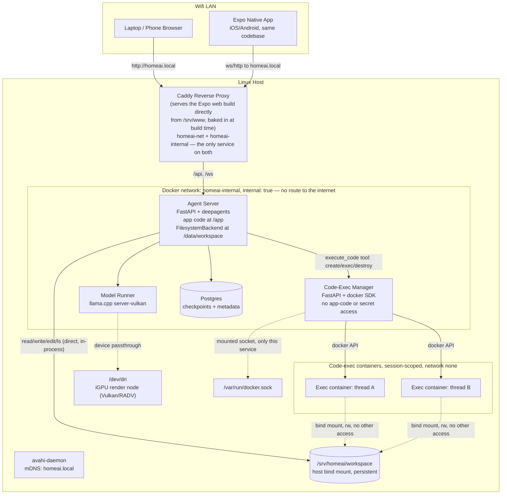
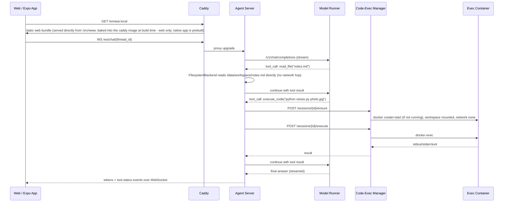
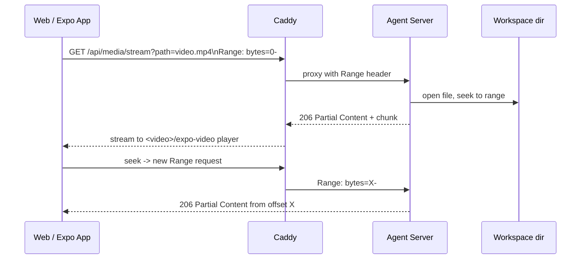

# Architecture

The as-built architecture of the Home AI Agent stack — what's actually
running, not just what was planned. This is the canonical, maintained copy;
`README.md`'s own `## Architecture` section is now a short summary that
points back here. If anything below ever conflicts with a GitHub issue,
this document (checked against the live `docker compose config` output and
the real code) wins — the issue was the plan, this is the result.

Six sections:

1. [System overview](#1-system-overview)
2. [Service catalog](#2-service-catalog)
3. [Contracts](#3-contracts)
4. [Model operations](#4-model-operations)
5. [Security model](#5-security-model)
6. [Operations](#6-operations)

---

## 1. System overview

The diagrams below show the system as actually deployed: the LAN/host
topology, the chat + tool-call flow, and media playback.



Caddy serves the Expo web export itself, straight off local disk
(`infra/caddy/Caddyfile`'s `handle { root * /srv/www; file_server }`).
`infra/caddy/Dockerfile` is a multi-stage build that produces this: stage 1
(`node:22-alpine`) runs `npx expo export --platform web` against
`services/frontend/`, then stage 2 (`caddy:2-alpine`) `COPY
--from=frontend-build /out /srv/www` bakes the resulting static bundle
directly into the final Caddy image.

`model-runner` passes through `/dev/dri:/dev/dri` (plus `group_add:
[RENDER_GID, VIDEO_GID]` and `ipc: host`) — the Vulkan/RADV render node
used by the **Vulkan** (RADV/Mesa) backend this service runs (see "Model
operations" below for why Vulkan over ROCm).

**Network segmentation (M7-01)**: there are two Docker networks, not one —
`homeai-internal` (`internal: true` — Docker attaches no default
route/NAT, so nothing on it can reach the public internet at the network
layer) and `homeai-net` (the ordinary bridge network with default Docker
egress). `agent-server`, `model-runner`, `code-exec-manager`, and
`postgres` are on `homeai-internal` **only**. `caddy` is the sole service
on both: it needs `homeai-internal` to reach `agent-server`, and
`homeai-net` to keep its published port (and thus a route out, for
whatever it itself needs). `homeai-net` is reserved exclusively for
`caddy` and the M7-02 `egress-proxy` — no other service may ever join it.
This makes "no internet" the default for every container instead of
something merely unused.

**Egress proxy (M7-02)**: `egress-proxy` is the second (and, by design,
last) service on `homeai-net` — it also sits on `homeai-internal`, so any
internal-only consumer (`web-fetch`, M7-03) can reach it at
`http://egress-proxy:8080` without joining `homeai-net` itself. It's a
`mitmproxy`-based filtering forward proxy: it terminates TLS with its own
locally-generated CA (a plain `CONNECT` tunnel would hide the HTTP method
from any filter sitting in front of it) and enforces a GET/HEAD-only +
destination-guard policy in its `policy.py` addon before forwarding
anything. See "Security model" below for the full policy and the CA-trust
recipe.

**Web fetch (M7-03)**: `web-fetch` is the sole consumer of `egress-proxy` —
the narrow internal HTTP service (`GET /fetch?url=<url>`, `GET
/search?q=<query>`) that turns a URL/query into readable markdown/text and
normalized search results with hard caps, so the agent — via its own
`web_search`/`web_fetch` tools (M7-05, `app/agent/web_tools.py`) — never
sees raw HTML/SearXNG response shapes and never itself holds a network
handle. See its "Service catalog" entry and "Contracts" below for the full
shape.

**Docker network naming**: the diagram labels them `homeai-internal`/
`homeai-net` — that's the compose-file key (`docker-compose.yml`'s
`networks:` block) and the name every script in this repo treats as
canonical. The actual Docker network name on the host is project-prefixed:
`homeai_homeai-net`/`homeai_homeai-internal` (compose project name
`homeai` + the compose-file key, confirmed via `docker network ls` — see
`scripts/verify_isolation.sh`'s own header comment for the same finding).
Scripts resolve this dynamically via `docker compose config --format json`
rather than hardcoding either name.

### Chat + tool-call flow (direct file ops vs. code execution)



Caddy answers `GET homeai.local` directly from its own baked-in static
files — no second process involved, matching the flowchart above.
Everything else in this sequence (the WS upgrade, the tool-call round
trips through `model-runner` and `code-exec-manager`) matches the real
`app/api/chat_ws.py` / `app/agent/execute_code_tool.py` / `app/sessions.py`
flow, and the `code-exec-manager` API calls (`POST /sessions/{id}/ensure`,
`POST /sessions/{id}/execute`) match the `code-exec-manager` API contract
in "Contracts" below.

### Media file playback flow



`app/api/media.py` parses `Range` per RFC 9110 §14.1.2, streams in 1 MiB
chunks via `anyio.to_thread`, and returns `206`/`Content-Range` exactly as
diagrammed (plus a `HEAD` path and a `416` path for unsatisfiable ranges,
both omitted here as diagram-level detail).

---

## 2. Service catalog

One subsection per real compose service, plus the exec-toolbox build
artifact and the host-level (non-container) pieces. Every port/mount/env
claim below was cross-checked against a real `docker compose config` run
and each service's `Dockerfile` / `app/core/config.py` — not just against
what another doc says it should be.

### `caddy`

- **Purpose**: the single ingress point for the whole LAN — reverse proxy
  for `/api`/`/ws` to `agent-server`, and static file server for the Expo
  web build. The only service that publishes a host port.
- **Image/base**: multi-stage — build stage `node:22-alpine` (`npm ci` +
  `npx expo export --platform web` against `services/frontend/`), final
  stage `caddy:2-alpine`. Dockerfile: `infra/caddy/Dockerfile`.
- **Published port**: `80` — confirmed via `docker compose config`
  (`ports: [{target: 80, published: "80"}]`); the *only* service in the
  stack with a `ports:` entry.
- **Internal port**: `80` (same — it's the entry point, not proxied to
  from anything else).
- **Network (M7-01)**: `homeai-net` **and** `homeai-internal` — the only
  service on both. `homeai-net` keeps the published port (and any egress
  this service itself needs); `homeai-internal` is how it reaches
  `agent-server`.
- **Mounts**: none at runtime. `infra/caddy/Caddyfile` and the exported
  static bundle (`/srv/www`) are both baked into the image at build time,
  not bind-mounted.
- **Env vars consumed**: none.
- **Tests**: no dedicated unit tests for Caddy itself (it's a stock image +
  a static Caddyfile). Verified indirectly by every browser e2e smoke
  script that goes through it (`scripts/e2e/chat_browser_smoke.sh`,
  `files_browser_smoke.sh`, `media_browser_smoke.sh`) and by
  `scripts/verify_network.sh`'s "end-to-end reachability" check. The
  frontend code it serves has its own unit tests — see `services/frontend/`:
  run with `cd services/frontend && npm test` (`check-platform.mjs` +
  `jest`/`jest-expo`; suites live under `lib/__tests__/`,
  `components/__tests__/`, `src/app/**/__tests__/`).

### `egress-proxy`

- **Purpose**: M7-02's filtering forward proxy — the single, deliberately
  narrow chokepoint any outbound-web-access feature must route through:
  `web-fetch`'s own `/fetch` (M7-03) talks to it directly, and `searxng`
  (M7-04) talks to it for every one of its own outbound engine queries
  (`web-fetch`'s `/search` itself only ever talks to `searxng` over
  `homeai-internal`, never to `egress-proxy` directly). Enforces the
  read-only-web guarantee at the network layer (destination guard +
  GET/HEAD-only) rather than trusting a fetcher's own code to behave, per
  "Security model" below.
- **Image/base**: `mitmproxy/mitmproxy` pinned by digest (multi-platform
  manifest-list digest for the `12` tag, resolved via the Docker Hub v2
  tags API — see `services/egress-proxy/Dockerfile`'s own comment for why
  that method was used instead of `docker inspect`/`buildx imagetools
  inspect`, the method every other digest-pinned Dockerfile in this repo
  uses, and for the re-verification command to run once real
  docker+registry access is available). Dockerfile:
  `services/egress-proxy/Dockerfile`.
- **Published port**: none.
- **Internal port**: `8080` (`mitmdump --listen-port 8080`).
- **Network (M7-01/M7-02)**: `homeai-net` **and** `homeai-internal` — the
  second of only two services ever on `homeai-net` (alongside `caddy`).
  `homeai-net` is what gives it an actual route to the public internet;
  `homeai-internal` is how any future internal-only consumer reaches it at
  `http://egress-proxy:8080` without that consumer itself ever joining
  `homeai-net`.
- **Mounts**: named volume `egress-proxy-ca:/home/mitmproxy/.mitmproxy` —
  where mitmproxy writes its self-generated CA (private key + cert) on
  first start; not baked into the image. See "Security model" below for
  the exact consumer-side mount/trust recipe.
- **Env vars consumed** (compose `environment:` block, cross-checked
  against `policy.py`'s own `max_bytes()`): `EGRESS_MAX_BYTES` (default 20
  MB if unset/unparseable — see `.env.example`).
- **Policy** (`services/egress-proxy/policy.py`, a mitmproxy addon loaded
  via `-s /app/policy.py`): in `request()` — method allowlist (`GET`/`HEAD`
  only, else `403 {"error": "method not allowed by egress policy"}`),
  then a destination guard (else `403 {"error": "destination not allowed
  by egress policy"}`) that denies non-80/443 ports, bare hostnames (no
  dot), the `.local`/`.internal` TLDs, and any resolved IP that is
  loopback/RFC1918/link-local/CGNAT (`100.64.0.0/10`)/IPv6
  loopback+ULA+link-local/multicast/unspecified — then strips the
  `Cookie`/`Authorization` request headers on anything that passes. In
  `responseheaders()` — kills the flow if `Content-Length` exceeds
  `EGRESS_MAX_BYTES`, otherwise marks the response to stream rather than
  buffer the full body. Logs one line per completed request (method, host,
  path truncated to 200 chars, status, bytes).
- **DNS-rebinding tradeoff (deliberate, documented, not fixed here)**: the
  destination guard resolves the host itself (`policy.py`'s
  `resolve_host()`) and makes its allow/deny decision against THOSE
  resolved IPs — it does not, and structurally cannot from inside a plain
  mitmproxy addon, pin mitmproxy's own subsequent upstream connection to
  the exact same IPs. A DNS answer that changes between this check and
  mitmproxy's own connect (attacker-controlled DNS rebinding) could in
  principle let a private IP through after this check passed on a public
  one. Out of scope for this ticket (the spec's own "out of scope" list
  covers domain allow/deny-lists and rate limiting, not full anti-rebinding
  connection pinning) — flagged here as a known gap for anyone hardening
  this further, not silently accepted.
- **Tests**: `services/egress-proxy/tests/test_policy.py` — table-driven
  pure-function tests for the method allowlist and destination guard
  (every denial category in the spec, plus the "resolution failed" and
  "one-of-several-resolved-IPs-is-bad" fail-closed cases), plus the
  `request()`/`responseheaders()`/`response()` addon hooks driven directly
  through `mitmproxy.test.tflow`/`tutils` (the same test helpers
  mitmproxy's own addon suite uses) for the 403/kill/streaming/logging
  paths. Run: `cd services/egress-proxy && uv run ruff check . && uv run
  pytest`. No integration test drives a real mitmproxy process end to end
  from this repo — `scripts/verify_egress.sh` (below) is that check,
  against the live stack with real internet.

### `web-fetch`

- **Purpose**: the narrow internal fetch/search service — the *only* thing
  that talks to `egress-proxy` directly. `GET /fetch?url=<url>` (M7-03)
  turns a URL into readable markdown/text with hard caps; `GET
  /search?q=<query>&n=<1..20>` (M7-04) proxies a query to the internal
  `searxng` service below and normalizes its JSON. Either way the agent
  (via its own `web_search`/`web_fetch` tools, M7-05) never sees raw
  HTML/PDF bytes or SearXNG's own response shape, and never itself holds a
  network handle. `/search` was added to this SAME service rather than a new
  Python one, per the M7-03 subagent's own contract note (`app/api/` is a
  multi-route-module layout by design, not a single-endpoint service).
- **Image/base**: `python:3.12-slim` + `uv`, same pattern as
  `agent-server`'s/`code-exec-manager`'s own Dockerfiles. Dockerfile:
  `services/web-fetch/Dockerfile`.
- **Published port**: none.
- **Internal port**: `8000` (`CMD`'s `uvicorn app.main:app --port 8000`).
- **Network (M7-01/M7-03)**: `homeai-internal` only — reaches the public
  web exclusively via `egress-proxy` (`homeai-net`), never by joining that
  network itself. Reaches `searxng` (M7-04, below) directly over this same
  `homeai-internal` network — that hop never touches `egress-proxy` at all;
  `searxng` is the one that does, for ITS OWN outbound requests.
- **Mounts**: named volume `egress-proxy-ca:/ca:ro` — the same volume
  `egress-proxy` (M7-02) writes its self-generated CA into, mounted
  read-only here per "Security model"'s CA-handling recipe below.
- **Runs as**: `user: "${HOMEAI_UID}:${HOMEAI_GID}"` (non-root, same as
  `agent-server`).
- **Entrypoint** (`services/web-fetch/entrypoint.sh`, not a bare `CMD` —
  see its own header comment): before `uvicorn` starts, combines the
  image's system CA bundle (`/etc/ssl/certs/ca-certificates.crt`, shipped
  by `python:3.12-slim`'s own `ca-certificates` package) with
  `/ca/mitmproxy-ca-cert.pem` into `/tmp/ca-bundle.pem`, then exports
  `SSL_CERT_FILE`/`REQUESTS_CA_BUNDLE` pointing at it — this is what makes
  the httpx client (`create_ssl_context()`, confirmed via
  `inspect.getsource`) trust `egress-proxy`'s MITM leaf certs. Only
  matters for `/fetch`'s own client (talks straight to the public web
  through `egress-proxy`) — `/search`'s client talks to `searxng` directly
  over plain internal HTTP, no proxy/CA trust involved on this leg.
  **CA-file-not-yet-written handling (a deliberate judgement call, since
  the spec left it open)**: the `egress-proxy-ca` volume is populated
  lazily by `egress-proxy` on ITS first start (§5 point 4 below) — if
  `web-fetch` starts first, or `egress-proxy` has literally never started,
  `/ca/mitmproxy-ca-cert.pem` won't exist yet. The entrypoint polls for up
  to 30s (1 retry/second) before giving up; if it's still missing, it
  **exits nonzero rather than starting anyway with no CA trust** — every
  fetch would fail with a much more confusing raw SSL error otherwise, and
  `restart: unless-stopped` (compose) means the container just retries the
  whole wait automatically on the next attempt once `egress-proxy` has
  actually started.
- **Env vars consumed** (compose `environment:` block, cross-checked
  against `app/core/config.py`'s `Settings`): `EGRESS_PROXY_URL`,
  `FETCH_TIMEOUT_S`, `FETCH_MAX_BYTES`, `FETCH_MAX_TEXT_CHARS`,
  `FETCH_MAX_REDIRECTS`, `SEARXNG_URL` (see `.env.example` for defaults).
  `/search` reuses `FETCH_TIMEOUT_S` for its own SearXNG round trip rather
  than introducing a second timeout knob — no new env var beyond
  `SEARXNG_URL` was added for it.
- **Tests**: `services/web-fetch/tests/` — `test_health.py`,
  `test_extract.py` (pure content-type-extraction unit tests: trafilatura
  happy path, the readability+markdownify fallback, plain-text/CSV/
  Markdown passthrough, JSON pretty-printing, PDF text extraction + the
  50-page cap), `test_fetch.py` (`/fetch` HTTP-level tests against
  `httpx.AsyncClient` mocked with `respx` — every content type, the
  413/415/504 caps, text truncation, a real multi-hop redirect chain, a
  real upstream 4xx/5xx passed through as `502`, and `egress-proxy`'s own
  403 passed through as `502` with its message intact), `test_search.py`
  (M7-04: `/search` HTTP-level tests against a mocked SearXNG JSON
  response via `respx` — happy path, de-duplication by URL across
  engines, the `n` cap and its default/out-of-range-422 behavior, a
  SearXNG 5xx/unreachable/invalid-JSON all mapping to `502`, and an
  empty-results pass-through), fixtures under `tests/fixtures/`
  (`sample.html`, `sample.pdf`). Run: `cd services/web-fetch && uv run
  ruff check . && uv run pytest`. No integration test drives a real
  `egress-proxy`/`searxng`/real internet from this repo (same reasoning as
  `egress-proxy`'s own test suite) — the host-only Tier A check for
  `/fetch` is `docker compose exec agent-server python3 ... web-fetch:8000/
  fetch?url=...` (no `curl` in this image — see "e2e gate scripts" below),
  and for `/search` it's `scripts/e2e/web_research_smoke.sh` (M7-04).

### `searxng`

- **Purpose**: M7-04's self-hosted metasearch engine — runs locally and
  queries public search engines directly (no intermediate hosted search
  API), giving the agent a way to *find* pages instead of only reading ones
  it's told about. Configured JSON-only (`search.formats: [json]`, no HTML
  UI) with only GET-implemented engines enabled, since every one of its own
  outbound requests has to survive `egress-proxy`'s GET/HEAD-only filter
  the same way `web-fetch`'s own requests do. Only ever called by
  `web-fetch`'s `GET /search` above — never routed by Caddy, never talked
  to by the UI or the agent directly.
- **Image/base**: `searxng/searxng`, pinned by digest (multi-platform
  manifest-list digest for the `latest` tag, resolved via the Docker Hub v2
  tags API on 2026-09-04 — same method `services/egress-proxy/Dockerfile`'s
  own comment used for `mitmproxy/mitmproxy:12`; no Dockerfile of this
  repo's own — the pin lives directly on `docker-compose.yml`'s `image:`
  line since this service needs no custom build, only a mounted config
  file). Re-verify with `docker buildx imagetools inspect
  searxng/searxng:latest` once this runs somewhere with real
  registry+docker access — `searxng/searxng:latest` moves often (observed
  a new push within the same day this was pinned), more so than
  `mitmproxy/mitmproxy:12`'s own comparatively slow cadence.
- **Published port**: none.
- **Internal port**: `8080` (the pinned image's own default).
- **Network (M7-01/M7-04)**: `homeai-internal` only. Its OWN outbound
  requests (to brave/wikipedia/github/stackoverflow/mojeek — the 5 engines
  kept, see below) are routed through `egress-proxy` via
  `outgoing.proxies` in `settings.yml`, not a direct route out — this
  service never joins `homeai-net`.
- **Mounts**: `./services/searxng/settings.yml:/etc/searxng/settings.yml:ro`
  (this repo's own config, read-only — see below for why supplying it here
  matters), and the same named volume `web-fetch` mounts,
  `egress-proxy-ca:/etc/searxng-ca:ro` (a separate top-level path from
  `/etc/searxng` — see the compose file's own comment for why).
- **Runs as**: the pinned image's own default user (no `user:` override in
  compose — least-privilege is the image maintainer's job here, same
  reasoning `postgres`'s own catalog entry implicitly follows).
- **Engine configuration** (`services/searxng/settings.yml`, spec §2 —
  this file's own header comment has the full reasoning; summarized here):
  uses `use_default_settings.engines.keep_only` (confirmed directly from
  `searx/settings_loader.py`'s `update_settings()`) to make ONLY
  `brave`, `wikipedia`, `github`, `stackoverflow`, `mojeek` exist in the
  merged engine list at all — not merely "enabled", genuinely absent, so
  there's no reliance on remembering to disable ~225 other engines by
  name. Each of those 5 was individually audited against its own
  `request()` function in the pinned image's SearXNG source
  (`github.com/searxng/searxng`, `master` @ 2026-09-04) and confirmed to
  never set `params["method"] = "POST"` (the online-engine default is GET,
  `searx/search/processors/online.py`'s `default_request_params()`).
  **Engine-audit correction to this ticket's own guess**: the spec's
  "expected set" also named `duckduckgo` and `startpage` — both were
  audited and found to explicitly `POST` (DuckDuckGo POSTs a no-JS HTML
  form to `html.duckduckgo.com/html/`; Startpage POSTs to `/sp/search`
  with a cookie literally named `enable_post_method`), so both are
  excluded. `wikidata` (checked as a natural `wikipedia` sibling) is POST
  too (a SPARQL query) and was likewise excluded. Every other engine in
  upstream's default list was NOT individually source-audited (only the
  ones mentioned by name in the ticket, plus `wikidata`) — flagged as an
  explicit gap for whoever adds a 6th engine later, not a silent
  assumption either way. `mojeek` is re-enabled via a plain `engines:`
  override (`disabled: false`) since upstream's own default entry for it
  has `disabled: true` — `keep_only` controls which engines exist at all,
  not their own `disabled` flag.
- **`server.secret_key` — NOT env-var-driven, despite `SEARXNG_SECRET`
  existing in `.env`/compose (a deliberate, explicitly-flagged deviation)**:
  the pinned image's `container/entrypoint.sh` only ever substitutes a
  random secret into a settings.yml it generates ITSELF, on a
  first-boot-only path (`if [ ! -f "$target_settings" ]`). Since this
  service mounts its OWN pre-existing settings.yml (with the engine
  allowlist + JSON format already configured), that bootstrap path never
  runs — and nothing else in the pinned image reads `SEARXNG_SECRET` (or
  any env var) to patch an already-existing settings.yml's `secret_key`
  (confirmed directly from `searx/webapp.py`:
  `app.secret_key = settings['server']['secret_key']`, no `os.environ`
  fallback). `settings.yml` ships a fixed, committed value instead; its
  own comment has the full reasoning and the "real risk is low in
  practice" argument (no public UI, JSON-only, `image_proxy: false` so the
  one HMAC use of this key never triggers). `SEARXNG_SECRET` stays wired
  through `.env`/compose for consistency with this repo's
  every-secret-is-an-env-var convention and so a future templating
  entrypoint could pick it up — flagged here as NOT currently load-bearing,
  not silently a no-op.
- **Env vars consumed**: `SEARXNG_SECRET` (compose `environment:` block —
  see the caveat directly above for why this doesn't currently do
  anything).
- **Tests**: no dedicated test suite of its own (it's a pinned upstream
  image + a static `settings.yml`, same category as `postgres`/`caddy`'s
  own catalog entries) — `services/web-fetch/tests/test_search.py`
  exercises `web-fetch`'s own `/search` contract against a mocked SearXNG
  response (unit-level, no real SearXNG), and
  `scripts/e2e/web_research_smoke.sh` (M7-04, "e2e gate scripts" below) is
  the real, live-stack check that a genuine query round-trips through this
  service's actual GET-only engines and back.

### `agent-server`

- **Purpose**: the FastAPI app hosting the `deepagents`-based chat agent —
  REST APIs for threads/files, the WebSocket chat stream, Range-based media
  streaming, the `execute_code` tool's HTTP client to `code-exec-manager`,
  and the `web_search`/`web_fetch` tools' HTTP client to `web-fetch`
  (M7-05).
- **Image/base**: `python:3.12-slim` + `uv` (astral's static binary
  copied in). Dockerfile: `services/agent-server/Dockerfile`.
- **Published port**: none.
- **Internal port**: `8000` (`CMD`'s `uvicorn app.main:app --port 8000`).
- **Network (M7-01)**: `homeai-internal` only — no route to the public
  internet. Stage 2's web access goes through `web-fetch` (M7-03) via the
  `web_search`/`web_fetch` tools (M7-05) — `agent-server` itself never
  joins `homeai-net` or talks to `egress-proxy` directly; see "Security
  model" below.
- **Mounts**: `${WORKSPACE_DIR}:/data/workspace` (rw bind; host default
  `/srv/homeai/workspace`) — confirmed in `docker compose config`'s
  `volumes:` block for this service.
- **Runs as**: `user: "${HOMEAI_UID}:${HOMEAI_GID}"` (non-root).
- **Env vars consumed** (compose `environment:` block, cross-checked
  against `app/core/config.py`'s `Settings` class): `MODEL_BASE_URL`,
  `MODEL_NAME`, `EXEC_MANAGER_URL`, `EXEC_DEFAULT_TIMEOUT_S`,
  `WEB_FETCH_URL`, `WEB_FETCH_TOOL_MAX_CHARS` (M7-05), `POSTGRES_USER`,
  `POSTGRES_PASSWORD`, `POSTGRES_DB`, and `TEST_PG_DSN` (only read by
  `tests/test_checkpointer_pg.py`'s integration fixture, not by the
  application itself — compose's own comment on this line says so).
  **Nuance**: `HOMEAI_UID`/`HOMEAI_GID`/`WORKSPACE_DIR` are used by
  *compose* to set this service's `user:` field and bind-mount source —
  they are never actually injected into the container's own environment.
  `Settings.workspace_root` is a hardcoded `/data/workspace` default, not
  read from a `WORKSPACE_DIR`/`WORKSPACE_ROOT` env var (`.env.example`'s own
  "Consumed by" comments reflect this — they don't list `agent-server` for
  `WORKSPACE_DIR`).
- **Tests**: `services/agent-server/tests/` — `test_health.py`,
  `test_chat.py`, `test_chat_ws.py`, `test_files_rest.py`,
  `test_media_stream.py`, `test_paths.py`, `test_agent_build.py`,
  `test_execute_code_tool.py`, `test_execute_code_integration.py`,
  `test_web_tools.py` (M7-05, `respx`-mocked `web-fetch`),
  `test_checkpointer_pg.py`, `test_threads_pg.py`, `test_fake_model.py`,
  plus the `fake_model/`/`fake_exec_manager/`/`fake_web_fetch/` test
  doubles used to keep most of the suite deterministic and independent of
  the real model/Docker/web-fetch.
  Run: `cd services/agent-server && uv run ruff check . && uv run pytest`
  (the default marker selection skips the `integration` tests). The
  Postgres-backed integration tests need a real reachable Postgres via
  `TEST_PG_DSN`: `uv run pytest -m integration`, or the already-wired
  container form `docker compose exec agent-server uv run pytest -m
  integration` (per `docker-compose.yml`'s own comment on `TEST_PG_DSN`).

### `model-runner`

- **Purpose**: serves the local LLM on the iGPU via `llama.cpp`'s
  OpenAI-compatible `/v1/chat/completions` endpoint.
- **Image/base**: `ghcr.io/ggml-org/llama.cpp` pinned by digest
  (`server-vulkan` build, confirmed newer than the April 2026 Gemma 4
  chat-template fix via its `org.opencontainers.image.created` label) +
  an `apt-get install libglvnd0 libgl1 libegl1 libgles2` fix for a known
  missing-GL-loader issue in the upstream image. Dockerfile:
  `services/model-runner/Dockerfile`.
- **Published port**: none.
- **Internal port**: `8080`.
- **Network (M7-01)**: `homeai-internal` only — no route to the public
  internet.
- **Mounts**: `./services/model-runner/models:/models:ro` (ro bind).
- **Devices**: `/dev/dri:/dev/dri` passthrough, `group_add:
  [${RENDER_GID}, ${VIDEO_GID}]`, `ipc: host`.
- **Env vars consumed**: none directly by the `llama-server` process —
  `MODEL_FILE`/`MODEL_CTX_SIZE`/`MODEL_EXTRA_ARGS` are substituted into the
  compose `command:` argument list at parse time (confirmed in `docker
  compose config`'s fully-expanded `command:` array), and
  `RENDER_GID`/`VIDEO_GID` only ever feed the compose `group_add:` field —
  none of the four are read as env vars *inside* the container.
- **Tests**: no automated unit-test suite of its own — it's a pinned
  upstream binary, not this repo's code. Verified via the real
  `llama-bench` procedure documented in "Model operations" below, and
  exercised live end-to-end by the `scripts/e2e/gate_m*.sh` chain (which
  drives real chat completions through `agent-server`).

### `code-exec-manager`

- **Purpose**: the sole `docker.sock` holder — creates, execs into, and
  destroys session-scoped sandboxed exec containers on behalf of
  `agent-server`'s `execute_code` tool, and idle-reaps them.
- **Image/base**: `python:3.12-slim` + `uv`. Dockerfile:
  `services/code-exec-manager/Dockerfile`. Runs as the image's default
  **root** user (deliberately, unlike `agent-server`) — it's the one
  service that needs unrestricted access to a root/`docker`-group-owned
  socket, per the Dockerfile's own comment.
- **Published port**: none.
- **Internal port**: `8090` (`EXPOSE 8090`, `uvicorn --port 8090`).
- **Network (M7-01)**: `homeai-internal` only — no route to the public
  internet. Unaffected in practice, since this service reaches the Docker
  daemon over the bind-mounted unix socket (next bullet), not the network;
  the exec containers it spawns keep their own separate `network_mode:
  none` regardless (see "Security model" below).
- **Mounts**: `/var/run/docker.sock:/var/run/docker.sock` — the *only*
  service in the compose file with this mount, enforced by
  `scripts/check_socket_exclusivity.sh`.
- **Env vars consumed** (compose `environment:` block, cross-checked
  against `app/core/config.py`'s `Settings`): `WORKSPACE_DIR` (aliased to
  the field `workspace_host_dir` — deliberately not named
  `workspace_root`, since this service never reads the workspace itself;
  it only tells `dockerd` where the exec-container bind-mount source
  lives), `HOMEAI_UID`, `HOMEAI_GID`, `EXEC_IDLE_MINUTES`,
  `EXEC_DEFAULT_TIMEOUT_S`.
- **Tests**: `services/code-exec-manager/tests/` — `test_api_unit.py`,
  `test_sessions_unit.py`, `test_hardening_spec.py`, `test_reaper_unit.py`
  (all use the `fake_docker.py` test double, no real Docker needed), plus
  `test_sessions_integration.py` (marked `integration` — needs a real
  `docker.sock` and the `homeai-exec-toolbox:latest` image built). Run:
  `cd services/code-exec-manager && uv run ruff check . && uv run pytest`
  for the deterministic suite, `uv run pytest -m integration` for the
  real-Docker tests. `./smoke.sh` (from that same directory) is a
  standalone ad-hoc `docker run` + curl-equivalent smoke check, independent
  of compose. `scripts/verify_isolation.sh` (from the repo root, against
  the live stack) is the full 17-check hardening-spec suite — see
  "Security model" below.

### exec-toolbox image (`services/code-exec-manager/exec-image/`)

- **Purpose**: the pre-baked image every exec container actually runs.
  Not a compose service — built standalone and spun up on demand by
  `code-exec-manager` (compose can't build an image it never runs itself).
- **Image/base**: `ubuntu:24.04` + `python3`/`nodejs`/`git`/`ffmpeg`/
  `imagemagick`/`pandoc`/`poppler-utils`/etc., plus pinned `pip` packages
  (`pandas`, `numpy`, `pillow`, `openpyxl`, `matplotlib`, `pypdf`,
  `requests`, `beautifulsoup4`, `python-dateutil`). Non-root `homeai` user
  matching `HOMEAI_UID`/`HOMEAI_GID` (the base image's own pre-existing
  `ubuntu` account at the same UID is explicitly removed first to avoid a
  collision). Dockerfile: `services/code-exec-manager/exec-image/Dockerfile`.
- **Build**: `./services/code-exec-manager/build-exec-image.sh` →
  `homeai-exec-toolbox:latest` (~1.88 GB measured).
- **Tests**: no unit tests of its own; exercised by `scripts/verify_isolation.sh`
  (drives real commands through a live exec container) and
  `services/code-exec-manager/smoke.sh`.

### `postgres`

- **Purpose**: stores LangGraph checkpoints (thread/message state) and
  thread metadata.
- **Image/base**: `postgres:17`, official/unmodified.
- **Published port**: none.
- **Internal port**: `5432`.
- **Network (M7-01)**: `homeai-internal` only — no route to the public
  internet.
- **Mounts**: named volume `pgdata:/var/lib/postgresql/data` (confirmed in
  `docker compose config` — `volumes: pgdata: name: homeai_pgdata`).
- **Env vars consumed**: `POSTGRES_USER`, `POSTGRES_PASSWORD`,
  `POSTGRES_DB` — confirmed directly in `docker compose config`'s
  `postgres.environment` block.
- **Tests**: no tests of its own; exercised via `agent-server`'s
  `test_checkpointer_pg.py` / `test_threads_pg.py` (`-m integration`, needs
  `TEST_PG_DSN`) and the `scripts/e2e/gate_m3.sh` / `persistence_smoke.sh`
  scripts.

### Host-level pieces (not containers)

These aren't compose services at all — they run directly on the Linux
host and are set up/verified by scripts under `infra/host/` and `scripts/`.

- **`avahi-daemon`** — advertises `homeai.local` over mDNS so LAN devices
  can find the host by name. Installed/configured by
  `infra/host/setup-avahi.sh` (idempotent, handles the IPv6-link-local and
  Docker-bridge-address gotchas documented in `docs/NETWORKING.md`).
  Verified by `scripts/verify_network.sh` check 1.
- **`ufw` + the `DOCKER-USER` iptables rule** — LAN-only firewall for
  port 80. Installed by `infra/host/setup-ufw.sh`, which also installs a
  small systemd oneshot unit (`homeai-docker-user-fw.service`) to
  re-insert the `DOCKER-USER` rule on every boot (the rule itself doesn't
  survive a reboot or a `dockerd` restart otherwise). Verified by
  `scripts/verify_network.sh` checks 3–5.
- **`homeai-backup.timer` / `homeai-backup.service`** (systemd) — runs
  `infra/host/backup-workspace.sh` daily at 03:00. Installed/removed by
  `infra/host/install-backup-timer.sh`. See "Operations" below and
  `README.md`'s "Backups" section for the full mechanics.

---

## 3. Contracts

The binding API shapes for `agent-server`'s HTTP API, its WebSocket chat
protocol, `code-exec-manager`'s internal REST API, and the workspace
path-traversal guard shared by the files and media APIs. This section is
the single source of truth for these shapes — if any code ever disagrees
with it, fix the code (or update this doc, if the doc is what's actually
wrong) rather than letting them drift apart silently.

### HTTP API (agent-server, all under `/api`)

All JSON. Errors: `{"detail": "<human readable>"}` with an appropriate
4xx/5xx status. Every `path` parameter is a **workspace-relative POSIX
path** (`""` = workspace root); any path that resolves outside the
workspace root returns `400` (see the path-traversal guard below).

**Health**
- `GET /api/health` → `200 {"status": "ok"}`

**Threads**
- `POST /api/threads` body `{"title": "optional string"}` → `201
  {"id": "<uuid>", "title": "New chat", "created_at": iso8601,
  "updated_at": iso8601}`
- `GET /api/threads` → `200 [{thread}, ...]`, ordered by `updated_at` desc
- `GET /api/threads/{id}/messages` → `200 [{"id": str, "role":
  "user"|"assistant"|"tool", "content": str, "tool_name": str|null,
  "tool_calls": [{"id", "name", "args"}]|null, "tool_call_id": str|null},
  ...]`, normalized from the LangGraph checkpoint. `id` is the stored
  LangChain message id (`HumanMessage` is constructed with
  `id=str(uuid4())` so user rows are addressable for edit/resend).
  `tool` rows carry the tool result text and `tool_call_id` (the paired
  assistant `tool_calls[].id`) so the frontend can recover `args`.
  `tool_call_id` is `null` on user/assistant rows.
- `GET /api/threads/{id}/state` (M8-03) → `200 {"pending_approval":
  {"interrupt_id": str, "actions": [{"tool_call_id": str, "name": str,
  "category": "file"|"exec"|"plan"|"web"|"other", "args": {},
  "description": str}]} | null}` — same payload as the live
  `approval_request` frame (minus the frame's `type` envelope). Derived
  from the checkpointer's pending interrupt (no extra storage). The
  frontend calls this after history hydration on (re)connect so an
  approval card survives a reload. Unknown / never-run thread ids return
  `{"pending_approval": null}` rather than 404.
- `DELETE /api/threads/{id}` → `204` (deletes the row and the
  checkpointer state for that thread)

**Files**
- `GET /api/files?path=<dir>` → `200 {"path": str, "entries": [{"name":
  str, "path": str, "type": "file"|"dir", "size": int, "mtime": iso8601,
  "mime": str|null}]}`, sorted dirs-first then case-insensitive by name;
  `404` if the dir is missing
- `POST /api/files/upload` — multipart form, field `path` (target dir),
  field `file` (binary, may repeat) → `201 {"uploaded": ["rel/path",
  ...]}`; overwrites existing files
- `GET /api/files/download?path=<file>` → `200` binary,
  `Content-Disposition: attachment`
- `POST /api/files/mkdir` body `{"path": str}` → `201` (parents created,
  `mkdir -p` semantics)
- `POST /api/files/move` body `{"src": str, "dst": str}` → `200`
  (rename == move); `409` if `dst` exists
- `POST /api/files/copy` body `{"src": str, "dst": str}` → `200` (dirs
  copied recursively); `409` if `dst` exists
- `DELETE /api/files?path=<p>` → `204` (dirs deleted recursively)

**Media**
- `GET /api/media/stream?path=<file>` — `Range`-aware, `206 Partial
  Content`, `Accept-Ranges: bytes`; see "Media file playback flow" above
  for the exact request/response sequence.

**Settings**
- `GET /api/settings` → `200 {"hitl_enabled": bool, "thinking_enabled":
  bool, "edit_mode_default": "truncate"|"fork"}` — the full document,
  defaults applied for any key not yet stored (`hitl_enabled` defaults
  `true`, `thinking_enabled` defaults `false`, `edit_mode_default` defaults
  `"truncate"`)
- `PUT /api/settings` body: any subset of the three fields above → `200`
  the full merged document; `422` on an unknown extra key or a wrong
  type/invalid literal value; persists to Postgres (survives a restart)

### WebSocket chat protocol (`/ws/chat/{thread_id}`)

One JSON object per text frame. The connection stays open across turns;
turns for one thread are serialized server-side by a per-thread
`asyncio.Lock`.

Client → server:

```json
{"type": "user_message", "content": "string",
 "replace_from_message_id": "str?",
 "mode": "truncate"|"fork"?}
{"type": "cancel"}
{"type": "approval_response", "interrupt_id": "str",
 "decisions": [{"tool_call_id": "str", "decision": "approve"|"reject"}]}
```

`cancel` (M8-01) stops the in-flight turn early. It's only meaningful while
a turn is in flight; sent outside a turn (idle, waiting for the next
`user_message`, and **not** awaiting approval) it's a **no-op** — ignored,
no error/close, no frame sent in response. Any other, non-`cancel` frame
received mid-turn is likewise ignored (looped past) rather than
misinterpreted; sending anything other than a well-formed `user_message`
(or `cancel`) *while idle* still gets the usual `error` frame + close (see
below).

`approval_response` (M8-03) is only valid while a previous turn ended
`awaiting_approval` (or a reconnect hydrated the same pending interrupt
from `GET /api/threads/{id}/state`). It resumes the paused graph as a
**new turn** on the same per-thread lock (`turn_start` … `turn_end`) via
`Command(resume={"decisions": [...]})`. Each decision is mapped to
deepagents' HITL shape: `{"type": "approve"}` or `{"type": "reject",
"message": "The user rejected this action."}`. One decision is required
per pending `tool_call_id`; a mismatched `interrupt_id` or incomplete
decision list is an invalid frame (`error` + close 1008).

`cancel` **while awaiting approval** is not the M8-01 cancel-a-running-task
path (there is no running task — the graph is paused). It rejects every
pending action with message `"The user cancelled."` and resumes the same
way an all-reject `approval_response` would.

`user_message.replace_from_message_id` + `mode` (M8-04) edit/resend a
prior user message. Omitted `mode` falls back to
`SettingsStore.edit_mode_default` (`"truncate"` | `"fork"`). `fork` is
M8-05 — until then a replace that resolves to fork is `error` + close
1008. `truncate` (under the per-thread lock, before the new turn):
`aget_state`, locate the message with that id (must be a `HumanMessage`,
else `error` + 1008; unknown id is the same), then one
`aupdate_state` of `RemoveMessage` for every message from that index
onward. The new `HumanMessage` then runs normally. Thread title is not
re-derived. The client may also send `id` on `user_message`; when
present it becomes the stored LangChain message id so a same-session
edit can address the bubble it just appended.

Server → client, in order within a turn:

```json
{"type": "turn_start"}
{"type": "token", "content": "str"}                       // one per streamed model token chunk
{"type": "tool_start", "tool_call_id": "str", "name": "str",
 "category": "file"|"exec"|"plan"|"web"|"other", "args": {}}     // args truncated to 500 chars/value
{"type": "tool_end", "tool_call_id": "str", "name": "str",
 "status": "success"|"error", "result_preview": "str"}     // truncated to 2000 chars
{"type": "approval_request", "interrupt_id": "str",
 "actions": [{"tool_call_id": "str", "name": "str",
              "category": "file"|"exec"|"plan"|"web"|"other",
              "args": {}, "description": "str"}]}           // args truncated like tool_start
{"type": "turn_end", "status": "completed"|"cancelled"|"awaiting_approval"}
{"type": "error", "message": "str"}                        // followed by a normal close, code 1011
```

`turn_end.status` (M8-01 / M8-03) is `"completed"` for a normal finish,
`"cancelled"` if the client sent `cancel` mid-turn, or `"awaiting_approval"`
when the turn paused on one or more mutating tool calls (`write_file`,
`edit_file`, `delete`, `execute_code`) with HITL on. `approval_request` is
**always** immediately followed by `turn_end {"status": "awaiting_approval"}`
— there is no `turn_end {"status": "completed"}` for that turn. HITL is
gated per turn by `SettingsStore.hitl_enabled` (read at the start of every
fresh and resumed turn into `configurable.hitl_enabled`); with HITL off
those four tools run without an interrupt, same as any other tool.

On `cancel` mid-turn: the server cancels the turn task, awaits it, sends
`turn_end {"status": "cancelled"}`, and — unlike a client disconnect —
**keeps the connection open**; the per-thread lock is released normally
and the thread's `updated_at` is still bumped, so the very next
`user_message` on the same socket runs a normal turn. The `error` frame
path (unhandled model/agent exception) is unchanged by any of this — it
still ends the turn with `error` + close code 1011, never a `turn_end`.

Category mapping by tool name: `ls|read_file|write_file|edit_file|glob|
grep|delete` → `file`; `execute_code` → `exec`; `write_todos|task` →
`plan`; `web_search|web_fetch` (M7-05) → `web`; anything else → `other`.

**Known limitations of `cancel` (M8-01, by design — see that ticket's "out
of scope"):**

- **Partial output is not persisted.** LangGraph does not checkpoint the
  interrupted model node, so a cancelled turn's partial assistant text
  never lands in the thread's history — it only exists in the frontend's
  in-memory state for that session (rendered greyed-out/"Stopped"). A page
  reload or reopening the thread loses it entirely; `GET
  /api/threads/{id}/messages` never returns it.
- **`execute_code` isn't actually stopped.** Cancelling a turn while
  `execute_code` is mid-flight only cancels agent-server's own HTTP call to
  `code-exec-manager` — the sandboxed command keeps running inside its
  container until its own configured timeout elapses; the tool's exec
  session and container are unaffected.
- **llama-server DOES abort generation on cancel.** Verified live (Tier A)
  against the real `model-runner` container: cancelling the turn task tears
  down the agent-server's streaming HTTP request to
  `POST /v1/chat/completions`, and `model-runner`'s log shows the
  in-flight generation being aborted as soon as the client connection drops
  — see the M8-01 ticket report for the exact log line captured during
  verification. So cancel does stop the (expensive) model inference itself
  immediately; it's only the *tool call* HTTP round-trip (`execute_code`)
  whose underlying side effect isn't killed.

### Agent web tools (`web_search`/`web_fetch`, M7-05)

Thin HTTP clients (`app/agent/web_tools.py`) against `web-fetch`'s own
`/search`/`/fetch` (see that API's own contract above) — same
factory-closes-over-`Settings` shape as `execute_code_tool.py`'s
`make_execute_code_tool`, registered in `app/agent/build.py`'s
`build_agent` alongside it. `Settings.web_fetch_url` (env `WEB_FETCH_URL`,
default `http://web-fetch:8000`) points them at the internal `web-fetch`
service over `homeai-internal` — neither tool ever talks to
`egress-proxy` or the public internet directly.

- `web_search(query: str, max_results: int = 8) -> str` — `max_results`
  clamped to web-fetch's own `1..20` range before the request (avoids a
  422 from over/under-shooting it). Formats each result as a numbered
  entry:
  ```
  1. <title>
     <url>
     <snippet>
  ```
  (one blank-title/snippet-safe fallback: `"(untitled)"` for a missing
  title, empty string for a missing snippet), joined with `\n` — no
  trailing newline. An empty `results` list renders as the literal string
  `"No results found."` instead of an empty list.
- `web_fetch(url: str) -> str` — formats the response as:
  ```
  Title: <title, or "(untitled)" if null>
  URL: <final_url>

  <text>
  ```
  `text` is capped client-side at `Settings.web_fetch_tool_max_chars` (env
  `WEB_FETCH_TOOL_MAX_CHARS`, default 30000 — independent of, and smaller
  than, web-fetch's own server-side `FETCH_MAX_TEXT_CHARS` cap); a cut
  result gets a trailing `\n[content truncated]` line, mirroring
  `execute_code`'s own `[output truncated]` convention.
- **Errors are always returned as an `"Error: ..."` string, never raised**
  — matching deepagents' own filesystem tools (see `chat_ws.py`'s module
  doc for why an `on_tool_error` event, which a raised exception would
  fire, aborts the whole turn instead of letting the model react). Covers
  both a non-2xx from `web-fetch` (its `{"error": str, ...}` body's
  `error` field is used verbatim — e.g. a proxied `egress-proxy` 403 reads
  `Error: destination not allowed by egress policy`, so the model learns
  the boundary directly) and any transport-level failure (`web-fetch`
  itself unreachable, timed out, etc. → `Error: web_search failed: ...`/
  `Error: web_fetch failed: ...` with the underlying exception's `repr`).

### `code-exec-manager` API (internal, port 8090)

- `POST /sessions/{session_id}/ensure` → `200 {"container_id": str,
  "created": bool}`. `session_id` must match `^[a-zA-Z0-9_-]{1,64}$`
  (thread UUIDs qualify) — otherwise `422`.
- `POST /sessions/{session_id}/execute` body `{"command": str,
  "timeout_seconds": int = EXEC_DEFAULT_TIMEOUT_S}` → `200 {"stdout": str,
  "stderr": str, "exit_code": int, "timed_out": bool, "duration_ms": int,
  "truncated": bool}` (`stdout`/`stderr` each truncated to 200,000 bytes).
  `404` if the session doesn't exist yet (callers must `ensure` first).
- `DELETE /sessions/{session_id}` → `204` (stop + remove the container;
  idempotent).
- `GET /sessions` → `200 [{"session_id": str, "container_id": str,
  "last_used": iso8601}]`.

**Exec-container hardening spec** — the exact configuration
`services/code-exec-manager/app/sessions.py`'s `build_run_kwargs`
produces, and the spec `scripts/verify_isolation.sh` checks against:
`network_mode="none"`, `cap_drop=["ALL"]`,
`security_opt=["no-new-privileges"]`, `read_only=True`,
`tmpfs={"/tmp": "size=512m", "/home/homeai": "size=64m"}`,
`mem_limit="4g"`, `nano_cpus=4_000_000_000` (4 CPUs),
`user=f"{HOMEAI_UID}:{HOMEAI_GID}"`, `pids_limit=512`, a single bind mount
`WORKSPACE_DIR (host path) -> /workspace (rw)`, command `sleep infinity`,
labels `{"homeai.exec": "1", "homeai.session": session_id}`. Nothing else
mounted; no env secrets passed in.

### `web-fetch` API (internal, port 8000)

- `GET /fetch?url=<url>` → `200 {"url": str, "final_url": str, "title":
  str|None, "content_type": str, "text": str, "truncated": bool,
  "fetched_at": iso8601}`. `content_type` is the base MIME type only (any
  `; charset=...` parameter stripped) — one of `text/html`, `text/plain`,
  `text/markdown`, `text/csv`, `application/json`, `application/pdf`.
  `title` is only ever non-`None` for `text/html` (extracted via
  `readability-lxml`'s `Document.title()`).
  - Requires an `http`/`https` `url` — anything else → `400 {"error":
    str}` before any request is made (no scheme normalization/guessing).
  - Every outbound request goes through `egress-proxy`
    (`EGRESS_PROXY_URL`) with `follow_redirects=True`,
    `max_redirects=FETCH_MAX_REDIRECTS`, `timeout=FETCH_TIMEOUT_S`, and
    `User-Agent: HomeAI-Agent/1.0 (+read-only)`.
  - The response body is streamed and aborted once actual bytes read
    exceed `FETCH_MAX_BYTES` (checked against real bytes streamed, not a
    declared `Content-Length`) → `413 {"error": str}`.
  - A `Content-Type` outside the supported list above → `415 {"error":
    str}` (checked from the response headers before the body is read/
    capped).
  - A real upstream `4xx`/`5xx`, OR `egress-proxy`'s own synthesized `403`
    (method/destination guard, `docs/ARCHITECTURE.md` §5) → `502
    {"error": str, "upstream_status": int}` — `error` is the upstream/
    proxy response body text verbatim (e.g. `egress-proxy`'s own
    `{"error": "destination not allowed by egress policy"}` JSON, passed
    through as a string) so the caller learns *why*, not just that it
    failed.
  - A request that doesn't complete within `FETCH_TIMEOUT_S` → `504
    {"error": str}`.
  - Extracted `text` longer than `FETCH_MAX_TEXT_CHARS` is truncated to
    exactly that length with `"truncated": true`; the response is never
    rejected for being too long, only for being too large in raw bytes
    (413, above).
- `GET /search?q=<query>&n=<1..20, default 8>` (M7-04) → `200 {"query":
  str, "results": [{"title": str, "url": str, "snippet": str, "engine":
  str}, ...]}`. Calls the internal `searxng` service's own
  `GET /search?q=...&format=json` (never the public internet directly —
  `searxng` is what does that, through `egress-proxy`). Results are
  de-duplicated by `url` (SearXNG can return the same URL from more than
  one enabled engine) and capped at `n`, preserving SearXNG's own
  relevance ordering rather than re-sorting. `n` outside `1..20` → `422`
  (FastAPI query-param validation, not a hand-rolled clamp). `searxng`
  unreachable, a non-`200` response, or an unparseable/malformed-shape
  JSON body → `502 {"error": str}` — this endpoint has no caller-supplied
  destination to validate (unlike `/fetch`'s own `url`), so there's no
  `400` path here.
- `GET /health` → `200 {"status": "ok"}`.

**Extraction by content type** (`app/core/extract.py`, spec §2):
`text/html` → `trafilatura.extract(output_format="markdown",
include_links=True, include_tables=True)`; if that returns nothing (e.g.
a page too short/unstructured for its boilerplate heuristics to find a
main-content region), falls back to `readability-lxml`'s
`Document.summary()` + `markdownify.markdownify()`. `text/plain`/
`text/markdown`/`text/csv` → UTF-8 decoded as-is (`errors="replace"` for
undeclared/wrong charsets). `application/json` → parsed then
re-serialized with `json.dumps(indent=2)`. `application/pdf` → `pypdf`
`extract_text()` per page, **first 50 pages only** (`PDF_MAX_PAGES` — a
judgement call: bounds worst-case latency/memory against a
multi-thousand-page PDF without a spec-mandated limit to follow; not
configurable via env, since it's a safety bound rather than a tunable
like the `FETCH_*` caps).

### Path-traversal guard

Used by the files and media APIs:

```python
def resolve_workspace_path(rel: str) -> Path:
    root = Path("/data/workspace").resolve()
    p = (root / rel).resolve()          # resolves symlinks and ".."
    if p != root and root not in p.parents:
        raise HTTPException(400, "path escapes workspace")
    return p
```

Tested against: `../x`, absolute `/etc/passwd`, nested `a/../../x`, and a
symlink inside the workspace that points outside it (the resolved target
must be rejected).

---

## 4. Model operations

### Model

- **HF repo**: [`ggml-org/gemma-4-26B-A4B-it-GGUF`](https://huggingface.co/ggml-org/gemma-4-26B-A4B-it-GGUF)
- **File / quant used**: `gemma-4-26B-A4B-it-Q8_0.gguf` — see "Chosen
  default" below for the benchmark behind that choice.
- **Available quants**: this repo (`ggml-org/gemma-4-26B-A4B-it-GGUF`,
  auto-converted per its own README) ships no K-quants — only the legacy
  `Q4_0` (~14.6 GB), `Q8_0` (~26.9 GB), and `BF16` (~50.5 GB) — plus
  unrelated siblings (`mmproj-*` vision adapter, `dflash-*`
  speculative-decode draft model, `mtp-*` multi-token-prediction heads)
  out of scope for this text-only v1. See
  `services/model-runner/fetch-model.sh` for detail.
- **Size on disk**: see the per-quant file sizes in the benchmark results
  table below.
- **Model load time**: ~4.5 seconds for a file already resident in the
  host's page cache (91 GB RAM); a cold-cache load (e.g. after a host
  reboot) takes closer to however long the file takes to read off disk,
  scaling with the quant's file size.
- **GPU offload (Vulkan)**: confirmed full GPU offload, no CPU-only
  fallback. Key log lines (`docker compose logs model-runner`, requires
  `MODEL_EXTRA_ARGS` to include `--verbose` — see `.env.example` comment,
  llama-server's default log-verbosity threshold otherwise hides these):

  ```
  I cmn  common_param:   - Vulkan0 : AMD Radeon 890M Graphics (RADV STRIX1) (47275 MiB, 45557 MiB free)
  I llama_prepare_model_devices: using device Vulkan0 (AMD Radeon 890M Graphics (RADV STRIX1)) (0000:c1:00.0) - 45557 MiB free
  I load_tensors: offloading output layer to GPU
  I load_tensors: offloading 29 repeating layers to GPU
  I load_tensors: offloaded 31/31 layers to GPU
  I load_tensors:      Vulkan0 model buffer size = 13925.86 MiB
  ```

- **Why Vulkan, not ROCm**: on this Radeon 890M (gfx1150/RDNA 3.5), Vulkan
  (RADV/Mesa) beats ROCm on token generation and avoids ROCm's GTT
  allocation bug (ROCm only sees VRAM; Vulkan sees VRAM+GTT via
  `VK_MEMORY_PROPERTY_HOST_VISIBLE_BIT`). This is why `model-runner` passes
  through `/dev/dri` (the Vulkan/RADV render node) rather than `/dev/kfd`
  (the ROCm compute-queue node) — see the system overview diagram above.
- **Sampling defaults**: `--temp 1.0 --top-p 0.95 --top-k 64` (per the
  model card, in `docker-compose.yml`'s `command:`).
- **`MODEL_EXTRA_ARGS` additions**: `--verbose --reasoning-budget 0`.
  `--verbose` is required to see the Vulkan offload lines above (default
  verbosity threshold hides them). `--reasoning-budget 0` disables Gemma
  4's default "auto" thinking mode — without it, short `max_tokens`
  completions (e.g. a `max_tokens: 8` smoke test) can spend the entire
  budget on hidden `<|channel>thought` content and return an empty
  `message.content`. **M8-06 re-validated tool-calling with this flag
  removed (thinking re-enabled) and got a GO** (see "M8-06: thinking
  re-enabled" below) — so this flag is no longer strictly load-bearing for
  tool-calling reliability itself. It is, however, still the live config
  as of this writing (M8-06 was a spike only; no production config change)
  — see `.env.example`'s `MODEL_EXTRA_ARGS` comment for the currently
  recommended flags for a future ticket that actually wants to flip it.

### Swapping quant/model in practice

1. `./services/model-runner/fetch-model.sh <QUANT>` (e.g. `Q4_0`, `Q8_0`,
   `BF16`) — downloads the corresponding GGUF into
   `services/model-runner/models/` (skips the download if the target file
   already exists and is non-empty; pass `--force` to re-download).
2. Update `MODEL_FILE` in `.env` to the new filename (e.g.
   `gemma-4-26B-A4B-it-BF16.gguf`).
3. `docker compose up -d model-runner` — **no `--build` needed**: the
   models directory is a read-only bind mount
   (`./services/model-runner/models:/models:ro`), not baked into the
   image, so swapping the file + restarting the container is a one-line
   `.env` change, exactly as `README.md`'s "Model swap-ability" design
   note promises. `--build` only matters if the *Dockerfile itself*
   changes (e.g. a new base-image digest).
4. Confirm the new model loaded: `docker compose logs -f model-runner`
   until `llama_server: model loaded` (or the healthcheck at
   `/health` turns green — `docker compose ps model-runner`).

To benchmark a new quant yourself (the exact procedure M1-04 used, see
below): stop the serving container first
(`docker compose stop model-runner`, avoids GTT contention), then

```bash
docker compose run --rm --entrypoint /app/llama model-runner \
  bench -m /models/<file> -p 512 -n 128 -ngl 999 -r 3 --verbose
```

### Context-size tradeoffs

`MODEL_CTX_SIZE=32768` (32K tokens) in `.env`/`.env.example`, passed
straight through to `llama-server`'s `--ctx-size`. The model itself
supports up to 256K context per its model card — 32K was picked as a
generous-but-bounded middle ground for interactive chat + tool-calling
history, not from a dedicated benchmark. Unlike the quant choice below,
**context size has not been benchmarked directly in this repo** — no
ticket has measured the actual KV-cache memory cost or throughput impact
of raising `MODEL_CTX_SIZE`. The real tradeoff, documented here rather than
measured, is: KV-cache memory scales with context size and shares the same
GPU-mappable memory pool (VRAM+GTT) as the model weights themselves — the
same pool that made `BF16` fail to load in the benchmark below at the
*default* GTT cap — so a much larger context size on a large-quant model
could reduce headroom for that quant, or vice versa. If you need a bigger
context window, watch the same `Vulkan0 model buffer size` / `device lost`
signals the benchmark below used to detect memory pressure, and consider
whether `MODEL_FILE` also needs to move to a smaller quant to compensate.

### Quant benchmark (M1-04)

Real `llama-bench` numbers on this exact host (AMD Radeon 890M iGPU, Ryzen
AI 9 HX 370), used to pick the default quant instead of guessing. As noted
in `fetch-model.sh`, the model repo has no K-quants — the real choice is
between three legacy-type quants: `Q4_0` (noticeably lossy), `Q8_0`
(near-lossless), `BF16` (full precision).

#### Benchmark mechanics

- **Binary**: the `server-vulkan` image (`ghcr.io/ggml-org/llama.cpp`)
  does **not** ship a standalone `/app/llama-bench` executable — only
  `/app/llama-server` and a unified dispatcher binary `/app/llama`, which
  exposes `bench` as a subcommand (`/app/llama help all` lists it
  alongside `serve`, `cli`, `quantize`, etc.). Confirmed via `docker run
  --rm --entrypoint /bin/sh ... -c "ls /app"` (no `llama-bench` file
  present) and `docker run --rm --entrypoint /app/llama ... help all`.
- **Invocation**: `docker compose run --rm --entrypoint /app/llama
  model-runner bench -m /models/<file> -p 512 -n 128 -ngl 999 -r 3
  --verbose`. Passing `--entrypoint /app/llama` overrides the image's
  default entrypoint (`/app/llama-server`), and the `bench ...` arguments
  after the service name in `docker compose run` fully replace the
  compose file's `command:` block (which is llama-server-flavored and
  would otherwise be nonsensical for a bench run) — no compose file edits
  needed. The `-v /models:ro` volume mount and `group_add`/`devices`
  GPU-access config from the `model-runner` service definition still
  apply to `run` the same as `up`.
- **Serving container was stopped** (confirmed via `docker compose ps -a`
  showing no containers) before every benchmark run, to avoid GTT
  contention with an already-loaded model.
- **Repetitions**: `-r 3` (3 repetitions per quant); `llama-bench` reports
  the mean ± stddev across those 3 reps directly.
- All numbers in the table below are from **clean runs**, with no
  concurrent network/disk activity and no other containers running — an
  early `Q4_0` sanity check (`-r 1`) run in parallel with an in-progress
  `BF16` download showed higher, misleadingly optimistic numbers (pp512 ≈
  411 t/s, tg128 ≈ 24.7 t/s) than the clean numbers below, most likely from
  memory-bandwidth contention with the concurrent download plus only 1 rep
  vs. 3.

#### Results

| Quant  | File size (decimal / GiB)     | pp512 (t/s)      | tg128 (t/s)     | Fully offloaded to Vulkan? |
| ------ | ------------------------------ | ---------------- | --------------- | --------------------------- |
| Q4_0   | 14.62 GB / 13.60 GiB           | 293.34 ± 1.77     | 17.80 ± 0.13    | Yes — `offloaded 31/31 layers to GPU`, Vulkan0 model buffer 13925.86 MiB |
| Q8_0   | 26.86 GB / 25.00 GiB           | 263.45 ± 1.94     | 12.62 ± 0.01    | Yes — `offloaded 31/31 layers to GPU`, Vulkan0 model buffer 25600.47 MiB |
| BF16   | 50.51 GB / 47.03 GiB           | 194.27 ± 1.93     | 6.68 ± 0.01     | Yes (after GTT cap raise, see below) — `offloaded 31/31 layers to GPU`, Vulkan0 model buffer 48150.36 MiB |

**Initial run: BF16 failed to load.** At the default GTT cap (Linux's
`ttm` allocator defaults to ~50% of system RAM — 45.67 GiB on this 91 GiB
host), BF16's weights alone need a `Vulkan0 model buffer size = 48150.36
MiB` (plus `Vulkan_Host model buffer size = 1408.00 MiB`) — over budget
before KV-cache/compute buffers are even added. The real, literal failure:

```
load_tensors: offloaded 31/31 layers to GPU
load_tensors:      Vulkan0 model buffer size = 48150.36 MiB
load_tensors:  Vulkan_Host model buffer size =  1408.00 MiB
load_all_data: using async uploads for device Vulkan0, buffer type Vulkan0, backend Vulkan0
radv/amdgpu: Not enough memory for command submission.
ggml_vulkan: device lost on Vulkan0
llama_model_load: error loading model: vk::Queue::submit: ErrorDeviceLost
llama_bench: error: failed to load model '/models/gemma-4-26B-A4B-it-BF16.gguf'
```

This is a hard crash (Vulkan `ErrorDeviceLost`), not a graceful CPU
fallback — `llama-bench`'s `-ngl 999` forces every layer onto the GPU
device rather than auto-balancing across CPU/GPU. (A follow-up attempt at
`-ngl 0`, immediately after the crash, also failed with the same
`ErrorDeviceLost` — the AMD/RADV Vulkan device needs a brief recovery
window after a device-lost event; a later, unrelated Q4_0 run a few
seconds after that confirmed the device had recovered and worked normally
again.)

**Follow-up: raised the GTT cap and re-benchmarked successfully.** The
~50% default is a Linux kernel (`ttm` allocator) default, not a hardware
limit — on AMD APUs, "VRAM" is just system RAM the kernel is willing to
map into the GPU's address space, tunable via `ttm.pages_limit` /
`ttm.page_pool_size` boot params. Raised to 64 GiB
(`ttm.pages_limit=16777216 ttm.page_pool_size=16777216` in
`GRUB_CMDLINE_LINUX_DEFAULT`, requires a reboot — this is a host-level
change, not something this repo's scripts manage, since it trades host RAM
for GPU-mappable RAM and the right value depends on what else runs on the
box). After rebooting and confirming `cat
/sys/module/ttm/parameters/pages_limit` read `16777216`, BF16 loaded and
fully offloaded (31/31 layers) with the same `docker compose run --rm
--entrypoint /app/llama model-runner bench ...` invocation, no other
changes.

#### Chosen default: `Q8_0`

**`Q8_0` is the default** (`MODEL_FILE` in both `.env` and `.env.example`).

Rationale: `Q8_0` fully offloads to the Vulkan GPU (same as `Q4_0`) and its
token-generation speed — **12.62 t/s** — is comfortably interactive (well
above typical reading speed) and only **~1.4x slower** than `Q4_0`'s 17.80
t/s (prompt-processing is even closer: 263 vs 293 t/s, ~1.1x). That modest
speed cost buys a near-lossless quant instead of `Q4_0`'s noticeably-lossy
legacy 4-bit quantization, and there is ample free memory (45+ GB GTT even
at the *default* cap) to afford the extra ~12 GB `Q8_0` needs on disk/GPU.

`BF16` remains excluded even though it *can* load after the GTT cap raise
(above): at **6.68 t/s** tg it's ~2.7x slower than `Q4_0` and ~1.9x slower
than `Q8_0` — noticeably less snappy for interactive chat — while costing
nearly 2x `Q8_0`'s disk/GPU footprint for a materially smaller quality gain
(BF16 vs. Q8_0 is a much smaller precision jump than Q8_0 vs. Q4_0). It
also requires a host-level GTT reconfiguration + reboot that most
deployments of this project won't want to make just to run the default
model. `Q8_0` remains the clear default; `BF16` is documented here as a
working option for anyone who's raised their GTT cap and wants maximum
quality regardless of speed.

#### Quality: perplexity & KL-divergence vs. BF16 (follow-up)

The speed numbers above say nothing about *quality* — how much worse
`Q8_0` or `Q4_0` actually behave compared to full-precision `BF16`.
Quantization quality loss is a property of the quantized weights + eval
text, not the hardware running it, so this is measurable directly with
`llama.cpp`'s bundled `perplexity` subcommand (`/app/llama perplexity`),
which supports both plain perplexity (PPL) and `--kl-divergence` mode
(compares a quant's full output probability distribution, token-by-token,
against a saved full-precision reference — the same methodology the
`llama.cpp` project itself uses to publish quant-quality numbers).

**Methodology**: standard `wikitext-2-raw-v1` corpus (the community-standard
eval set for these comparisons). `BF16` was run first with
`--kl-divergence-base <file>` to save its per-token output distributions as
the reference; `Q8_0` and `Q4_0` were then each run with
`--kl-divergence --kl-divergence-base <file>` to compare against it.
`ctx-size` 512 (default).

**Scaled down from the full corpus for a concrete, checked reason**: the
reference logits file turned out to store near-full-vocab log-probs per
scored token (~522 KB/token, measured directly from a 2-chunk test) — for
this model's large vocabulary, the *full* corpus (576 chunks / 294,912
tokens) would have produced a ~77 GB logits file. Scaled to **220 chunks**
(112,640 tokens, 56,320 scored) instead, producing a 29.41 GB file (matched
the pre-run prediction almost exactly) and ~27 min total runtime across all
3 models — comfortably bounded, while still a substantial, representative
sample (not a token effort).

**Results** — `Q8_0` vs `BF16` reference:

```
Mean KLD      : 0.691161 ± 0.008128
Median KLD    : 0.059910
Maximum KLD   : 32.827709
Mean Δp       : -0.073 ± 0.043 %
RMS Δp        : 10.146 ± 0.149 %
Same top p    : 76.800 ± 0.178 %
```

**Results** — `Q4_0` vs `BF16` reference:

```
Mean KLD      : 2.195803 ± 0.009057
Median KLD    : 1.667623
Maximum KLD   : 24.602465
Mean Δp       : -2.438 ± 0.092 %
RMS Δp        : 21.905 ± 0.145 %
Same top p    : 44.020 ± 0.210 %
```

**Interpretation**: `Q4_0` diverges from `BF16` roughly **3.2x more** than
`Q8_0` does (mean KLD 2.196 vs 0.691), and only picks the *same*
most-likely next token as `BF16` **44.0%** of the time, vs. `Q8_0`'s
**76.8%** — nearly double the agreement. Token-probability perturbation
(RMS Δp) is also ~2.2x larger for `Q4_0` (21.9% vs 10.1%). This
quantitatively confirms the qualitative call made above: `Q8_0` behaves
much more like full-precision `BF16` than `Q4_0` does, which is exactly
the "near-lossless" property the default-quant rationale relies on.

**Caveat — the raw PPL-ratio numbers from this tool are not trustworthy for
this comparison and were discarded.** The KL-run's *reconstructed* baseline
PPL (recovered from the 16-bit-quantized saved logits) didn't match
`BF16`'s own directly-measured PPL (7036 vs. 18412 — a 2.6x mismatch), and
`Q4_0`'s own live PPL (884) came out *lower* than `BF16`'s despite being
the lossier quant, which is nonsensical for a proper full-precision
reference. Likely cause: this is an *instruction-tuned* model being fed
raw, unformatted Wikipedia text with no chat template — exactly the
out-of-distribution scenario `llama.cpp`'s own perplexity docs warn can
produce misleadingly high/unstable perplexity, and the 16-bit log-prob
storage used for `--kl-divergence-base` doesn't seem to faithfully
preserve the resulting extreme-outlier surprisal values on reconstruction.
KLD, Δp, and same-top-p (reported above) are computed more robustly from
the same run and don't show this pathology, so those are the numbers to
trust here — not the PPL ratios.

### Tool-calling verdict

**GO** — native tool-calling (`bind_tools`/OpenAI-style `tools=[...]`)
against the real `model-runner` (llama.cpp server-vulkan + Gemma 4,
`--jinja`) is reliable, including through `deepagents.create_deep_agent`:
**75/75 real-model runs passed** across three full repetitions of a 5-case
matrix (single call, tool loop, multi-step, tool restraint, a full
deepagents smoke test), all at the server's default non-zero sampling
temperature. This was originally load-bearing on `--reasoning-budget 0`
staying set in `MODEL_EXTRA_ARGS` — see "M8-06: thinking re-enabled"
immediately below for the re-validation that relaxed this. Full
methodology, per-case breakdown, and what was explicitly *not* tested:
`docs/TOOL_CALLING.md`.

### M8-06: thinking re-enabled re-validation

**GO** (re-confirmed). The M1-03 GO verdict above was flagged as
load-bearing on `--reasoning-budget 0` — Gemma 4's thinking/reasoning mode
being fully disabled server-side. M8-06 re-ran the identical 75-run,
3-repetition, 5-case matrix against `model-runner` reconfigured with
`--reasoning-format deepseek` and **no** `--reasoning-budget` cap (thinking
fully on): **75/75 passed**, **zero** empty-`content` completions, **zero**
observed "thinking loops", and median end-to-end latency of 2.57s vs a
freshly-measured 1.45s baseline — **1.77x**, under the ticket's 2x
threshold. Per-request `chat_template_kwargs.enable_thinking=false` against
that same server config reproduced today's exact 75/75 with
baseline-equivalent latency. Both of the ticket's GO criteria were met, so
this is a clean GO — but note **`--reasoning-budget 0` was NOT removed from
the live `MODEL_EXTRA_ARGS`** by this ticket (M8-06 was a spike:
investigation + doc/fixture/prototype changes only); flipping the live
config to actually ship thinking-mode output is M8-07's job, which this
verdict leaves **open** rather than closing as not-planned. Also confirmed
via curl: `--reasoning-format deepseek` streams `delta.reasoning_content`
before `delta.content`, and per-request `enable_thinking=false` fully
suppresses it (wire-level parity with today's `--reasoning-budget 0`
behavior). Full per-configuration result tables, the client-side
`reasoning_content` prototype (`ReasoningChatOpenAI` in
`app/agent/reasoning_model.py`), and the fake-model fixture's new
`reasoning_content` support: `docs/TOOL_CALLING.md`'s M8-06 section.

---

## 5. Security model

### Threat model

Three real trust boundaries this system has, in order of how much this
design actually protects against them:

1. **Trusted LAN.** The whole product assumes it's reachable only from a
   small, trusted home network — no auth, no TLS, no rate limiting. This
   is a deliberate v1 scope decision (see `docs/NETWORKING.md`), not an
   oversight; it's enforced by network topology (only `caddy` publishes a
   port, `ufw` + the `DOCKER-USER` iptables rule LAN-scope that port), not
   by anything in the application layer.
2. **No outbound internet access, by default — and when Stage 2 grants it,
   it's read-only and filtered by a proxy, not trusted client code.**
   "No internet" is the default for every container, enforced at the
   network layer, not by convention — see "Network segmentation (M7-01)"
   below. The one exception, `egress-proxy` (M7-02), is a filtering MITM
   proxy specifically so this guarantee doesn't depend on `web-fetch`'s
   own `/fetch` (M7-03) or `searxng`'s outbound engine queries backing
   `/search` (M7-04) being bug-free: "agent can read the public web;
   cannot write to it; cannot reach the LAN via the proxy" — see "Egress
   proxy (M7-02)" below for exactly how. This is also the guarantee behind
   README.md's "Guiding principles" caveat that search depends on public
   search engines answering SearXNG's own queries: SearXNG is not a
   third-party *service* this stack depends on (it's self-hosted, runs
   locally, no API key/hosted search backend involved) — but the actual
   search results it returns necessarily come from third-party *websites*
   answering its queries, the same trust relationship `/fetch` already has
   with any page the agent asks it to read.
3. **Untrusted model output.** Everything the model says — including tool
   names, tool-call arguments, and file paths — has to be treated as
   attacker-or-hallucination-influenced input, not as trusted instruction.
   The path-traversal guard ("Contracts" above) and the files/media APIs'
   workspace-relative path handling exist specifically because the model
   can be prompted (by a user, or by content it reads from a file) into
   requesting a path that tries to escape the workspace.
4. **Untrusted executed code.** The `execute_code` tool runs arbitrary
   shell/Python/etc. the model asked for — genuinely untrusted code by
   construction, since a user (or content the model summarized) can steer
   what gets run. This is the boundary the isolation suite below exists
   to verify: the exec container can touch the shared workspace and
   nothing else.

### Isolation verification (M4-05)

Run `scripts/verify_isolation.sh` after any change to `code-exec-manager`
or the toolbox image (`services/code-exec-manager/exec-image/Dockerfile`)
— it is the scripted, repeatable check for the product's core safety
promise ("safe to let it run code"), so it needs re-running whenever
anything in that promise's implementation moves.

It drives 17 checks against the live stack: 14 run commands **inside a
real exec container through the manager's own `POST
/sessions/{id}/execute` endpoint** (never via `docker exec` straight into
the container, which would bypass exactly what's being tested — an agent
can only ever reach the container through that same endpoint), plus 3
stack-level checks run directly against the compose config and a `docker
inspect` of that same container. Together they cover every clause of
`services/code-exec-manager/app/sessions.py`'s `build_run_kwargs` (the
exact §7 hardening spec):

- **Network isolation** — no interfaces besides `lo`, no reachability to
  `agent-server`, the LAN, or the public internet, at both the shell
  (`curl`) and raw-socket (Python) level.
- **Filesystem isolation** — the root filesystem is read-only; `docker.sock`
  and agent-server's own `/app`/`/data` paths are absent; `/tmp` and
  `$HOME` are writable tmpfs; `/workspace` is the sole writable non-tmpfs
  (real bind) mount.
- **Capability dropping** — every Linux capability is dropped (`CapEff`
  all-zero), and the container runs as the configured non-root
  `HOMEAI_UID`, never root.
- **Resource limits** — the cgroup CPU quota and `memory.max` match
  `nano_cpus`/`mem_limit` exactly.
- **Secret non-leakage** — no environment variables reach the exec
  container at all (no `POSTGRES`, `MODEL_`, or similar secret-shaped
  names), matching `build_run_kwargs` never setting an `environment=` key.
- **Stack-level** — `code-exec-manager` remains the sole `docker.sock`
  holder (reuses M4-03's `scripts/check_socket_exclusivity.sh`), the exec
  container's own `docker inspect` confirms `NetworkMode`/`ReadonlyRootfs`/
  `CapDrop`/`Privileged`/bind-mount all match spec, and no compose service
  other than `caddy` publishes a host port.

Any failing check prints in red and the suite keeps running the rest (so a
single run shows every failure at once, not just the first), then exits 1
if anything failed. It's always safe to re-run: the exec container, its
manager session, and the throwaway "runner" container used to reach the
manager's REST API (see the script's own header comment for why a runner
container is needed at all — `code-exec-manager` publishes no host port)
are all cleaned up in an `EXIT` trap.

### Network segmentation (M7-01)

**No container except `caddy` and the (not-yet-built) `egress-proxy` has a
route to the internet.** Before this ticket, every compose service sat on
one plain bridge network with default Docker egress — nothing used it,
but nothing prevented it either. M7-01 makes "no internet" the default
instead of merely-unused, ahead of Stage 2 giving the agent web access:

- **`homeai-internal`** (`docker-compose.yml`'s `networks:` block,
  `internal: true`) — Docker attaches no default route/NAT to an
  `internal: true` network, so no container on it can reach the public
  internet at the network layer, full stop, regardless of what the
  container itself tries. `agent-server`, `model-runner`,
  `code-exec-manager`, and `postgres` are on this network **only**.
- **`homeai-net`** — the original bridge network, kept as the
  egress-capable one. Reserved for exactly two services: `caddy` (needs it
  to keep its published port) and the M7-02 `egress-proxy` (not built
  yet — the single, deliberately-narrow chokepoint Stage 2's web access
  will be routed through). No other service may ever join `homeai-net`;
  there is no mechanism in this repo that enforces that as code yet (the
  same kind of compose-config assertion `scripts/check_socket_exclusivity.sh`
  makes for `docker.sock` would be the natural fast-follow, tracked
  alongside M7-02/M7-03 rather than built speculatively here).
- **Verification**: `scripts/verify_network.sh` checks 6–8 (M7-01) assert,
  against the live stack, that each of the four internal-only services
  genuinely cannot open an outbound TCP connection to a public IP, that
  `agent-server` can still reach `model-runner`/`postgres` on
  `homeai-internal`, and that the UI is still served on `:80` from the LAN
  through `caddy`, unaffected.
- **Exec containers unaffected**: the session-scoped exec containers
  (`network_mode: none`, above) were never on any compose network to begin
  with — this split doesn't touch them. `code-exec-manager` itself reaches
  the Docker daemon over the bind-mounted unix socket, not the network, so
  moving it to `homeai-internal` doesn't affect its ability to manage
  those containers either.

### Egress proxy (M7-02)

**"Agent can read the public web; cannot write to it; cannot reach the LAN
via the proxy."** `egress-proxy` (`mitmproxy` + `services/egress-proxy/policy.py`,
see its "Service catalog" entry above for the exact policy and image pin)
is how that guarantee is enforced independently of any fetcher's own code:

- **Why MITM at all, not just a `CONNECT` tunnel**: a plain HTTPS
  `CONNECT` tunnel hides the actual HTTP method and destination path from
  anything sitting in front of it — the proxy would only ever see
  `CONNECT host:443`, never whether the tunneled request inside was a
  `GET` or a `POST`. `egress-proxy` terminates TLS itself (using its own
  locally-generated CA) specifically so `policy.py`'s `request()` hook can
  see, and act on, the real method/host/port/path before anything is
  forwarded.
- **Method allowlist**: only `GET`/`HEAD` are forwarded; everything else
  (`POST`, `PUT`, `DELETE`, etc.) gets `403 {"error": "method not allowed
  by egress policy"}` without ever reaching the destination. This is the
  "cannot write to it" half of the guarantee — enforced here, at the one
  chokepoint, rather than trusted to hold in every current and future
  caller.
- **Destination guard**: denies loopback, RFC1918, link-local, CGNAT
  (`100.64.0.0/10`), IPv6 loopback/ULA/link-local, the `.local`/`.internal`
  TLDs, bare hostnames (no dot — catches Docker service names like
  `agent-server`), and any port other than 80/443 — `403 {"error":
  "destination not allowed by egress policy"}`. This is the "cannot reach
  the LAN via the proxy" half — it's what stops the agent from using its
  own egress proxy as a side channel back into `homeai-internal` (e.g. a
  hallucinated or attacker-steered fetch of `http://agent-server:8000/...`
  or `http://code-exec-manager:8090/...`).
- **DNS-rebinding tradeoff**: the guard resolves the host itself and
  decides against those resolved IPs; it does not pin mitmproxy's own
  later upstream connection to the exact same IPs (a plain mitmproxy addon
  has no hook for that). A DNS answer that changes between the check and
  mitmproxy's own connect could in principle slip a private IP through
  after the check passed on a public one — a known, documented gap, not a
  silent one; see the "Service catalog" entry above and the ticket's own
  "out of scope" list (domain allow/deny-lists, rate limiting — the same
  category of hardening this would belong to).
- **Body size cap**: `EGRESS_MAX_BYTES` (default 20 MB) — if the upstream
  response's `Content-Length` exceeds it, the flow is killed before the
  body is read; otherwise the response streams rather than buffers fully
  in memory.
- **Verification**: `scripts/verify_egress.sh`, against the live stack
  with real internet (not runnable offline/in CI — see its own header
  comment for why). `scripts/verify_network.sh` (M7-01) still passes
  unmodified — `egress-proxy` is the only new egress-capable container,
  and it's on `homeai-net` by design, not `homeai-internal`, so it isn't
  in scope for that script's "internal services can't reach the internet"
  checks; those checks continue to cover exactly the same four services
  they always did.

**CA handling — how any consumer that fetches through this proxy must
mount the volume and trust the cert (implemented for real by `web-fetch`,
M7-03; the recipe below is what it actually does, not a plan):**

1. Mount the SAME named volume `egress-proxy-ca` **read-only** at whatever
   path the consumer's own HOME resolves to for its HTTPS client's trust
   store — `web-fetch` uses `egress-proxy-ca:/ca:ro` (it just needs the raw
   file, not mitmproxy's own `~/.mitmproxy` layout). Do NOT mount it
   read-write anywhere but `egress-proxy`'s own service block — the CA
   private key lives in this volume too (`mitmproxy-ca.pem`), and nothing
   but the proxy that generated it should ever be able to write to it.
2. mitmproxy writes several formats into that directory on first start;
   the one every ordinary HTTPS client (`curl --cacert`, Python
   `requests`/`httpx` via `REQUESTS_CA_BUNDLE`/`SSL_CERT_FILE`, Node's
   `NODE_EXTRA_CA_CERTS`, a JVM truststore import, etc.) should trust is
   **`mitmproxy-ca-cert.pem`** (PEM, cert only — not `mitmproxy-ca.pem`,
   which also bundles the private key and must never leave `egress-proxy`
   itself in practice, even though the read-only mount technically exposes
   it too). `web-fetch`'s `entrypoint.sh` concatenates this with the
   image's own system CA bundle (`/etc/ssl/certs/ca-certificates.crt`)
   into one combined file at container-start time, rather than trusting
   the mitmproxy cert exclusively — a fetch to a public site is expected
   to see an mitmproxy-issued leaf cert (since `egress-proxy` MITMs
   everything it forwards), but combining bundles rather than replacing
   the system one keeps this robust to that assumption ever changing.
3. Point the consumer's outbound HTTP client at the proxy AND at the
   mounted/combined cert bundle. `web-fetch` does this by passing
   `proxy=EGRESS_PROXY_URL` directly to its `httpx.AsyncClient`
   constructor (not the `HTTPS_PROXY`/`HTTP_PROXY` env-var convention
   `scripts/verify_egress.sh`'s `curl` invocation uses) and exporting
   `SSL_CERT_FILE`/`REQUESTS_CA_BUNDLE` (both, since it's unclear which
   one a given httpx/requests version consults — cheap belt-and-suspenders)
   pointing at the combined bundle from point 2 before `uvicorn` starts;
   httpx's own `create_ssl_context()` respects `SSL_CERT_FILE` when
   `trust_env` is on (confirmed by reading its source directly). Either
   env-var-based or constructor-argument-based proxy configuration
   satisfies this point — pick whichever fits the consumer's own HTTP
   client library.
4. The volume is populated lazily — mitmproxy only writes the CA files the
   **first time `egress-proxy` actually starts**. Any consumer/verification
   script that depends on the cert being present must either depend on
   `egress-proxy` via `depends_on` + a startup order, or poll for the file
   (as `scripts/verify_egress.sh` and `web-fetch`'s own `entrypoint.sh` both
   do), rather than assuming it exists immediately after `docker compose
   up`. `web-fetch`'s entrypoint polls for 30s then **exits nonzero** if the
   cert still isn't there (a judgement call: fail loud and let `restart:
   unless-stopped` retry the whole wait, rather than silently starting up
   with no CA trust and having every single fetch fail with a confusing raw
   SSL error instead).

### Documented fast-follows (not built for v1)

- Docker-socket-proxy in front of code-exec-manager's docker.sock access.
- HTTPS via Caddy internal CA + device trust, or a real cert if a domain is ever added.
- Simple shared-password auth at the proxy if the network trust model changes.
- Multi-user thread ownership (currently single-user/home-trusted).
- GPU-sharing/queueing if multiple concurrent chats saturate the iGPU.
- EAS Build for a standalone, app-icon-branded iOS/Android app; app-store or sideload distribution.
- ffmpeg transcode sidecar if you ever need to play back non-browser-native media formats (e.g. exotic codecs, HDR).

---

## 6. Operations

### Start / stop / update

```bash
docker compose up -d --build   # build (if needed) + start the whole stack
docker compose down            # stop + remove all containers (volumes/data persist)
docker compose restart <svc>   # restart one service without rebuilding
docker compose up -d --build <svc>   # rebuild + restart just one service
```

`model-runner` doesn't need `--build` for a model swap — see "Swapping
quant/model in practice" above; `--build` there only matters if the
Dockerfile itself changes.

### Logs

```bash
docker compose logs -f <service>       # e.g. agent-server, model-runner, code-exec-manager, caddy, postgres
docker compose logs -f --tail=200      # last 200 lines, all services
```

### Backup / restore

Covered in full in `README.md`'s [Backups](../README.md#backups) section
(what's covered/not covered, manual run, the daily systemd timer,
restore steps for both the workspace and Postgres) — not duplicated here
to avoid two copies drifting apart.

### Host checklist

Manual, human/host-only checks (things a script can't verify — phone
reachability, reboot survival, etc.) live in
[`docs/HOST-CHECKS.md`](HOST-CHECKS.md), organized by milestone.

### e2e gate scripts

| Script | Scope | When to run |
|---|---|---|
| `scripts/e2e/gate_full.sh` | Full chain — every gate script below in order, against one fresh `docker compose up -d --build` | Before/after any change that could affect multiple milestones; the M6-03 Tier A acceptance check |
| `scripts/e2e/gate_m2.sh` | M2 (agentic chat) scripted gate | After touching agent-server's chat/agent code |
| `scripts/e2e/gate_m3.sh` | M3 (persistence + files) scripted gate | After touching threads/files/checkpointer code |
| `scripts/e2e/gate_m4.sh` | M4 (code execution) scripted gate | After touching code-exec-manager or the `execute_code` tool |
| `scripts/e2e/persistence_smoke.sh` | Thread/file persistence across restarts | After touching the checkpointer or files storage |
| `scripts/e2e/exec_crossview_smoke.sh` | Code-exec results visible from the files view | After touching the exec ↔ workspace file-visibility path |
| `scripts/e2e/files_rest_smoke.sh`, `threads_rest_smoke.sh` | Narrow REST-only smoke checks | Quick check after a small files/threads API change |
| `scripts/e2e/files_browser_smoke.sh`, `chat_browser_smoke.sh`, `media_browser_smoke.sh` | Real headless-browser UI smoke tests | After frontend changes to the corresponding tab, or before a milestone gate |
| `scripts/verify_isolation.sh` | 17-check code-exec hardening suite (see "Security model" above) | After any change to `code-exec-manager` or the toolbox image |
| `scripts/verify_network.sh` (needs `sudo`) | LAN-only network posture (mDNS, port audit, `ufw`, `DOCKER-USER`) + M7-01 network segmentation (no-egress from internal services, internal reachability, UI still on `:80`) | After touching `docker-compose.yml` port/network config, firewall scripts, or the network hardware |
| `scripts/verify_egress.sh` (needs real internet, no `sudo`) | M7-02 egress-proxy policy against the live stack: HTTPS MITM actually works, method + destination guard both enforce `403`, `agent-server` itself still has no route out | After touching `services/egress-proxy/` or its compose service block |
| `scripts/e2e/web_research_smoke.sh` (needs real internet, no `sudo`) | M7-04: `web-fetch`'s `GET /search` against the live stack — a real query round-trips through `searxng`'s enabled GET-only engines and `egress-proxy` and returns >=1 `https://` result, AND `egress-proxy`'s own log shows zero `POST` lines for the run (the GET-only engine audit holds at runtime, not just on paper) | After touching `services/searxng/`, `web-fetch`'s `/search` route, or either's compose service block |
| `scripts/e2e/gate_m7.sh` (needs `sudo` + real internet — chains `verify_network.sh`/`verify_egress.sh`) | M7-07 GATE G7: milestone gate for M7 — runs `verify_network.sh` + `verify_egress.sh` + `verify_isolation.sh` + `web_research_smoke.sh`, then two new Playwright scenarios (`research_browser_smoke.mjs`, via its `research_browser_smoke.sh` wrapper): a positive "research a question, save a summary" turn (real `web_search`/`web_fetch`/`write_file` tool cards + a real file on the host workspace) and a negative "post a comment online" turn (agent declines; `egress-proxy`'s log shows zero successful non-GET requests) | After touching anything M7 (`egress-proxy`, `web-fetch`, `searxng`, the network segmentation, or the `web_search`/`web_fetch` tools/UI cards); before the M7 milestone gate |
| `scripts/check_socket_exclusivity.sh` | No service besides `code-exec-manager` mounts `docker.sock` | After touching `docker-compose.yml`'s volumes |

Each script is self-contained (does its own health-waiting/cleanup) and
safe to re-run; `gate_full.sh`'s own header comment has the exact chain
order if you need to run a subset by hand.
