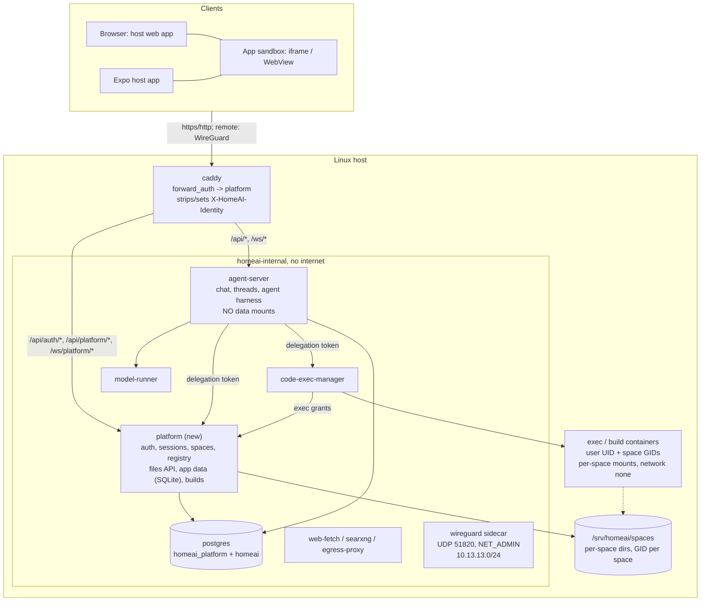

# Platform design (Stage 3: the agentic OS)

Stage 3 turns the single-user, trusted-LAN chat + files tool into a small
**agentic operating system** for a household or small business: several
people, each with private and shared data, running apps that the agent
builds for them by chat — and every app is *agent-native*: anything the UI
can do, the agent can do through the same enforced interface.

This document is the binding contract for Stage 3 (milestones M10–M15), the
same way [`ARCHITECTURE.md`](ARCHITECTURE.md) is for what's already built.
When a ticket and this document disagree, fix one of them explicitly in the
PR — don't silently diverge. As pieces land, their as-built details move into
`ARCHITECTURE.md`; this file keeps the design, the decisions, and the
contracts that span services.

Sections:

1. [Goals and principles](#1-goals-and-principles)
2. [Decision record](#2-decision-record)
3. [Target architecture](#3-target-architecture)
4. [Identity and auth](#4-identity-and-auth)
5. [Spaces and storage](#5-spaces-and-storage)
6. [The agent and code execution under delegation](#6-the-agent-and-code-execution-under-delegation)
7. [Apps](#7-apps)
8. [Remote access](#8-remote-access)
9. [Security invariants](#9-security-invariants)
10. [Roadmap](#10-roadmap)
11. [Risks and open items](#11-risks-and-open-items)

---

## 1. Goals and principles

- **Local, private, free for the self-hoster.** Everything runs on the box.
  Someone self-hosting must never need to pay for or depend on a third-party
  service: no required domain, no required cloud relay, no required app-store
  account on their side. (The maintainer may pay for things like an Apple
  developer account to publish the host app.)
- **Agent-native apps, full parity.** Every app's data and actions are
  reachable by the user's agent through the same platform API the UI uses.
- **Enforcement below the agent.** Permissions are enforced by the platform
  service, the kernel (UIDs/GIDs, mounts), and the network — never by the
  prompt or by code the model controls. The agent is never a principal of its
  own: it acts *as* the user, with at most the user's permissions.
- **Standards over inventions.** The model is a small local one; wherever it
  touches the platform we use the most common real standard its training
  already covers (SQL/SQLite, expo-sqlite's API, React Native, expo-router
  conventions, Expo module APIs, `AGENT.md`), not a custom DSL.
- **Domain optional.** Everything works on the LAN with no domain. A domain
  unlocks browser passkeys, real certificates, and the opt-in public mode.
- **The core cannot be modified by the agent.** Platform code lives only in
  images; nothing the agent or an app writes is ever executed by a core
  service.

## 2. Decision record

Decisions made in the Stage 3 design discussion. Each is binding unless a PR
explicitly revisits it (and updates this list).

| # | Decision |
|---|---|
| D1 | **Users**: household / small business (≈2–20 people), mostly on the LAN. Two roles: `admin` and `member`. Design for real isolation between users; tier-3 concerns (quotas, GPU fair-share, abuse handling) are out of scope. |
| D2 | **Spaces** are the only sharing primitive. Every file and every app instance lives in exactly one space. Each user has a personal space; shared spaces have members with roles `owner` / `editor` / `viewer`. "Share with B but not C" = a space with A and B. No per-row ACLs. |
| D3 | **Merged views** are read-time only (SDK / platform fan-out); every write targets exactly one space. |
| D4 | **Content in shared spaces is untrusted input** to other members' agents (prompt injection). Destructive agent actions in shared spaces require HITL approval by default. |
| D5 | **Identity**: no-domain mode = password (+ optional TOTP) for browsers; domain mode adds browser passkeys. Native app = **device pairing** (hardware-backed key pair enrolled via QR on the LAN). Enrollment of new devices/users is LAN-or-VPN only. |
| D6 | **Delegation**: every agent run carries a platform-minted delegation token bound to the user's session. The model never sees it. **An admin's agent gets member-level powers**; admin actions need the UI plus a fresh step-up. |
| D7 | **Platform service split**: a new `platform` service owns auth, spaces, the app registry, and all user storage. `agent-server` loses its data mounts and becomes a client of the platform API. |
| D8 | **App UI runtime**: user apps are React Native code compiled server-side and run in a **sandbox** — a sandboxed iframe on web, a WebView (react-native-web) on native. The sandbox holds no credentials; all I/O is RPC over a bridge that the host forwards to a fixed app instance. |
| D9 | **Option B stays open**: app code may only use React Native primitives, an allowlist of Expo-API-compatible modules, and `@homeai/sdk` — never DOM/web APIs — so the same code can later run natively for trusted apps. New capabilities are added by growing the SDK/shim allowlist. |
| D10 | **App data**: **SQLite, one file per app instance**, in the space's directory. Core data (users, spaces, registry, chat threads/checkpoints) stays in Postgres. No MongoDB. |
| D11 | **Plain SQL everywhere**: app code uses an expo-sqlite-shaped async API; schema is a plain `schema.sql` of `CREATE TABLE` statements; migrations are *computed* by diffing — the platform's own stdlib differ (M12-01 rejected `sqlite3def`: it silently skips type/constraint changes) — and classified additive / safe (auto) vs destructive (approval + snapshot). |
| D12 | **The platform is the only writer** of app databases (UI via SDK RPC, agent via `app_sql`/actions). Exec containers get read-only access to app data. |
| D13 | **Cross-app data, phase 1**: the agent is the integration layer (reads across all apps/spaces the user can see). **Phase 2**: apps declare `exports`; other apps declare `reads`; granted at install; read-only via SQLite `ATTACH`; writes via the owning app's exported actions; exports are versioned contracts. |
| D14 | **App source is a git repo per app, run by the platform** (the agent never needs the git CLI). One commit per successful build. History + revert in the UI. *Amended (M13-01, security):* the repo is a bare one in platform-owned storage, never a `.git` in the source folder; it records the staged copy each build makes (§7 "Source history"). |
| D15 | **Live editing**: the author's own install tracks the working copy (hot reload; additive migrations auto; destructive need approval + snapshot). Installs in other spaces pin **published versions**; updates are approved; permission changes re-prompt. Forking = copy into your space. |
| D16 | **Server-side logic v1**: declared SQL **actions** executed by the platform (parameterized, transactional). Sandboxed server functions / scheduled jobs are a later, additive extension. |
| D17 | **System apps** (Chat, Files, Settings/Admin, Home/launcher) use the same package format (manifest, `AGENT.md`, actions) with privileged capabilities only grantable to image-shipped apps; they render natively in the host app and are read-only to the agent. |
| D18 | **Agent file paths**: `/personal/...` and `/spaces/<slug>/...`. |
| D19 | **Remote access**: WireGuard is the default remote mode; opt-in public HTTPS (domain required, passkey-only when public); WireGuard embedded in the host app later. |

## 3. Target architecture



### New and changed services

- **`platform`** (new, Python 3.12 + FastAPI + uv, same conventions as
  `agent-server`; `services/platform/`; internal port `8100`;
  `homeai-internal` only). Owns the `homeai_platform` Postgres database and
  the `SPACES_DIR` host tree. Runs as root inside its container with
  `cap_drop: [ALL]` and `cap_add: [CHOWN, DAC_OVERRIDE, FOWNER, FSETID]`
  (it is the trusted kernel that assigns file ownership per user/space;
  `FSETID` lets it set the setgid bit on directories whose group it isn't
  in — without it the kernel silently drops the bit), read-only root
  filesystem.
- **`agent-server`**: keeps chat, threads, checkpoints, settings, the agent
  harness. Loses `${FILES_DIR}` (M11). Verifies identity JWTs; obtains
  delegation tokens; file tools go through the platform files API.
- **`code-exec-manager`**: requires a delegation token per call; asks the
  platform for *exec grants* (UID, GIDs, mounts) instead of mounting one
  shared files dir.
- **`caddy`**: `forward_auth` to the platform for every authenticated route.
- **`db-init`** (new, one-shot): idempotently creates Postgres roles and
  databases (`platform` role + `homeai_platform` DB; since M11-04 the
  non-superuser `agent` role that owns agent-server's tables) using the
  superuser credentials. Needed because the Postgres
  image only runs init scripts on an empty volume.

### HTTP routing (Caddy)

| Path | Upstream | Auth |
|---|---|---|
| `/api/auth/*` | `platform:8100` | none (login, setup, invite accept, status) |
| `/api/health` | `agent-server:8000` | none (liveness for scripts and monitors) |
| `/api/platform/*` | `platform:8100` | `forward_auth` |
| `/ws/platform/*` | `platform:8100` | `forward_auth` |
| `/api/*` (everything else) | `agent-server:8000` | `forward_auth` |
| `/ws/*` (everything else) | `agent-server:8000` | `forward_auth` |
| `/ca.crt` (http only), static web bundle | caddy | none |

Caddy **removes any client-supplied `X-HomeAI-Identity` header** before
routing, and `forward_auth` (`uri /internal/auth/verify`,
`copy_headers X-HomeAI-Identity`) sets it from the platform's response. The
platform's `/internal/*` routes are never routed by Caddy.

## 4. Identity and auth

### Users, sessions, bootstrap

- `users`: `id uuid`, `username` (unique, lowercase), `display_name`,
  `role` (`admin`|`member`), `uid int` (unique, allocated from 20000),
  `password_hash` (argon2id), `totp_secret` (nullable), `disabled_at`,
  `created_at`.
- `sessions`: opaque random token (`hs_` + 32 bytes urlsafe base64),
  **stored hashed** (SHA-256); `user_id`, `device_label`, `created_at`,
  `last_seen_at`, `expires_at` (sliding, 30 days), `stepped_up_until`,
  `revoked_at`. Web: `homeai_session` cookie (HttpOnly, SameSite=Lax, Secure
  on https). Native: session-creating endpoints called with
  `X-HomeAI-Client: native` return the token in the body instead of a
  cookie; the client sends `Authorization: Bearer hs_...` (token kept in
  `expo-secure-store`). WebSockets from browsers use the cookie.
- **Bootstrap**: until the bootstrap admin exists
  (`platform_state.bootstrap_admin_id`), the platform keeps a one-time
  **setup code** (reused across restarts until used), logs it, and writes it
  to `/data/platform/setup-code` (readable on the host via
  `docker compose exec platform cat ...` or the log). `POST /api/auth/setup`
  requires it; it creates the first admin, records `bootstrap_admin_id`, and
  is then permanently disabled. Users created by the recovery CLI don't
  count — the setup code stays valid until someone uses it.
- **Recovery CLI** (physical-access path; host Docker = root):
  `docker compose exec platform python -m app.cli
  {create-user,reset-password,set-role,disable-user,enable-user,list-users}`.
  It uses the image's venv Python directly (not `uv run`, which needs a
  writable root).
- **Invites**: admins create single-use, 7-day invite tokens
  (`POST /api/platform/admin/invites` → URL/QR). Accepting creates a member
  and a session. Invite accept, device enrollment (`POST` wireguard-devices),
  bootstrap setup, and `/api/platform/admin/*` are **LAN/VPN-only**
  (`403 public_origin`; M15-02). Public HTTPS (M15-05) does not invent a
  second policy.
- **Step-up**: admin endpoints require `act=user`, `role=admin`, and
  `stepped_up_until > now` (re-enter password, or passkey in domain mode;
  5-minute window).
- Login attempts are rate-limited per username and per client IP.

### Identity token (Caddy → services)

`GET /internal/auth/verify` (called by Caddy `forward_auth`) validates the
session cookie/bearer and returns `200` with `X-HomeAI-Identity: <JWT>`, or
`401`.

- Algorithm **EdDSA (Ed25519)**; key pair generated on first start and kept
  in the `platform-data` volume. Public keys served at
  `GET http://platform:8100/internal/jwks` (JWKS). Services cache the JWKS
  and re-fetch on unknown `kid`.
- Claims: `iss="homeai-platform"`, `aud="homeai"`, `sub=<user_id>`,
  `sid=<session_id>`, `role`, `act="user"`, `iat`, `exp` (+5 min), `kid`.
- Downstream services **must verify** signature, `iss`, `aud`, `exp` — never
  trust the header unverified.
- The platform's own `/api/platform/*` routes resolve the caller from
  `X-HomeAI-Identity` (must be `act="user"`) or, only when that header is
  absent, `Authorization: Bearer <JWT act="agent">`; opaque `hs_` tokens are
  accepted only by `/internal/auth/verify` and `/api/auth/*`. Role and
  step-up state are always read from the database.

### Delegation token (agent runs)

- `POST /internal/delegations` (service-authenticated, see below) with
  `{identity_token, thread_id}` → `{token, expires_at}`. Same key and format
  as the identity token, with `act="agent"`, `thr=<thread_id>`, `exp` +15
  min. `POST /internal/delegations/refresh` with a still-valid-or-recent
  (expired < 5 min) delegation renews it **only while its `sid` session is
  active**. (Contract details: `docs/ARCHITECTURE.md` §3 "Delegation
  contract".)
- Every platform request authorized by a delegation re-checks that the
  session is not revoked/expired and the user is not disabled.
- `act="agent"` tokens are **always rejected** by admin endpoints and by
  auth/session-management endpoints, regardless of `role`.
- The token lives in the LangGraph run config (`configurable["delegation"]`)
  — never in the prompt, messages, or tool arguments. It's held there as an
  object rather than a bare string like `hitl_enabled`, because LangGraph
  copies primitive `configurable` values into the checkpoint metadata it
  stores; the token must not be persisted.
- A chat socket exchanges its identity token once, at connect (the
  identity token lives 5 min, a socket much longer), then refreshes the
  delegation at every turn start and every resumed run (HITL
  approve/reject), and in the background while it's open. So a resume
  on the same socket gets a fresh delegation for the approver, who is
  that socket's user and must own the thread; a resume from a new socket
  exchanges that socket's identity token.

### Service-to-service auth

Internal endpoints (`/internal/*` other than `jwks` and `auth/verify`)
require `Authorization: Bearer <service token>`: `PLATFORM_AGENT_TOKEN`
(agent-server) and `PLATFORM_EXEC_TOKEN` (code-exec-manager), random secrets
in `.env`. Each token only unlocks the internal endpoints that service needs.

## 5. Spaces and storage

### Model

- `spaces`: `id uuid`, `slug` (unique, `^[a-z0-9][a-z0-9-]{0,39}$`),
  `name`, `kind` (`personal`|`shared`), `gid int` (unique, allocated from
  30000), `owner_user_id` (personal), `created_at`, `archived_at`.
  Slugs are immutable and share one namespace across personal and shared
  spaces; `personal` and `spaces` are reserved. A personal space's slug is
  derived from the username (collision-safe) and is only an identifier —
  its virtual path is always `/personal`.
- `space_members`: `(space_id, user_id, role in owner|editor|viewer)`.
  Personal spaces have exactly one member (the user, `owner`), and cannot
  gain members. A shared space always keeps at least one owner. Any member
  can see the member list; only owners change it.
- One authorization helper, `authorize_space(principal, space, need)`
  (`read` = viewer, `write` = editor, `manage` = owner), decides access to
  a space and its data; non-members get `404`. Agent delegations get
  their user's `read`/`write` but never `manage`. A stepped-up admin may
  list every space and manage any shared space's membership, but gains no
  access to space data.
- Membership is the only sharing primitive. Removing a member revokes access;
  data stays with the space. Deleting a user archives their personal space.
  Moving data between spaces is an explicit copy/move action.

### Virtual paths (UI, API, agent file tools)

```text
/                         -> lists "personal" and "spaces"
/personal/...             -> the caller's personal space files
/spaces/<slug>/...        -> a shared space's files (members only)
```

Exec containers see the same tree under `/files`
(`/files/personal/...`, `/files/spaces/<slug>/...`; §6). The `file:` link
convention (M9-03) uses the same virtual paths. Resolution of every virtual
path goes through one guard (the successor of `resolve_files_path`), which
maps it into a space *and* checks membership and role (`viewer` = read-only);
the filesystem is then reached only below that space's open `files/` fd
(see "Race-free access").

### Host layout

```text
${SPACES_DIR}/                       # default /srv/homeai/spaces
  <space_id>/                        # root:<space_gid> 2770 (setgid)
    files/                           # the space's files root
    apps/                            # root:<space_gid> 2750: only the platform writes below here (M12-03)
    apps/<instance_id>/data.sqlite   # app data, platform-only writer (D12); 0600
    apps/<instance_id>/snapshots/    # pre-migration snapshots (0600, newest 10 kept)
    apps/<instance_id>/ro/data.sqlite  # read-only snapshot published for exec (§7 Data), 0444; only ro/ is ever mounted
    apps/.trash/<instance_id>-<stamp>/ # an uninstalled instance's dir, kept as its final snapshot (M12-02)
```

App **source** lives inside the files tree at `/<space>/Apps/<app-slug>/`
(D14, M13) so the agent edits it with its ordinary file tools; `Apps` is a
reserved top-level folder the platform protects from deletion/rename. The
app's git history is kept outside the files tree (§7 "Source history"), so
there is no platform `.git` in it to hide.

> **As built (M12-02):** the files API refuses delete, rename and move of a
> space's top-level `Apps` *directory* with `403 reserved`; copying it and
> everything inside it stay ordinary, and a file or symlink squatting on
> the name can be removed. `Apps` isn't pre-created: users (and agents) may
> `mkdir` it, and registering an app creates it if missing. (M13-01: the
> original "`.git` hidden from every file API" was dropped with the move of
> the repos out of the tree; a `.git` a user makes there is ordinary files.)

Ownership: directories are group-owned by the space GID with the setgid bit;
files created on behalf of a user are owned `user_uid:space_gid`, mode
`0660`/`0770` (exec containers run with `umask 002`). Users/spaces have no
`/etc/passwd` entries on the host — numeric IDs only. Mounts are the primary
boundary; UID/GID permissions are defense in depth.

### Race-free access

Everything below `<space_id>/` is writable by the space's members (and,
since M11-03, everything below `files/` by their exec containers, which
mount only that dir), while the platform acts on it as root.
So **no platform operation on space content may be redirected by a symlink
or directory swapped in between a check and a use**: not a read, write,
mkdir, move/rename (within or across spaces), copy, delete, chown/chmod,
listing, search, media stream, legacy migration step, or app-package walk.

As built (M11-03a), the platform never hands the kernel a path inside a
space. The virtual-path guard only authorizes and gives an escape its early
`422`; every operation then opens the space's `files/` fd (`<root>` is
root-owned and not group-writable; `<space_id>` and `files` are opened
`O_NOFOLLOW` relative to it) and resolves the rest with a component walk on
directory fds (`app/core/beneath.py`): each component opened `O_PATH |
O_NOFOLLOW` relative to its parent's fd, symlinks expanded by the walk
itself — a relative target from the link's directory with `..` popping the
walk's own fd stack (never past the root), an absolute target only if it
names that `files/` dir's own path or below it — and anything that leaves
the root is `EXDEV` (`422 invalid_path`). The operation is then an `*at`
call on the resulting directory fd with `O_NOFOLLOW` on the final name
(`openat`, `mkdirat`, `renameat2`, `unlinkat`, `fchownat(AT_SYMLINK_NOFOLLOW)`),
or `fchown`/`fchmod`/`fstat`/`futimens` on the opened fd; recursive copy,
delete and regroup descend by opening each child `O_NOFOLLOW` relative to
its parent's fd, and links inside a tree are recreated or re-owned as links,
never followed. Downloads and thumbnails are served from the opened fd
(`/proc/self/fd/<n>`), never by path. A walk (not `openat2(RESOLVE_BENEATH)`)
because `RESOLVE_BENEATH` refuses all absolute symlinks, which the files API
follows while they stay inside the space, and it would need a second code
path wherever `openat2` is unavailable or filtered by seccomp.

Nor may a move replace what someone creates at its destination after the
existence check (#184): every move/rename in a space, and each legacy
migration step, is `renameat2(..., RENAME_NOREPLACE)` (`fsops.rename_noreplace`,
a `ctypes` call into libc, glibc >= 2.28). A destination that appeared in
between is `EEXIST`, the same `409 already_exists` the check gives; the legacy
migration picks the next free name instead. Without `renameat2` a move
fails (`ENOSYS`, `500`) rather than fall back to a plain `rename`.

### Legacy migration

On the switch to the platform files API (M11-01), the pre-Stage-3 files root
(`FILES_DIR`, mounted read-write into the platform at `/data/legacy-files`)
is moved into the **bootstrap admin's personal space** `files/`, chowned,
and a marker file prevents re-running. Idempotent and logged. It runs only
with `PLATFORM_MIGRATE_LEGACY_FILES=1`, which compose sets since M11-02
moved the agent onto spaces, and waits until bootstrap has completed
(details: `docs/ARCHITECTURE.md` §2 `platform`).

Pre-Stage-3 chat threads (no owner) and the old global chat settings are
assigned to the bootstrap admin earlier, from M10-04: agent-server asks
`GET /internal/bootstrap-admin` (service token `PLATFORM_AGENT_TOKEN`)
until bootstrap has completed, then adopts them once (idempotent, logged).
Until then they're visible to nobody.

## 6. The agent and code execution under delegation

- **File tools**: a custom deepagents backend (`PlatformFilesBackend`)
  implements `deepagents.backends.protocol.BackendProtocol` (`ls`, `read`,
  `write`, `edit`, `delete`, `grep`, `glob`, uploads/downloads, and their
  async variants) over the platform files API. `deepagents==0.7.11` takes a
  single backend instance (no per-run factory), so the backend reads the
  run's delegation token from the in-flight run config via
  `langgraph.config.get_config()["configurable"]` on every call — the same
  mechanism the HITL `when` predicate already relies on — and fails closed if
  it's absent. `FilesystemBackend` and the
  files mount are removed from `agent-server`.
- **Exec**: `agent-server` passes the delegation to `code-exec-manager`,
  which calls `POST /internal/exec-grants` → `{uid, gids[], mounts:
  [{host_path, container_path, read_only}]}`. Containers keep every existing
  hardening flag (`network_mode: none`, `cap_drop: ALL`, read-only root,
  limits) and additionally run as `uid` with `group_add: gids`. Session key
  = thread id; a container is recreated if its grants (user, memberships,
  roles) no longer match.

> **As built (M11-03):**
> - `POST /internal/exec-grants` (service token `PLATFORM_EXEC_TOKEN`, body
>   `{"delegation": ...}`) returns `{uid, gid, gids, mounts}`. `gid` is the
>   personal space's gid (the container's primary group); `gids` lists
>   every member space's gid, personal first. Mounts are
>   `${SPACES_HOST_DIR}/<space_id>/files` → `/files/personal` or
>   `/files/spaces/<slug>`, with `read_only` for a viewer. Compose sets
>   `SPACES_HOST_DIR` from `SPACES_DIR`; left empty, every call is refused.
>   A space whose `files/` isn't a plain directory is left out.
> - `code-exec-manager` verifies the delegation (platform JWKS, `act=agent`)
>   on ensure, execute and delete, and requires its `thr` to equal the
>   session id (403 otherwise). It fetches the grants on ensure and execute
>   and runs the container with `user=<uid>:<gid>` and
>   `group_add=<the other gids>`. Binds are `--mount type=bind`, so a
>   missing source fails instead of being created. Nothing else is mounted
>   and every other hardening flag is unchanged. Labels `homeai.user` and
>   `homeai.grants` (a digest) are compared on every ensure *and* execute:
>   a container labelled for another user is refused (403) by ensure,
>   execute and delete and left alone; otherwise a mismatch recreates it. Commands run under `umask 002`, so
>   exec-created files are `uid:space_gid` 0664 and dirs 2775.
> - The manager no longer mounts `FILES_DIR` or reads
>   `HOMEAI_UID`/`HOMEAI_GID`.
- **Threads** are owned by a user (`owner_user_id`); every chat REST/WS
  endpoint checks ownership from the verified identity. (Shared-space
  threads are a later extension.)
- **Postgres roles**: `agent-server` connects with a non-superuser role that
  can reach only its own database; the platform has its own role/DB.

> **As built (M11-04):**
> - The role is `agent` (`AGENT_DB_PASSWORD`). `db-init` gives it
>   `CONNECT`/`TEMPORARY` on `homeai` and `USAGE`/`CREATE` on `public`, and
>   hands it every object in `public` it doesn't own yet — on an existing
>   volume, the tables agent-server and LangGraph created as the superuser.
>   The database itself stays the superuser's. `PUBLIC` loses `CONNECT` on
>   `homeai`, `homeai_platform`, `postgres` and `template1`. agent-server
>   starts only after `db-init` succeeds.
> - `agent-server` and `platform` run with read-only roots and a `/tmp`
>   tmpfs; agent-server also drops every capability.
> - `scripts/verify_tenancy.sh` checks §9 invariants 1-7 (`docs/ARCHITECTURE.md`
>   §5 "Tenancy verification").

> **As built (#194): row-level security under the ownership checks.**
> - agent-server's startup DDL enables and **forces** RLS (forced, because
>   `agent` owns the tables and owners otherwise bypass it) on `threads`,
>   `user_settings`, `checkpoints`, `checkpoint_blobs`, `checkpoint_writes`,
>   `turn_stats` and the legacy `settings`. Policy `owner_only` admits a row
>   for reading and writing only while `app.user_id` names its owner:
>   `threads.owner_user_id` / `user_settings.user_id` directly, and the
>   thread-keyed tables by `thread_id` being one of that user's threads.
>   `settings` has no policy, so it's invisible. `checkpoint_migrations`
>   holds no user data and has none.
> - `app.user_id` comes from the verified identity: the REST dependency
>   and the chat socket bind it per request/socket (a context variable
>   inherited by the turn's tasks), and agent-server's `RlsConnectionPool`
>   sets it with `set_config(..., false)` on each checkout and a `reset`
>   hook clears it before the connection rejoins the pool. (`SET LOCAL`
>   isn't usable: the pool is autocommit and LangGraph's saver issues its
>   own statements.) With nothing bound, a connection sees and writes
>   nothing.
> - The one bypass is role `agent_rls_bypass` (`db-init`, `NOLOGIN
>   BYPASSRLS`, SET-only membership for `agent`), used inside one
>   transaction (`SET LOCAL ROLE`) to hand ownerless pre-Stage-3 threads
>   and the legacy settings to the bootstrap admin (§5 "Legacy
>   migration"). Startup DDL and LangGraph's migrations need no bypass.
> - Thread delete removes checkpoints and stats before the `threads` row,
>   since they're only visible while it exists.
> - **Scope:** defence in depth against an agent-server code path that
>   misses an ownership check. It is *not* a boundary against a
>   compromised agent-server, which owns the tables, chooses
>   `app.user_id`, and can use the bypass role.
> - Cost: +2–8 ms per chat turn (a fake-model turn on a thread with a few
>   hundred messages; the budget is 15 ms), from +0.05–0.4 ms on each
>   checkpointer and store query — see `spikes/rls_194/README.md`. `scripts/verify_tenancy.sh` checks 26-28
>   cover it live.
- **Model**: all users share one `model-runner`; llama.cpp queues requests.
  No fair-share scheduling in this stage (D1).

## 7. Apps

> The runtime details below were validated (and amended) by the M12-01
> spike; measurements and rationale are in
> [`spikes/app_runtime.md`](spikes/app_runtime.md). The on-device Expo Go
> check is a maintainer step before G12.

### Package format (standards-shaped, D11)

```text
<app-slug>/
  app.json          # Expo-style manifest: {"name", "slug", "version", "homeai": {...}}
  AGENT.md          # what the app does, data model, conventions — for the agent
  schema.sql        # desired schema: plain SQLite CREATE TABLE / INDEX statements
  actions/*.sql     # named, parameterized SQL actions (:named params), one per file
  app/              # expo-router-style screens: _layout.tsx, index.tsx, item/[id].tsx
```

`app.json`'s `homeai` block: `sdk` (SDK version), `icon` (vector-icon name),
`permissions` (e.g. `{"net": ["api.weather.gov"]}`, added as capabilities
grow), `exports` / `reads` (phase 2, D13). Validated against a JSON Schema
the platform publishes.

> **As built (M12-02)** — schema and package rules in `ARCHITECTURE.md` §3
> "Apps". Where it narrows the text above: `sdk` is a string (`"1"` is the
> only one); `homeai` also takes an optional `description`, and unknown
> `homeai` keys are rejected while other top-level (Expo) keys are ignored;
> SDK 1 user-app permissions must be `{}` (or omitted); `permissions.privileged`
> is only on the image-shipped schema (M14-03). `exports` is an array of
> `{name, version, tables, actions?}` (omit or `[]` if the app shares nothing);
> `reads` is `{app, export, version}` targeting another app's slug. Changing an
> export's tables or columns without bumping `version` is a validate/build
> diagnostic. Diagnostics are `{file, path (JSON pointer), message}`. Route names
> are `^[A-Za-z0-9][A-Za-z0-9_-]*$` segments, and a `[...rest]` catch-all
> must be a file.

### Allowed imports (D9)

`react`, `react-native` (all of react-native-web's exports), `expo-router`
(shim: `Stack` + `Stack.Screen`, `Slot`, `Link`, `router` / `useRouter`,
`useLocalSearchParams`, `useGlobalSearchParams`, `usePathname`),
`expo-sqlite` (shim bound to this instance's database), `@homeai/sdk`, and
a growing allowlist of Expo-compatible shims. Relative imports must resolve
inside the app directory (symlinks included). Anything else — including
`react-dom`, `fs`, `window`, `document`, raw `fetch` — fails the build:
imports in the bundler's allowlist plugin (file:line:col), DOM globals in
the type-check (no `dom` lib).

Routes: only `.ts`/`.tsx` files under `app/`, segments `name`, `index`,
`[param]`, `[...rest]`, and a root `app/_layout.tsx`. Groups, nested
layouts, tabs and modals are not in the shim yet and are rejected with a
diagnostic until added.

### `@homeai/sdk` (the only platform-specific surface; keep it tiny)

- `useDatabase()` → expo-sqlite-shaped: `getAllAsync(sql, params)`,
  `getFirstAsync`, `runAsync`. `withTransactionAsync(fn)` is deferred: over
  RPC it needs a server-side transaction lease; multi-statement atomic
  writes use `runAction` (actions are transactional, D16).
- `useQuery(sql, params)` → `{ data, error, loading, refresh }`, re-runs when
  the platform reports a change to the instance's database.
- `runAction(name, params)`; `useSpace()` → `{ id, slug, name, role }`.
- `askAgent(prompt)` — opens the host's agent panel with that prompt
  (M13-04; a host-local bridge method, never the instance RPC).
- Later: cross-instance reads, capability shims.

> **As built (M12-05)** — `packages/homeai-sdk/` holds everything
> SDK-versioned: the sandbox runtime (`src/runtime.tsx`, `bridge.ts`,
> `sdk.ts`, `router.tsx`), the app typings (`types/homeai.d.ts`), the
> allowed modules (`modules.json`, which the builder's import allowlist and
> the runtime's `require` both read), the runtime build options
> (`build.mjs`), and the host library `@homeai/sdk/host` (below). The
> builder image and the Caddy image each build the runtime from it. Beyond
> the text above: `getAllAsync` / `getFirstAsync` / `runAsync` / `useQuery`
> take expo-sqlite's three bind forms — a list, an object for `:x` / `$x` /
> `@x` names, or values one by one; `runAction` resolves to `{changes,
> lastInsertRowId, rows}` (the last result set's rows); every rejection
> carries a `code` (the platform's, e.g. `sql_error`, or the host's, e.g.
> `read_only`, `timeout`), typed as `SDKError`. `useQuery` keeps one query
> in flight per hook and folds changes that arrive meanwhile into one
> re-run, and a write from the sandbox (`runAsync`, `runAction` with
> `changes > 0`) refreshes that sandbox's queries without waiting for the
> platform's event. `useSpace()` is the host's `space` from the sandbox
> config at first render, then any `space` event. `askAgent(prompt)` is
> host-local `agent.ask` (M13-04). The `expo-sqlite` shim is
> `useSQLiteContext`, `openDatabaseAsync`, `SQLiteProvider` over the same
> database; `withTransactionAsync` stays out (it throws, and it isn't in the
> typings).

### Runtime and bridge

- **Runtime bundle**: one IIFE per SDK version (≈468 KB, ≈146 KB gzip),
  cacheable forever: React + `react-dom/client` + react-native-web (all
  exports) + the expo-router shim + `@homeai/sdk` + the `expo-sqlite` shim +
  the bridge. It registers the allowlisted modules and refuses any other
  `require`.
- **App bundle**: esbuild CJS body (es2020, automatic JSX) wrapped as
  `__homeai_define(function (require, module, exports) {…})`, exporting
  `{ routes, layout }` from a route table generated at build time from
  `app/**`. Externals are exactly the allowed imports. A few KB; the source
  map is kept with the version artifact (for diagnostics), not shipped.
- **Sandbox document**: one HTML string — CSP `<meta>` + config + runtime +
  app, all inline — used as the iframe `srcdoc` on web and as WebView
  `source={{ html }}` on native. CSP: `default-src 'none'; script-src
  'unsafe-inline'; style-src 'unsafe-inline'; img-src data: blob:; font-src
  data:; connect-src 'none'; form-action 'none'; base-uri 'none'`. The CSP is
  required: without it the opaque-origin sandbox still can't read
  credentials, but it can send requests.
- Web: `<iframe sandbox="allow-scripts">` (no `allow-same-origin`, opaque
  origin, no cookie/storage access). The host removes the iframe if it fires
  a second `load` (the frame navigated itself; see §11). Native:
  `react-native-webview` 13.16.1 (the version Expo SDK 57 / Expo Go
  bundles) with `originWhitelist={['*']}` plus `onShouldStartLoadWithRequest`
  allowing only `about:*` — the default whitelist hands non-matching URLs to
  `Linking.openURL` — and multiple windows, DOM storage, cache, file access
  and third-party/shared cookies off.
- **Bridge envelope v1** (always a JSON string — WebViews only carry
  strings): `{homeai:1, kind:'req', id, method, params}`,
  `{homeai:1, kind:'res', id, ok, result | error:{code, message}}`,
  `{homeai:1, kind:'evt', event, data}`. Sandbox → host:
  `ReactNativeWebView.postMessage(s)` in a WebView, else
  `parent.postMessage(s, '*')` (host checks `event.source`). Host → sandbox:
  `iframe.contentWindow.postMessage(s, '*')` on web;
  `injectJavaScript("window.__homeaiReceive(<s>);true;")` on native (the
  WebView's own `postMessage` dispatches on `document` on Android but
  `window` on iOS, so it is not used). Events: `db.changed`, `bundle.load`,
  `space` (host → sandbox); `runtime.ready`, `runtime.error`, `nav.changed`
  (sandbox → host).
- **The sandbox holds no credentials.** It can only send RPC requests
  (`db.getAll`, `db.getFirst`, `db.run`, `action`, and host-local
  `agent.ask`). The host checks the
  envelope and the method allowlist (viewers: no `db.run`/`action`) and
  forwards the database methods to `/api/platform/apps/instances/<instance_id>/rpc` — the
  instance id is fixed by the host when it opens the sandbox, never taken
  from the message — using the host's own session. The platform authorizes
  against the user's role in the instance's space.
- Change events (for `useQuery` and hot reload) come from
  `/ws/platform/events` and are relayed into the sandbox by the host. Hot
  reload = `bundle.load` with the new app bundle: the runtime re-evaluates it
  and re-renders, keeping the navigation stack (component state is not
  preserved).

#### Bridge protocol (v1)

Types: `packages/homeai-sdk/src/protocol.ts`. A message is one JSON string
of at most 2^20 UTF-16 units; either side drops anything that doesn't parse
as a v1 envelope (`homeai: 1`; `req`/`res` with an integer `id`, `req` with
a string `method`, `evt` with a string `event`).

| Sandbox → host `req` | `params` | `result` |
|---|---|---|
| `db.getAll` | `{sql, params}` | `[{column: value}]` |
| `db.getFirst` | `{sql, params}` | `{…} \| null` |
| `db.run` | `{sql, params}` | `{changes, lastInsertRowId}` |
| `action` | `{name, params: {…}}` | `{changes, lastInsertRowId, rows}` |
| `agent.ask` | `{prompt}` | `{}` — host-local (M13-04): open the runner's agent panel. Not forwarded to the instance RPC. Viewers may ask. |

`params` of the `db.*` methods is a list (`?` placeholders) or an object
(named); values and results are as in the platform's RPC
(`ARCHITECTURE.md` §3 "App data": a BLOB comes back as `{"$blob":
base64}`). A failure is `ok: false, error: {code, message}`: `code` is the
platform's `detail` (`sql_error`, `sql_not_allowed`, `too_many_rows`,
`unknown_action`, `not_found`, …, or `http_<status>` without one), or the
host's own: `method_not_allowed` (not in the table), `read_only` (a viewer's
`db.run` / `action`), `bad_request` (params of the wrong shape, `sql` over
100 KiB), `busy` (more than 32 requests in flight), `unavailable` (the
platform unreachable), `host_error`. The sandbox adds `timeout` (no answer
in 15 s).

| Event | Direction | `data` |
|---|---|---|
| `db.changed` | host → sandbox | `{}` — re-run live queries (the host sends it for this instance's `db_changed` and on every events `ready`, since nothing is replayed) |
| `bundle.load` | host → sandbox | `{code}` — a new app bundle; the runtime evaluates it and re-renders on the current route |
| `space` | host → sandbox | `{id, slug, name, role}` |
| `runtime.ready` | sandbox → host | `{version, renderMs}` — after each (re)mount's commit |
| `runtime.error` | sandbox → host | `{message, stack, componentStack}` |
| `nav.changed` | sandbox → host | `{path}` |

The sandbox config (`window.__homeai_config`, in the document) is
`{initialPath?, space?}`.

> **As built (M12-05)** — the host side is the library
> `@homeai/sdk/host` (DOM-free, so the native host can use it as is;
> `tsconfig.host.json` type-checks it without the DOM lib):
> `createBridgeHost({send, forward, readOnly, onEvent})` applies the rules
> above and rebuilds `params` from their known fields only, so nothing in a
> message can name an instance or a URL; `platformForward(instanceId,
> {baseUrl, fetch, headers})` is the `forward` that maps the methods onto
> `POST /api/platform/apps/instances/{id}/rpc` with the host's own
> credentials; `platformEventRelay({instanceId, appId, host, reload})`
> turns `/ws/platform/events` frames into `db.changed` / `bundle.load` (the
> caller owns the socket); `sandboxDocument({runtime, app, config})` builds
> the document (CSP first; `</script` can't appear in the inline scripts;
> the config JSON has `<` escaped); `injectScriptFor(wire)` is native's
> `send`. `@homeai/sdk/host/web`'s `mountSandboxFrame(container, …)` is the
> web transport: the iframe, the `event.source` check, and removal on a
> second `load`. The host holds messages it sends until the sandbox has
> sent its first one (before that the frame's window may still be the
> initial `about:blank`, and a message would be lost). Deviations:
>
> - **The platform serves the parts, not an assembled page.** The runtime
>   is static at `/app-runtime/<sdk>/runtime.js` (Caddy, public: it holds
>   no data; `Cache-Control: no-cache`, so hosts revalidate by ETag), the
>   app bundle is `GET /api/platform/apps/instances/{id}/bundle`
>   (`ARCHITECTURE.md` §3 "App runtime"), and the host builds the document
>   with `sandboxDocument`. The document has to be an inline string anyway
>   (`srcdoc`, `source={{ html }}`), and an HTML page served from the
>   platform's own origin would run app code with the session if someone
>   opened its URL directly.
> - The envelope is the M12-01 spike's `{homeai: 1, kind, id, method,
>   params}`, not the issue's `{v, id, op, args}`.
> - The RPC's `transaction` op isn't a bridge method (it is the shape
>   `withTransactionAsync` would need; deferred with it).
> - Hot reload is in the host library (`app_built` for the instance's app →
>   `fetchBundle` → `bundle.load`); wiring it into the frontend is M12-06.

> **As built (M12-06)** — the app host is in `services/frontend`
> (`ARCHITECTURE.md` §3 "App host"): an **Apps** tab (installed instances
> grouped by space; M14-02 turned this into the Home launcher) and a runner
> at `/apps/<instance_id>`. The runner fixes the instance id from the route
> and uses `@homeai/sdk/host` unchanged: `platformForward(instanceId)` is the
> only `forward` either transport gets, `readOnly` is the user's role in the
> instance's space as the platform reports it, and the runner owns a
> `/ws/platform/events` socket feeding `platformEventRelay` (so `db_changed`
> re-runs live queries and `app_built` hot-reloads). A `runtime.error` covers
> the sandbox with an error overlay (message, **Reload**, **Dismiss**);
> `runtime.ready` clears it. Deviations:
>
> - **No instance lookup endpoint.** The platform lists instances per space
>   (`GET /spaces/{id}/instances`), so the Apps tab asks every live space,
>   and the runner finds its instance (and so its space and the user's role)
>   the same way rather than trusting anything in the link. A
>   `GET /apps/instances/{id}` would save the fan-out; not needed yet.
> - **Reload is a fresh sandbox**, not `bundle.load`: it re-fetches the
>   bundle and runtime and remounts the frame or WebView, so an app whose
>   error left the runtime itself broken comes back too.
> - **Native doesn't kill the WebView** on a navigation attempt:
>   `onShouldStartLoadWithRequest` refuses it before any request is made,
>   and the app keeps running. The web frame, which can't be stopped from
>   navigating, is removed (library behaviour) and the overlay says so.
> - **One events socket per open runner**, not one per app session: it
>   reconnects with backoff (1 s → 30 s), and a rejected or `4401`-closed
>   socket asks the platform whether the session still holds, as the chat
>   socket does. A failed hot-reload fetch keeps the running version.
> - **A missing role is read-only**: `readOnly` is on unless the user is an
>   owner or editor of the space (the platform refuses writes regardless).
> - The frontend depends on the package as `"@homeai/sdk":
>   "file:../../packages/homeai-sdk"`; `metro.config.js` watches the package
>   and resolves its imports from the frontend's `node_modules`, and the
>   Caddy image's frontend stage keeps the repo layout so the lockfile's
>   link resolves. `react-native-webview` is 13.16.1 (`npx expo install`,
>   the version Expo Go for SDK 57 bundles). The on-device Expo Go check is
>   in `HOST-CHECKS.md` (M12).

### Data (D10–D12)

- One SQLite database per instance (WAL mode). All writes go through the
  platform. Queries are executed on a connection that has only that
  instance's database open (plus read-only `ATTACH`es for granted exports in
  phase 2) — scope is physical, not parsed.
- **Migrations**: on build, the platform runs `schema.sql` into a scratch
  in-memory database under a SQLite authorizer that permits only CREATE
  TABLE / CREATE INDEX, and diffs it against the live database (`PRAGMA
  table_xinfo` / `foreign_key_list` / `index_list` plus each table's
  normalized column and constraint text). Each step is classified:
  **additive** (CREATE TABLE, ADD COLUMN where SQLite allows it, CREATE
  INDEX) and **safe** (index drop/replace, a table rebuild that only relaxes,
  e.g. a default change) apply automatically; **destructive** (DROP
  TABLE/COLUMN, a rebuild that retypes or tightens — type, NOT NULL, UNIQUE,
  CHECK, FK, PK — and renames, which are drop + add) require approval (UI
  confirm or HITL for the agent) after taking a snapshot (SQLite backup
  API). Changes `ALTER` can't do use the standard table rebuild. The whole
  plan runs in one transaction; `foreign_key_check` and a re-diff that must
  come back empty gate the commit, otherwise it rolls back and returns a
  diagnostic.
- **Exec read-only access (D12)**: exec containers never see the live
  database (WAL `mode=ro` fails whenever the platform has no open
  connection, and a read-only reader can still pin the WAL; `immutable=1` on
  the live file returns corrupt reads). The platform publishes a consistent
  snapshot with `VACUUM INTO` to `apps/<instance_id>/ro/data.sqlite` (temp
  file → fsync → 0444 → atomic rename) when it issues an exec grant, or on
  request if the database changed (at most once per second), mounts only
  that `ro/` directory, and exec opens it with `mode=ro&immutable=1`.
- Viewers get read-only RPC (`db.getAll`/`getFirst`, no `run`/actions).

> **As built (M12-03)** (contract: `ARCHITECTURE.md` §3 "App data"):
> `POST /api/platform/apps/instances/{id}/rpc` takes `getAll`, `getFirst`,
> `run`, `transaction` and `action` (a named `actions/<name>.sql` read from
> the app's source, `:named` params, every statement in one transaction);
> `GET …/migrations`, `POST …/migrate` and `POST …/migrations/{mid}/approve`
> / `reject` drive migrations, with pending ones kept in Postgres
> (`app_migrations`). `/ws/platform/events` emits `db_changed` and
> `app_built`. Scope is enforced by an allow-list SQLite authorizer rather
> than a CREATE-only deny-list, plus `SQLITE_LIMIT_ATTACHED = 0` (raised only
> for granted export ATTACHes) and a leading-keyword check. Deviations:
>
> - **`apps/` is 2750, not 2770.** SQLite reopens a database (and its
>   `-wal`/`-shm`) by the path it was given, and a `/proc/self/fd/N/…` path
>   resolves back to a real one. Pinning the instance dir by fd alone can't
>   stop a group member from swapping files under it, so nobody but root may
>   write below `apps/`. The platform also refuses to open a `data.sqlite`
>   or side file that isn't a regular file. `<space_id>/` itself is still
>   2770; tightening it to 2750 is a follow-up for M11-04.
> - **`ro/` is published after every committed write and migration**
>   (debounced to once a second, trailing), not when an exec grant is
>   issued. Exec grants mount it since M13-02 (below).
> - **Migrations don't run on install**; a successful build migrates each
>   instance tracking `working` to the `schema.sql` it built (destructive
>   plans stay `pending` and are listed in the build response). The approver of a destructive plan is any editor+ of the
>   space. An agent (`act=agent`) needs a HITL marker as well (M13-02,
>   "Agent tools for apps" below).
> - Pinned instances (`tracks: pinned`) get 409
>   `pinned_versions_unsupported` for actions and migrations until published
>   versions exist (M14).
> - `transaction` is a batch of statements run in one transaction, not a
>   lease held across requests; that's the shape `withTransactionAsync` in
>   the shim needs (deferred per the M12-01 spike).
> - Virtual tables (FTS etc.), views and triggers aren't allowed in
>   `schema.sql` yet.

> **As built (M14-04), cross-app exports:** an app may declare `homeai.exports`
> (`{name, version, tables, actions?}`). Readers declare `homeai.reads`
> (`{app` slug, `export`, `version}`). Empty `reads` is auto-granted (`[]`);
> a non-empty list must be sent back as `granted_reads` on a pinned install
> or update (`reads_required` / `reads_mismatch` / `reads_changed`, same
> pattern as permissions). On RPC the platform ATTACHes live instances of
> that slug whose export name+version match, in spaces the caller can read,
> via `/proc/self/fd/…/data.sqlite?mode=ro`, then creates a TEMP VIEW
> `{app}_{export}` (`UNION ALL` of each copy plus `_space`, e.g. `/personal`
> or `/spaces/family`). User SQL still cannot ATTACH (`LIMIT_ATTACHED` is
> only high enough for those copies; the authorizer denies INSERT/UPDATE/DELETE
> off `main` and SELECT/READ off `main` plus the attached export tables and
> views). Writes to another app go through `op: "exportAction"` (`instance`,
> `export`, `name`) which runs that instance's `actions/<name>.sql` and needs
> write on the owning space; ungranted exports are `404 unknown_export`.
> Changing an export's tables or columns without bumping `version` is a
> validate/build diagnostic. Tests: `tests/test_app_exports.py`,
> `tests/test_appdb.py`, `tests/test_manifest.py`.

> **As built (M13-02), exec read-only mounts:** `POST /internal/exec-grants`
> adds one read-only bind per live instance in every space the user is a
> member of, viewers included (the copy is read-only for everyone):
> `${SPACES_HOST_DIR}/<space_id>/apps/<instance_id>/ro` →
> `/app-data/personal/<app-slug>` or `/app-data/spaces/<space-slug>/<app-slug>`,
> holding `data.sqlite`. A second instance with the same app slug in one
> space gets `-<first 8 of its instance id>`. It's a separate root rather
> than a nested bind under the writable `/files` mounts. Code opens it with
> `sqlite3.connect("file:<path>?mode=ro&immutable=1", uri=True)`; it can be
> up to a second behind the live database. An instance whose `apps/`,
> instance or `ro/` dir isn't a plain directory, found by an `O_NOFOLLOW`
> fd walk from the spaces root (`app.core.beneath`), is left out.
> `code-exec-manager` accepts a `/app-data/...` target only read-only.
> The `execute_code` tool description says all this, and `list_apps` prints
> each instance's path.
>
> **As built (M14-05):** those mounts stay a separate `/app-data/...` root
> (not nested under the writable `/files` tree as `/files/.appdata`).
> `scripts/verify_tenancy.sh` check 29 proves A can read its personal
> grocery snapshot, cannot write the mount, B cannot see A's personal
> app-data, and viewer B can read (not write) the shared instance's
> snapshot. `scripts/verify_isolation.sh` does not install grocery; it
> only asserts that if `/app-data` is mounted it is read-only, and that B
> has no path to A's personal app-data.

### Build and verify

The platform builds apps in a sandboxed container (network none, same
hardening as exec): validate `app.json`, check imports against the
allowlist, type-check against the SDK/shim typings, bundle (esbuild), and
smoke-render. The smoke render loads every route (dynamic params filled in)
in jsdom with `react-dom/client` — not `react-dom/server`, so effects and
`useQuery` really run — evaluating the dev builds of the runtime and the app
against an in-memory SQLite created from `schema.sql`, over the same bridge
transport the WebView uses; render errors are source-mapped and SQL errors
reported. Errors come back as structured, model-readable diagnostics
(`kind` = import/route/type/render/sql, file, line, column, message,
component stack or SQL). A successful build is committed to the app's git
repo, stored as a version artifact, and pushed as a hot-reload event.

> **As built (M12-04)** (contract: `ARCHITECTURE.md` §3 "App builds").
> `POST /api/platform/apps/{id}/build` (write on the source space; agents
> too) copies the source by fd walk into a platform-owned staging dir,
> never mounting the space itself, and calls code-exec-manager's
> additive, platform-only `POST /builds/{build_id}/{compile|smoke}`
> (`PLATFORM_BUILD_TOKEN` since #192; the caller names only the id, the manager
> derives the mounts). The builder image (`services/app-builder`) carries
> the whole toolchain offline. Diagnostics are `manifest.Diagnostic`
> plus `step`, `line`, `column` and optional `source`, capped at 50. The
> bundle and its map go to the platform data volume
> (`app-bundles/<app>/<build>/`), recorded as the working version's
> `bundle_path`; a failed build keeps the previous one. Deviations:
> - `app.json` is validated platform-side (`manifest.validate_package`,
>   step `manifest`) on the staged copy, before any container starts.
> - Two containers per build instead of one: `compile` (esbuild + tsc;
>   no app code runs) writes the bundle; `smoke` runs app code and
>   sees the bundle read-only. jsdom is not a sandbox (app code can reach
>   Node through outer-realm objects), so the container is the boundary.
> - The diagnostic field is `step` (manifest, files, route, import,
>   bundle, type, render, sql, build), not `kind`; the component stack is
>   in the render message.
> - A successful build migrates the instances tracking `working` and emits
>   `app_built` (wired in M12-03); hot reload is the host's (M12-05). Since
>   M13-01 it also commits the staged copy (§7 "Source history") and sets
>   the working version's `commit`.
> - The runtime and SDK/shim typings lived in the builder until M12-05
>   moved them to `packages/homeai-sdk/`, which the builder image now
>   copies in (build context: the repo root).
> - Typing is `strict` minus `noImplicitAny`. RN's typings declare
>   `fetch`, `XMLHttpRequest`, `WebSocket` and `require` as globals, so a
>   checker pass refuses references to those (and the DOM names), also
>   through `globalThis` (#192: by name, computed, or `globalThis` used as
>   a value); the CSP remains the boundary.
> - Archiving the source space deletes its apps' working bundles (#192).
>   There is no app archive endpoint yet (`apps.archived_at` is never
>   set); whatever adds one should delete the app's bundles the same way
>   (`appbuild.release_space_bundles` + `drop_bundles`).

### Source history

Every successful build is a commit in the app's history; the UI lists it
and can revert to any earlier commit (D14).

**Spec amendment (M13-01, security).** The source folder is writable by the
space's members and by their exec containers, and the platform runs as
root: git run inside a user-controlled `.git` would execute whatever a
planted `.git/config` asks for (`core.fsmonitor`, hooks, `core.sshCommand`,
filters, `include`). So there is no `.git` in the source folder:

- One **bare repo per app in platform-owned storage**,
  `<platform data>/app-git/<app_id>.git` (root 0700), never inside a space.
- What gets committed is the **staged copy** the build already makes by fd
  walk (M12-04, `appbuild.Builds.stage`), with `GIT_DIR` on the repo and
  `GIT_WORK_TREE` on the staging dir, both platform-owned. The copy skips
  dotfiles, so a user's `.git`, `.gitattributes` or `.gitignore` never
  reaches git.
- Every git call gets a **hardened environment**: nothing inherited (no
  `GIT_*` from the service's environment), `GIT_CONFIG_NOSYSTEM=1`,
  `GIT_CONFIG_GLOBAL=/dev/null`, `HOME` an empty platform-owned dir, and
  `-c` overrides for `core.hooksPath=/dev/null`, `core.fsmonitor=false`,
  `core.attributesFile`/`core.excludesFile=/dev/null`, `protocol.allow=never`,
  no auto gc, and `safe.directory` naming only that repo. No remotes exist.
- **Revert writes the target tree back through `fsops`/`beneath`** by fd
  (never `git checkout` into the user tree, never following a symlink),
  then rebuilds.

> **As built (M13-01)** (contract: `ARCHITECTURE.md` §3 "App source
> history"; code: `app/core/apphistory.py`, `appbuild.revert_app`).
> - A build that gets through `smoke` stores the staged tree
>   (`git add -A` into a throwaway index, `write-tree`) before the staging
>   dir is removed; the commit itself (`commit-tree` + `update-ref` with the
>   old head as a guard) happens under the working version's row lock,
>   together with recording the bundle, and its id becomes
>   `app_versions.commit` and the build's `commit`. A build that fails at
>   any step (manifest, files, compile, smoke, or the space archived
>   meanwhile) commits nothing.
> - Messages: `Build <version>` (`... by the agent` for `act=agent`), or
>   `Revert to <short> (<version>)`, followed by trailers `Version`, `User`
>   (username), `Thread` (the delegation's thread id), `Reverts` (full id),
>   which `GET .../history` parses back. Author and committer are a fixed
>   "Home AI" identity.
> - `GET /api/platform/apps/{id}/history?offset=&limit=` (read on the
>   source space; `limit` 1-100, default 50) lists the first-parent chain
>   newest first, with `current` on the commit the working version was
>   built from and `next_offset` for the next page.
> - `POST /api/platform/apps/{id}/revert {commit}` (write on the source
>   space; agents too) takes a full or 7+ hex-digit id that must be on the
>   app's branch (else 422 `unknown_commit`). It commits the target's tree
>   on top of the head, replaces the source folder's contents with that
>   tree (files `uid:space_gid` 0660; entries not in the tree removed;
>   dotfiles, and folders that still hold dotfiles, left alone; a symlink
>   where a file or folder goes is replaced, not followed), then runs the
>   ordinary build, which migrates instances (M12-03: destructive steps stay
>   pending). The response is the build response plus `commit`, the new head.
> - The app info screen (Apps tab, the runner's info button) shows the
>   history and, to owners and editors, a Revert button with a confirmation.
> - `git` is in the platform image; with `read_only: true` it writes only
>   under `/data/platform/app-git`. If git is missing or that dir is
>   unusable at startup (logged), builds still work with `commit` null and
>   history/revert answer 503 `history_unavailable`.
> - Deviations: a build whose tree equals the head's adds no empty commit
>   and records the head (so "a commit per build" means per build that
>   changed something); reverting to the head's own tree likewise adds no
>   commit but still restores the folder (discarding unbuilt edits). The
>   revert commit is made before the rebuild, so if the rebuild then fails
>   (diagnostics in the response) the head is a revert that isn't built;
>   `current` shows which commit is. Git records every file as 100644 (the
>   staged copy has no exec bits), and archiving the source space keeps the
>   repo (nothing is hard-deleted).
> - Tests: `tests/test_app_history.py` (including a planted `.git` whose
>   hooks, fsmonitor, filter and `GIT_*` environment would each touch a
>   marker, which a plain `git add` in the folder does fire and the platform
>   never does) and `scripts/e2e/app_history_smoke.sh` (in `gate_full.sh`).

### Registry, lifecycle, sharing

- Tables: `apps` (id, slug, name, source space, source path, created_by),
  `app_versions` (app_id, version, commit, manifest, bundle, published_at),
  `app_instances` (id, app_id, space_id, `tracks` = `working` | pinned
  version, installed_by, granted permissions).

  > **As built (M12-02)** (contract: `ARCHITECTURE.md` §3 "Apps"): slugs
  > are unique per source space, and `source_path` is the virtual path as
  > that space's members see it. Each app has one `working` version row
  > (the source as last validated) next to future `published` ones;
  > `bundle` is `bundle_path`. `tracks` is stored as `tracks` +
  > `version_id` (a real FK) and shown as `"working"` or the version id.
  > For now `working` installs only in the app's own source space, and
  > there's at most one live instance per app and space. Uninstall keeps
  > the row (`uninstalled_at`) and moves `apps/<instance_id>/` to
  > `apps/.trash/<instance_id>-<stamp>/` instead of deleting it; there is
  > no purge yet. Agents may register, install and uninstall with their
  > user's rights (D6: none of this is an admin or auth action).
- Author's instance in the source space tracks the working copy (D15).
  Publishing a version makes it installable from a space's catalog;
  installs pin versions; updates require approval; permission changes
  re-prompt. Fork = copy the source into your space as a new app.

  > **As built (M14-01)** (`ARCHITECTURE.md` §3 "Apps"): `POST /apps/{id}/publish`
  > with `space_ids` snapshots the current package under
  > `app-releases/<app_id>/<version_id>/`, copies the working version's
  > bundle and `app.json` version into a `published` row, and lists the
  > app in those spaces' catalogs (`app_catalog`). `GET /spaces/{id}/catalog`
  > is the latest published version of each listed app. Installing in a
  > space that isn't the source needs a catalog entry and pins that
  > version. `POST …/instances/{id}/update` pins a newer published version
  > and migrates from the snapshot; permission diffs must be re-granted.
  > `POST /apps/{id}/fork` copies live source (if readable) or the latest
  > snapshot into another space as a new app. SDK 1 permissions stay `{}`;
  > the prompt is implemented. UI: Catalog, install sheet, update badge,
  > Publish on app info.

### Agent tools for apps (M13)

`list_apps`, `create_app` (from a template), `build_app` (verify + migrate +
build + commit + hot reload; returns diagnostics), `app_sql` (run SQL against
an instance the user can access; destructive writes in shared spaces → HITL),
`app_action`. Editing source uses the normal file tools. The agent reads an
app's `app.json` + `AGENT.md` + `schema.sql` before working with it.

> **As built (M12-07)** — the first template is the hand-written reference
> app [`examples/apps/grocery-list/`](../examples/apps/grocery-list/): one
> `items` table, two actions (`addItem` with a `:name` param,
> `clearChecked`), `app/index.tsx` (live list via `useQuery`, writes via
> `db.runAsync` / `runAction`) and `app/item/[id].tsx` (edit one row), UI
> hidden from viewers via `useSpace().role`, and an `AGENT.md` that
> describes the files, the table, each action and how to extend it
> safely. `create_app` should copy it. Until M13 it is installed with
> `scripts/e2e/app_fixture.mjs install --app examples/apps/grocery-list`
> (`examples/apps/README.md`). The builder's `groceries` test fixture stays
> as a minimal, line-number-stable input for the diagnostics tests; the
> builder suite also builds the reference app.

> **As built (M13-02)** (`services/agent-server/app/agent/app_tools.py`):
> six tools, each a client of the apps API with the run's delegation, so
> the platform enforces every permission. Failures are strings the model
> reads.
>
> - `list_apps`: every live instance in the user's spaces (id, app, space
>   and role, source folder, last built commit, the `/app-data/...` path),
>   plus registered apps that aren't installed, plus the four image-shipped
>   system apps (Home, Chat, Files, Settings): native, read-only source,
>   instance id = slug. Files lists `moveToSpace` / `copyToSpace`.
> - `create_app(space, slug, name, template="grocery-list")`: copies a
>   template (a folder with `app.json` under `APP_TEMPLATES_DIR`; the image
>   ships `examples/apps/` at `/app/templates`) to
>   `<space>/Apps/<slug>/` with `slug`/`name` patched into `app.json`,
>   registers it and installs it in that space tracking `working`.
> - `build_app(app)`: `POST /apps/{id}/build`; returns the diagnostics
>   (step, file:line:column, message, source excerpt) or success plus each
>   instance's migration. A pending destructive migration is reported with
>   its steps and the `approve_migration` call to make; it is not applied.
> - `app_sql(instance, sql, params)`: one statement. It's tried as
>   `getAll` first; if the platform says `sql_not_allowed` it's a write and
>   goes through `run`. DDL is refused (schema changes go through
>   `schema.sql` + `build_app`).
> - `app_action(instance, name, params)`: `op: action` on a user-app instance;
>   for system app `files`, `POST /system-apps/files/actions/{name}`.
> - `approve_migration(instance, migration_id)` (not in the original list:
>   approving inside `build_app` would re-run the build when the paused
>   call resumes).
>
> **Approvals.** The tools call LangGraph `interrupt()` themselves rather
> than going through `HumanInTheLoopMiddleware`, since whether a call needs
> one depends on the instance's space and whether the SQL writes. The
> interrupt carries the middleware's `HITLRequest` shape plus the call's
> `tool_call_id`, so the chat UI shows it as an ordinary approval card
> (category `app`); parallel calls that each interrupt are merged into one
> card and resumed together. What asks:
>
> - `approve_migration`: always, even with HITL off. The card lists the
>   steps (SQL), the app and the space.
> - `app_sql` writes and `app_action` calls in a shared space, when HITL is
>   on. The card shows the SQL (or the action's `actions/<name>.sql`),
>   params and the space. Personal-space writes and all reads don't ask.
>
> A rejected write or action isn't run. A rejected migration stays
> `pending` (the user can still decide in the Apps screen).
>
> **HITL marker.** `POST …/migrations/{mid}/approve` from an `act=agent`
> principal also needs `X-HomeAI-HITL-Approval: <marker>`, else 403
> `hitl_approval_required` (people, `act=user`, are unaffected; reject
> needs no marker). agent-server gets one only after the user's approve
> decision comes back into the paused `approve_migration` call (a resume
> value only `chat_ws` builds, from that user's `approval_response` on
> their own socket): `POST /internal/hitl-approvals` with the agent
> service token (`PLATFORM_AGENT_TOKEN`) and
> `{delegation, instance_id, migration_id}`. The platform verifies the
> delegation, checks the user can write the instance and the migration is
> `pending`, and returns `{token: "hitl_<32 random bytes>", expires_in_s:
> 60}`. It keeps only the token's SHA-256, bound to (user, session, thread,
> instance, migration), in memory (the platform is one worker; a restart
> drops every marker, which fails closed). A marker is spent on its first
> presentation, matching or not, and accepted only if it's unexpired and
> every binding matches the approving delegation and URL. The model never
> sees the marker or the service token: neither is a tool argument or in a
> tool result. The model can't mint one itself because that needs the
> service token, and can't get agent-server to mint one without the
> human's decision.
>
> Deviations: `create_app` and `build_app` never ask (the source is the
> user's own files; a build applies only non-destructive changes).
> `app_sql` runs a single statement; use an action for a multi-statement
> write.

> **As built (M13-03)** — templates in `examples/apps/` (baked into
> agent-server at `/app/templates` the same way as M13-02): `grocery-list`
> (default), `list`, `notes`, `tracker`. A short authoring guide
> (`APP_AUTHORING_GUIDE` in `app/agent/prompts.py`) is appended to the
> system prompt in `build_agent` next to `make_app_tools`. `useSQLiteContext`
> is an alias of `useDatabase` on `@homeai/sdk`. The real-model eval is
> `scripts/eval/app_authoring/` (≥10 prompts; pass = build + smoke + a
> scripted data-model check; bar ≥ 7/10).
>
> **As built (M13-04)** — the runner (`/apps/<instance_id>`) has an **Ask
> the agent** panel (`components/AppAgentPanel.tsx`). Opening it creates a
> regular chat thread (`POST /api/threads`, title `Ask: <app name>`; no
> new thread kind) and shows the instance id, space, and the source
> `app.json` / `AGENT.md` / `schema.sql` (from `GET /apps/{id}` +
> `GET /files/stream`). The first `user_message` is those files plus the
> prompt; the bubble shows only the prompt. `@homeai/sdk` `askAgent(prompt)`
> is bridge method `agent.ask`, handled in `createBridgeHost` (`onAskAgent`)
> and never sent through `platformForward`. Agent `app_sql` / `app_action`
> / file writes still surface as this instance's existing `db_changed` on
> `/ws/platform/events`, which the runner already relays. Tests: SDK jest
> (jsdom) + Playwright (stub platform, fake model) and frontend jest;
> `app_runner_browser_smoke.sh` checks the panel's context and a live
> `db_changed` while it is open.
>
> **As built (M13-05)** — `scripts/e2e/gate_m13.sh` (GATE G13) chains the
> M13 smokes rather than duplicating them: stack healthy (no rebuild),
> `app_history_smoke.sh`, agent-server `test_app_tools.py`,
> `app_runner_browser_smoke.sh`, then the real-model scenario
> `g13_grocery_smoke.sh`. That scenario signs in as a throwaway
> `e2e-g13-*` user (HITL off, never completes bootstrap) and: creates a
> grocery list app from chat (`create_app` + `build_app`); iterates once
> ("add quantities") and builds again; opens it from the Apps tab; a row
> added in the runner is in the instance database and `app_sql` sees it;
> an `app_action` / `app_sql` write appears in the still-open runner
> (`db_changed`); `POST /apps/{id}/revert` restores the first build's
> commit and rebuilds. Report: `scripts/e2e/g13-last-report.json`
> (gitignored) with failure taxonomy if the model misses a step. Also in
> `gate_full.sh`. The ten-prompt authoring eval (M13-03) stays out of
> both (GPU, tens of minutes).

### System apps (D17)

Chat, Files, Settings/Admin, and Home (launcher) ship in the host app and
the platform image, described by the same manifest/`AGENT.md`/actions
format, with privileged capabilities only image-shipped apps can hold. They
render natively. Every app gets an "ask the agent" panel that opens a thread
with that app's context.

> **As built (M14-02)** — Home is a **native host screen**, not a sandboxed
> iframe (`services/frontend/src/app/(tabs)/apps/index.tsx`;
> tab title Home; `/` redirects here). Chat, Files, and Settings stay native
> host screens too: Settings moved from a sibling modal into the tab bar
> (Home, Chat, Files, Settings). Home shows system tiles that open those
> screens, installed apps grouped by space, a space switcher (All + each
> live space), catalog, and update badges. Runner/catalog/install/update/info
> stay under `/apps`.
>
> **As built (M14-03)** — Chat, Files, Settings, and Home ship as packages
> in the platform image (`services/platform/system_apps/`, copied to
> `/app/system_apps`). Same `app.json` / `AGENT.md` / `schema.sql` layout;
> they omit `app/` (native render). `GET /api/platform/apps/schema` is still
> the user-app schema (`permissions` empty). Image-shipped validation
> (`shipped=True`) allows `homeai.permissions.privileged`. SDK 1's only
> privileged capability is `files`, held by the Files package. User
> `register_app` rejects `privileged` and the slugs `home`/`chat`/`files`/
> `settings`. They are not `apps` / `app_instances` rows. `GET
> /api/platform/system-apps` lists them (any authenticated user, including
> an agent delegation). `list_apps` includes them so the agent learns Files
> the same way as any app. Files actions `moveToSpace` and `copyToSpace`
> (`POST /system-apps/files/actions/{name}`) call the files API `move` /
> `copy` (same write-on-both-spaces rules as the Files tab). Chat, Settings,
> and Home have no actions. Source is read-only to the agent.

## 8. Remote access

- **WireGuard (default)**: a WireGuard endpoint on the host (one UDP port
  forwarded by the router). Per-device peers created in Settings while on
  the LAN, delivered as a QR code; revoking a device removes its peer and its
  sessions. DNS for VPN clients points at the box.
- **Domain mode (optional)**: real certificates via ACME DNS-01 (no inbound
  port needed), split DNS on the LAN, browser passkeys (WebAuthn, RP ID = the
  domain).
- **Public HTTPS (opt-in, domain required)**: passkey-only login when
  reached publicly; rate limiting; device enrollment, invites, and admin
  endpoints refused unless the client address is on the LAN or VPN.
- **Host app**: device pairing via hardware-backed key (Android Keystore /
  Secure Enclave); later, an embedded WireGuard tunnel.

> **As built (M15-02)** — the origin classifier is in
> `app/core/origin.py`. Client address is the last `X-Forwarded-For` hop
> (`client_ip()` in `session_http.py`: Caddy's, else the TCP peer). Earlier
> XFF entries are ignored. Origins: **vpn** if the address is in
> `ORIGIN_VPN_SUBNETS` (default `10.13.13.0/24`, matched first so the
> tunnel is not LAN despite being RFC1918), else **lan** if in
> `ORIGIN_LAN_SUBNETS` (default RFC1918 + loopback `127.0.0.0/8` / `::1`
> + IPv6 ULA `fc00::/7` and link-local `fe80::/10`; globally-routable v6
> is public), else **public**. Privileged = lan or vpn. Defaults work
> with no extra compose env.
>
> From **public** only, these routes answer `403 {"detail":"public_origin"}`
> (existing `Forbidden` mapping), checked before other business errors when
> practical so a public client cannot complete setup or consume an invite:
> `POST /api/auth/setup`, `POST /api/auth/invite/accept`, all
> `/api/platform/admin/*`, and `POST /api/platform/me/wireguard-devices`.
> Login, logout, step-up, status, TOTP, GET/DELETE wireguard-devices, and
> ordinary space/app routes are not blocked. Unauthenticated setup/accept
> from public is still `403 public_origin` (not 401). Unauthenticated admin
> is still `401`; an agent on admin routes is still `403 agent_not_allowed`
> (origin runs after those guards). Passkey-only-when-public is M15-05.
>
> Caddy has **no** `trusted_proxies`, so it overwrites client-supplied
> `X-Forwarded-For` with the address it actually saw. Spoofed prefixes
> therefore cannot flip a LAN request to public (or the reverse). Do not
> add `trusted_proxies` — that overwrite is what makes spoofing fail.
>
> **Docker / socat caveat (as-built, not a bug for this ticket):**
> host-published `:80`/`:443` may show Caddy a docker-bridge IP (RFC1918)
> even for a WAN client, so today's classifier cannot tell WAN from LAN
> on those listeners. Distinct **vpn** vs **lan** for tunnel HTTP is also
> imperfect: the wireguard sidecar `socat`s to Caddy, so Caddy often sees
> the sidecar's `homeai-internal` address (RFC1918 → **lan**), not
> `10.13.13.x`. That is still *privileged* (allowed). Do not add PROXY
> protocol on `:80`/`:443` (clients could spoof PROXY) and do not put
> Caddy in `network_mode: host`. Real WAN distinction is M15-05 once a
> public listener exists; M15-02 is the policy hook + tests.
>
> Live check: `scripts/e2e/origin_policy_smoke.sh` (through Caddy; a LAN
> request that also sends `X-Forwarded-For: 8.8.8.8` must not become
> `403 public_origin`).
>
> **As built (M15-01)** — WireGuard is the default remote mode. A dedicated
> `wireguard` compose service (`cap_add: NET_ADMIN` only; not privileged,
> not `SYS_MODULE`) publishes **UDP 51820** on `homeai-wg` (return path;
> masquerade off) and reaches Caddy over `homeai-internal`. Platform is source of truth:
> Postgres `wireguard_peers`, server private key at
> `/data/platform/wireguard/server.key` (0600, never in git or compose
> env), derived `wg0.conf` on the `wireguard-config` volume (also 0600).
> The sidecar polls that file and `wg syncconf`s; kernel module load is a
> host step (`sudo modprobe wireguard`, `infra/host/setup-wireguard.md`).
> Tunnel subnet **10.13.13.0/24** (server **10.13.13.1**), chosen not to
> collide with home LAN `192.168.x` or Docker `172.x`. Client configs set
> `DNS = 10.13.13.1` and `AllowedIPs = 10.13.13.0/24`; the sidecar answers
> `homeai.local` and proxies `:80`/`:443` to Caddy. Split/recursive DNS is
> M15-03.
>
> Settings → Remote access lists devices, creates a named profile (QR +
> wg-quick text **once**), and revokes with confirm. Routes
> `GET|POST|DELETE /api/platform/me/wireguard-devices` are *human* only
> (`403 agent_not_allowed`). Create is LAN/VPN-only (`403 public_origin`,
> M15-02); GET list and DELETE revoke stay allowed from a public origin
> so a stolen peer can be revoked off-LAN. Revoke deletes the peer and live config, and revokes sessions
> **tagged** with that `device_id` (`POST /api/auth/login` optional
> `device_id`). Untagged LAN sessions of the same user stay. Admin does
> not manage other users' peers in v1.
>
> This ticket does **not** change the live host firewall or router. Human
> steps (module, `ufw allow 51820/udp`, router UDP forward, optional
> `WIREGUARD_ENDPOINT` for off-LAN QR) are in `docs/NETWORKING.md` and
> `infra/host/setup-wireguard.md`. Live check:
> `scripts/e2e/wireguard_smoke.sh`.

## 9. Security invariants

Each is enforced below the agent and covered by an automated check
(`scripts/verify_tenancy.sh`, M11, extended per milestone):

1. No authenticated route is reachable without a valid session; forged or
   client-supplied `X-HomeAI-Identity` headers are rejected/stripped.
2. User B cannot read, list, or write user A's personal space — via the UI
   API, the agent's file tools, `execute_code`, app RPC, or `app_sql`.
3. A viewer cannot write to a space by any of the same paths.
4. An agent run can never perform admin or auth-management actions, even for
   an admin user.
5. `agent-server` has no user-data mounts and no credentials for the
   platform database.
6. Exec and build containers have no network, no Docker socket, and only
   the mounts their grants list.
7. App sandboxes hold no credentials; an app instance's RPC can only touch
   that instance's database (and granted exports, read-only).
8. Nothing in `SPACES_DIR` is ever imported or executed by a core service.
9. No platform operation on space content can be redirected outside that
   space's `files/` (or `apps/`) dir by a symlink or directory swapped in
   between check and use, and no move or rename replaces an entry created
   at its destination after the check (§5 "Race-free access";
   `services/platform/tests/test_races.py`).

> **As built (M14-05):** exec app-data is the M13-02 `/app-data/...` root
> (a separate read-only bind, not `/files/.appdata`). Check 29 of
> `scripts/verify_tenancy.sh` proves it is readable, not writable, and does
> not include another user's data (invariants 2, 3, 7).
>
> **As built (M14-06)** — `scripts/e2e/gate_m14.sh` (GATE G14) chains the
> M14 smokes rather than duplicating them: stack healthy (no rebuild; never
> recreates model-runner or postgres), `app_publish_smoke.sh` (family
> catalog install + update approval), `home_launcher_smoke.sh`, platform
> pytest (`test_app_exports.py`, `test_system_apps.py`,
> `test_exec_grants.py`, `test_manifest.py`), then the live scenario
> `g14_exports_smoke.sh`. That scenario signs in as throwaway `e2e-g14-*`
> owner + family editor (never completes bootstrap) and: installs calendar
> (export `events` v1) in Personal and the family space; publishes planner
> (reads that export) from Personal into the family catalog; the editor's
> pinned install without `granted_reads` is `reads_required`, then succeeds
> with the grant; planner RPC `getAll` on `calendar_events` sees both
> `_space`s; a write to the view is `sql_not_allowed`; an ungranted app
> cannot see the view. REST through Caddy (`lib/auth.sh`); no browser, no
> extra GPU run (G13 already has one). `verify_tenancy.sh` stays where
> `gate_full.sh` already runs it. Two-phone checks are Tier B
> (`docs/HOST-CHECKS.md` M14). Also in `gate_full.sh`.

## 10. Roadmap

| Milestone | Value delivered | Gate |
|---|---|---|
| M10 — Identity & spaces | Accounts, sessions, bootstrap, invites, spaces + membership, auth on every route, threads owned by users | G10: two users log in from separate devices; each sees only their own threads; admin manages users and spaces |
| M11 — Platform owns storage | Platform files API over `/personal` + `/spaces/<slug>`, delegation tokens, agent file tools and exec as the user, Postgres roles, tenancy suite | G11: cross-user isolation suite green across UI, agent tools, and exec |
| M12 — App runtime | App package format, registry, per-instance SQLite with computed migrations, sandboxed builds, SDK, sandboxed runtime on web + Expo Go | G12: a hand-written reference app runs in personal and shared spaces on web and phone |
| M13 — Agent builds apps | Apps in the files tree + git, app tools, templates, model authoring eval, ask-the-agent panel | G13: "make me a grocery list app" end-to-end with the real model; agent and UI edit the same data |
| M14 — Sharing & system apps | Publish/install/update/fork, Home launcher, Settings/Files/Chat as system apps, cross-app exports | G14: family installs a published app; planner reads calendar exports |
| M15 — Remote access & devices | WireGuard, domain mode, passkeys, opt-in public HTTPS, host app dev build + device pairing | G15: phone reaches the box over WireGuard off-LAN; public mode refuses enrollment |

The full dependency graph and ordered backlog are on the
[Stage 3 backlog reference issue](https://github.com/cucucachu/unnamed_local_ai_server/issues/168).

## 11. Risks and open items

- **Model capability** (highest risk): a 26B-A4B local model writing working
  apps. Mitigations: tiny SDK, standards-shaped surfaces, templates, the
  verify loop, and an explicit authoring eval (M13) with a pass-rate target
  before G13.
- **Sandbox runtime on Expo Go**: M12-01 verified the web iframe (including
  an Expo web build) and a desktop emulation of the WebView transport, but
  not a real phone (no device available to the agent). The maintainer's
  on-device run (`spikes/app_runtime/README.md` → Expo Go) must pass before
  G12. The runtime is ≈146 KB gzip per SDK version — fine on the LAN, worth
  caching in the host app.
- **Sandbox self-navigation**: code in the iframe can navigate its own frame
  (`location.href = …`), which sends one cookieless request carrying
  whatever the app put in the URL; neither sandbox flags nor CSP can stop
  it. The host kills the frame on its second `load`, and D9 typing keeps
  `location`/`window` out of app code, but a deliberately malicious app can
  leak data it can already read, once per open. WebRTC-based egress was not
  tested. Native blocks navigation before any request
  (`onShouldStartLoadWithRequest`). M12-05's runtime harness
  (`scripts/e2e/app_runtime_smoke.sh`) re-checks this on the live stack:
  19 escape probes blocked, the one self-navigation request, the frame
  removed.
- **Runtime caching**: `/app-runtime/1/runtime.js` is one path per SDK
  version, not content-hashed, so hosts revalidate it (`no-cache` + ETag)
  rather than caching it forever. A hashed name (and a way for the host to
  learn it) can come with M12-06 if the ≈146 KB gzip matters.
- **App code in the smoke render** (M12-04): jsdom/`vm` doesn't contain
  it, so a build's `smoke` container runs untrusted code with Node's full
  API. It has no network, no socket, a read-only root and source, 2 GB /
  2 CPUs / 256 pids and a timeout, writes only its own result dir, and the
  platform reads that as untrusted (`scripts/verify_isolation.sh` checks
  23-27 escape on purpose and look around). A kernel escape would be
  the same exposure as an exec container's.
- **SQLite read-only access from exec containers**: resolved by M12-01 —
  published snapshots, never the live WAL file (§7 Data).
- **`withTransactionAsync`** is not in SDK v1 (needs a server-side
  transaction lease); revisit if the model reaches for it in the M13
  authoring eval.
- **Host app builds** (M15): the host has no Android SDK today; building a
  dev client needs either local Android tooling or EAS Build (maintainer
  account). Decide at M15.
- **No sudo in agent sessions on the host**: host-level steps (router port
  forward, `ufw` rules for WireGuard) are documented for the human.
