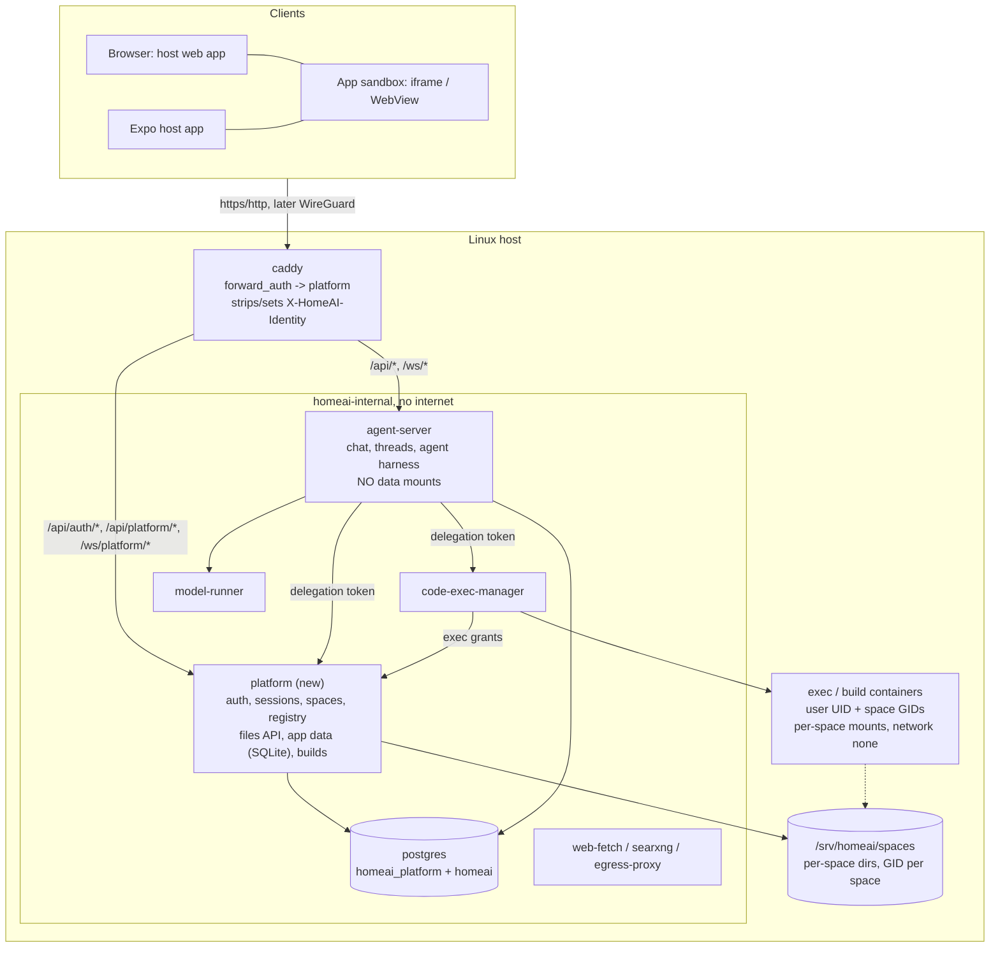

# Platform design (Stage 3: the agentic OS)

Stage 3 turns the single-user, trusted-LAN chat + files tool into a small
**agentic operating system** for a household or small business: several
people, each with private and shared data, running apps that the agent
builds for them by chat — and every app is *agent-native*: anything the UI
can do, the agent can do through the same enforced interface.

This document is the binding contract for Stage 3 (milestones M10–M15), the
same way [`ARCHITECTURE.md`](ARCHITECTURE.md) is for what's already built.
When a ticket and this document disagree, fix one of them explicitly in the
PR — don't silently diverge. As pieces land, their as-built details move into
`ARCHITECTURE.md`; this file keeps the design, the decisions, and the
contracts that span services.

Sections:

1. [Goals and principles](#1-goals-and-principles)
2. [Decision record](#2-decision-record)
3. [Target architecture](#3-target-architecture)
4. [Identity and auth](#4-identity-and-auth)
5. [Spaces and storage](#5-spaces-and-storage)
6. [The agent and code execution under delegation](#6-the-agent-and-code-execution-under-delegation)
7. [Apps](#7-apps)
8. [Remote access](#8-remote-access)
9. [Security invariants](#9-security-invariants)
10. [Roadmap](#10-roadmap)
11. [Risks and open items](#11-risks-and-open-items)

---

## 1. Goals and principles

- **Local, private, free for the self-hoster.** Everything runs on the box.
  Someone self-hosting must never need to pay for or depend on a third-party
  service: no required domain, no required cloud relay, no required app-store
  account on their side. (The maintainer may pay for things like an Apple
  developer account to publish the host app.)
- **Agent-native apps, full parity.** Every app's data and actions are
  reachable by the user's agent through the same platform API the UI uses.
- **Enforcement below the agent.** Permissions are enforced by the platform
  service, the kernel (UIDs/GIDs, mounts), and the network — never by the
  prompt or by code the model controls. The agent is never a principal of its
  own: it acts *as* the user, with at most the user's permissions.
- **Standards over inventions.** The model is a small local one; wherever it
  touches the platform we use the most common real standard its training
  already covers (SQL/SQLite, expo-sqlite's API, React Native, expo-router
  conventions, Expo module APIs, `AGENT.md`), not a custom DSL.
- **Domain optional.** Everything works on the LAN with no domain. A domain
  unlocks browser passkeys, real certificates, and the opt-in public mode.
- **The core cannot be modified by the agent.** Platform code lives only in
  images; nothing the agent or an app writes is ever executed by a core
  service.

## 2. Decision record

Decisions made in the Stage 3 design discussion. Each is binding unless a PR
explicitly revisits it (and updates this list).

| # | Decision |
|---|---|
| D1 | **Users**: household / small business (≈2–20 people), mostly on the LAN. Two roles: `admin` and `member`. Design for real isolation between users; tier-3 concerns (quotas, GPU fair-share, abuse handling) are out of scope. |
| D2 | **Spaces** are the only sharing primitive. Every file and every app instance lives in exactly one space. Each user has a personal space; shared spaces have members with roles `owner` / `editor` / `viewer`. "Share with B but not C" = a space with A and B. No per-row ACLs. |
| D3 | **Merged views** are read-time only (SDK / platform fan-out); every write targets exactly one space. |
| D4 | **Content in shared spaces is untrusted input** to other members' agents (prompt injection). Destructive agent actions in shared spaces require HITL approval by default. |
| D5 | **Identity**: no-domain mode = password (+ optional TOTP) for browsers; domain mode adds browser passkeys. Native app = **device pairing** (hardware-backed key pair enrolled via QR on the LAN). Enrollment of new devices/users is LAN-or-VPN only. |
| D6 | **Delegation**: every agent run carries a platform-minted delegation token bound to the user's session. The model never sees it. **An admin's agent gets member-level powers**; admin actions need the UI plus a fresh step-up. |
| D7 | **Platform service split**: a new `platform` service owns auth, spaces, the app registry, and all user storage. `agent-server` loses its data mounts and becomes a client of the platform API. |
| D8 | **App UI runtime**: user apps are React Native code compiled server-side and run in a **sandbox** — a sandboxed iframe on web, a WebView (react-native-web) on native. The sandbox holds no credentials; all I/O is RPC over a bridge that the host forwards to a fixed app instance. |
| D9 | **Option B stays open**: app code may only use React Native primitives, an allowlist of Expo-API-compatible modules, and `@homeai/sdk` — never DOM/web APIs — so the same code can later run natively for trusted apps. New capabilities are added by growing the SDK/shim allowlist. |
| D10 | **App data**: **SQLite, one file per app instance**, in the space's directory. Core data (users, spaces, registry, chat threads/checkpoints) stays in Postgres. No MongoDB. |
| D11 | **Plain SQL everywhere**: app code uses an expo-sqlite-shaped async API; schema is a plain `schema.sql` of `CREATE TABLE` statements; migrations are *computed* by diffing (sqldef's `sqlite3def` or equivalent) and classified additive (auto) vs destructive (approval + snapshot). |
| D12 | **The platform is the only writer** of app databases (UI via SDK RPC, agent via `app_sql`/actions). Exec containers get read-only access to app data. |
| D13 | **Cross-app data, phase 1**: the agent is the integration layer (reads across all apps/spaces the user can see). **Phase 2**: apps declare `exports`; other apps declare `reads`; granted at install; read-only via SQLite `ATTACH`; writes via the owning app's exported actions; exports are versioned contracts. |
| D14 | **App source is a git repo per app, run by the platform** (the agent never needs the git CLI). One commit per successful build. History + revert in the UI. |
| D15 | **Live editing**: the author's own install tracks the working copy (hot reload; additive migrations auto; destructive need approval + snapshot). Installs in other spaces pin **published versions**; updates are approved; permission changes re-prompt. Forking = copy into your space. |
| D16 | **Server-side logic v1**: declared SQL **actions** executed by the platform (parameterized, transactional). Sandboxed server functions / scheduled jobs are a later, additive extension. |
| D17 | **System apps** (Chat, Files, Settings/Admin, Home/launcher) use the same package format (manifest, `AGENT.md`, actions) with privileged capabilities only grantable to image-shipped apps; they render natively in the host app and are read-only to the agent. |
| D18 | **Agent file paths**: `/personal/...` and `/spaces/<slug>/...`. |
| D19 | **Remote access**: WireGuard is the default remote mode; opt-in public HTTPS (domain required, passkey-only when public); WireGuard embedded in the host app later. |

## 3. Target architecture



### New and changed services

- **`platform`** (new, Python 3.12 + FastAPI + uv, same conventions as
  `agent-server`; `services/platform/`; internal port `8100`;
  `homeai-internal` only). Owns the `homeai_platform` Postgres database and
  the `SPACES_DIR` host tree. Runs as root inside its container with
  `cap_drop: [ALL]` and `cap_add: [CHOWN, DAC_OVERRIDE, FOWNER]` (it is the
  trusted kernel that assigns file ownership per user/space), read-only root
  filesystem.
- **`agent-server`**: keeps chat, threads, checkpoints, settings, the agent
  harness. Loses `${FILES_DIR}` (M11). Verifies identity JWTs; obtains
  delegation tokens; file tools go through the platform files API.
- **`code-exec-manager`**: requires a delegation token per call; asks the
  platform for *exec grants* (UID, GIDs, mounts) instead of mounting one
  shared files dir.
- **`caddy`**: `forward_auth` to the platform for every authenticated route.
- **`db-init`** (new, one-shot): idempotently creates Postgres roles and
  databases (`platform` role + `homeai_platform` DB; later a non-superuser
  `agent` role) using the superuser credentials. Needed because the Postgres
  image only runs init scripts on an empty volume.

### HTTP routing (Caddy)

| Path | Upstream | Auth |
|---|---|---|
| `/api/auth/*` | `platform:8100` | none (login, setup, invite accept, status) |
| `/api/platform/*` | `platform:8100` | `forward_auth` |
| `/ws/platform/*` | `platform:8100` | `forward_auth` |
| `/api/*` (everything else) | `agent-server:8000` | `forward_auth` |
| `/ws/*` (everything else) | `agent-server:8000` | `forward_auth` |
| `/ca.crt` (http only), static web bundle | caddy | none |

Caddy **removes any client-supplied `X-HomeAI-Identity` header** before
routing, and `forward_auth` (`uri /internal/auth/verify`,
`copy_headers X-HomeAI-Identity`) sets it from the platform's response. The
platform's `/internal/*` routes are never routed by Caddy.

## 4. Identity and auth

### Users, sessions, bootstrap

- `users`: `id uuid`, `username` (unique, lowercase), `display_name`,
  `role` (`admin`|`member`), `uid int` (unique, allocated from 20000),
  `password_hash` (argon2id), `totp_secret` (nullable), `disabled_at`,
  `created_at`.
- `sessions`: opaque random token (`hs_` + 32 bytes urlsafe base64),
  **stored hashed** (SHA-256); `user_id`, `device_label`, `created_at`,
  `last_seen_at`, `expires_at` (sliding, 30 days), `stepped_up_until`,
  `revoked_at`. Web: `homeai_session` cookie (HttpOnly, SameSite=Lax, Secure
  on https). Native: session-creating endpoints called with
  `X-HomeAI-Client: native` return the token in the body instead of a
  cookie; the client sends `Authorization: Bearer hs_...` (token kept in
  `expo-secure-store`). WebSockets from browsers use the cookie.
- **Bootstrap**: until the bootstrap admin exists
  (`platform_state.bootstrap_admin_id`), the platform keeps a one-time
  **setup code** (reused across restarts until used), logs it, and writes it
  to `/data/platform/setup-code` (readable on the host via
  `docker compose exec platform cat ...` or the log). `POST /api/auth/setup`
  requires it; it creates the first admin, records `bootstrap_admin_id`, and
  is then permanently disabled. Users created by the recovery CLI don't
  count — the setup code stays valid until someone uses it.
- **Recovery CLI** (physical-access path; host Docker = root):
  `docker compose exec platform python -m app.cli
  {create-user,reset-password,set-role,disable-user,enable-user,list-users}`.
  It uses the image's venv Python directly (not `uv run`, which needs a
  writable root).
- **Invites**: admins create single-use, 7-day invite tokens
  (`POST /api/platform/admin/invites` → URL/QR). Accepting creates a member
  and a session. Invite/enrollment endpoints are **LAN/VPN-only** once
  public mode exists (M15).
- **Step-up**: admin endpoints require `act=user`, `role=admin`, and
  `stepped_up_until > now` (re-enter password, or passkey in domain mode;
  5-minute window).
- Login attempts are rate-limited per username and per client IP.

### Identity token (Caddy → services)

`GET /internal/auth/verify` (called by Caddy `forward_auth`) validates the
session cookie/bearer and returns `200` with `X-HomeAI-Identity: <JWT>`, or
`401`.

- Algorithm **EdDSA (Ed25519)**; key pair generated on first start and kept
  in the `platform-data` volume. Public keys served at
  `GET http://platform:8100/internal/jwks` (JWKS). Services cache the JWKS
  and re-fetch on unknown `kid`.
- Claims: `iss="homeai-platform"`, `aud="homeai"`, `sub=<user_id>`,
  `sid=<session_id>`, `role`, `act="user"`, `iat`, `exp` (+5 min), `kid`.
- Downstream services **must verify** signature, `iss`, `aud`, `exp` — never
  trust the header unverified.
- The platform's own `/api/platform/*` routes resolve the caller from
  `X-HomeAI-Identity` (must be `act="user"`) or, only when that header is
  absent, `Authorization: Bearer <JWT act="agent">`; opaque `hs_` tokens are
  accepted only by `/internal/auth/verify` and `/api/auth/*`. Role and
  step-up state are always read from the database.

### Delegation token (agent runs)

- `POST /internal/delegations` (service-authenticated, see below) with
  `{identity_token, thread_id}` → `{token, expires_at}`. Same key and format
  as the identity token, with `act="agent"`, `thr=<thread_id>`, `exp` +15
  min. `POST /internal/delegations/refresh` with a still-valid-or-recent
  delegation renews it **only while its `sid` session is active**.
- Every platform request authorized by a delegation re-checks that the
  session is not revoked/expired and the user is not disabled.
- `act="agent"` tokens are **always rejected** by admin endpoints and by
  auth/session-management endpoints, regardless of `role`.
- The token lives in the LangGraph run config (`configurable`), exactly like
  `hitl_enabled` today — never in the prompt, messages, or tool arguments.
- Resumed runs (HITL approve/reject) mint a fresh delegation from the
  *approver's* identity; the approver must own the thread.

### Service-to-service auth

Internal endpoints (`/internal/*` other than `jwks` and `auth/verify`)
require `Authorization: Bearer <service token>`: `PLATFORM_AGENT_TOKEN`
(agent-server) and `PLATFORM_EXEC_TOKEN` (code-exec-manager), random secrets
in `.env`. Each token only unlocks the internal endpoints that service needs.

## 5. Spaces and storage

### Model

- `spaces`: `id uuid`, `slug` (unique, `^[a-z0-9][a-z0-9-]{0,39}$`),
  `name`, `kind` (`personal`|`shared`), `gid int` (unique, allocated from
  30000), `owner_user_id` (personal), `created_at`, `archived_at`.
- `space_members`: `(space_id, user_id, role in owner|editor|viewer)`.
  Personal spaces have exactly one member (the user, `owner`), and cannot
  gain members.
- Membership is the only sharing primitive. Removing a member revokes access;
  data stays with the space. Deleting a user archives their personal space.
  Moving data between spaces is an explicit copy/move action.

### Virtual paths (UI, API, agent file tools)

```text
/                         -> lists "personal" and "spaces"
/personal/...             -> the caller's personal space files
/spaces/<slug>/...        -> a shared space's files (members only)
```

Exec containers see the same tree under `/files`
(`/files/personal/...`, `/files/spaces/<slug>/...`). The `file:` link
convention (M9-03) uses the same virtual paths. Resolution of every virtual
path goes through one guard (the successor of `resolve_files_path`), which
maps to a host path *and* checks membership and role (`viewer` = read-only).

### Host layout

```text
${SPACES_DIR}/                       # default /srv/homeai/spaces
  <space_id>/                        # root:<space_gid> 2770 (setgid)
    files/                           # the space's files root
    apps/<instance_id>/data.sqlite   # app data, platform-only writer (D12)
    apps/<instance_id>/snapshots/    # pre-migration snapshots
```

App **source** lives inside the files tree at `/<space>/Apps/<app-slug>/`
(D14, M13) so the agent edits it with its ordinary file tools; `Apps` is a
reserved top-level folder the platform protects from deletion/rename, and
`.git` is hidden from every file API.

Ownership: directories are group-owned by the space GID with the setgid bit;
files created on behalf of a user are owned `user_uid:space_gid`, mode
`0660`/`0770` (exec containers run with `umask 002`). Users/spaces have no
`/etc/passwd` entries on the host — numeric IDs only. Mounts are the primary
boundary; UID/GID permissions are defense in depth.

### Legacy migration

On the switch to the platform files API (M11-01), the pre-Stage-3 files root
(`FILES_DIR`, mounted read-write into the platform at `/data/legacy-files`)
is moved into the **bootstrap admin's personal space** `files/`, chowned,
and a marker file prevents re-running. Pre-Stage-3 chat threads (no owner)
are assigned to the bootstrap admin. Both steps are idempotent and logged.

## 6. The agent and code execution under delegation

- **File tools**: a custom deepagents backend (`PlatformFilesBackend`)
  implements `deepagents.backends.protocol.BackendProtocol` (`ls`, `read`,
  `write`, `edit`, `delete`, `grep`, `glob`, uploads/downloads, and their
  async variants) over the platform files API. `deepagents==0.7.11` takes a
  single backend instance (no per-run factory), so the backend reads the
  run's delegation token from the in-flight run config via
  `langgraph.config.get_config()["configurable"]` on every call — the same
  mechanism the HITL `when` predicate already relies on — and fails closed if
  it's absent. `FilesystemBackend` and the
  files mount are removed from `agent-server`.
- **Exec**: `agent-server` passes the delegation to `code-exec-manager`,
  which calls `POST /internal/exec-grants` → `{uid, gids[], mounts:
  [{host_path, container_path, read_only}]}`. Containers keep every existing
  hardening flag (`network_mode: none`, `cap_drop: ALL`, read-only root,
  limits) and additionally run as `uid` with `group_add: gids`. Session key
  = thread id; a container is recreated if its grants (user, memberships,
  roles) no longer match.
- **Threads** are owned by a user (`owner_user_id`); every chat REST/WS
  endpoint checks ownership from the verified identity. (Shared-space
  threads are a later extension.)
- **Postgres roles**: `agent-server` connects with a non-superuser role that
  can reach only its own database; the platform has its own role/DB.
- **Model**: all users share one `model-runner`; llama.cpp queues requests.
  No fair-share scheduling in this stage (D1).

## 7. Apps

> The runtime details below are the design target; **M12-01 is a spike**
> that must confirm or amend them (bundle format, bridge, router shim,
> sqlite3def, WAL read-only access) before M12 builds on them.

### Package format (standards-shaped, D11)

```text
<app-slug>/
  app.json          # Expo-style manifest: {"name", "slug", "version", "homeai": {...}}
  AGENT.md          # what the app does, data model, conventions — for the agent
  schema.sql        # desired schema: plain SQLite CREATE TABLE / INDEX statements
  actions/*.sql     # named, parameterized SQL actions (:named params), one per file
  app/              # expo-router-style screens: _layout.tsx, index.tsx, item/[id].tsx
```

`app.json`'s `homeai` block: `sdk` (SDK version), `icon` (vector-icon name),
`permissions` (e.g. `{"net": ["api.weather.gov"]}`, added as capabilities
grow), `exports` / `reads` (phase 2, D13). Validated against a JSON Schema
the platform publishes.

### Allowed imports (D9)

`react`, `react-native`, `expo-router` (shim: `Stack`, `Link`,
`useRouter`, `useLocalSearchParams`), `expo-sqlite` (shim bound to this
instance's database), `@homeai/sdk`, and a growing allowlist of
Expo-compatible shims. Anything else — including `react-dom`, `window`,
`document`, raw `fetch` — fails the build.

### `@homeai/sdk` (the only platform-specific surface; keep it tiny)

- `useDatabase()` → expo-sqlite-shaped: `getAllAsync(sql, params)`,
  `getFirstAsync`, `runAsync`, `withTransactionAsync(fn)`.
- `useQuery(sql, params)` → `{ data, error, loading, refresh }`, re-runs when
  the platform reports a change to the instance's database.
- `runAction(name, params)`; `useSpace()` → `{ id, slug, name, role }`.
- Later: `askAgent(prompt)`, cross-instance reads, capability shims.

### Runtime and bridge

- The platform serves a runtime page per instance; the sandbox loads a
  prebuilt runtime (React, react-native-web, SDK, shims) plus the app bundle.
- Web: `<iframe sandbox="allow-scripts">` (no `allow-same-origin`, opaque
  origin, no cookie/storage access). Native: `react-native-webview` (present
  in Expo Go).
- **The sandbox holds no credentials.** It can only `postMessage` RPC
  requests (`db.getAll`, `db.run`, `action`, …). The host forwards them to
  `/api/platform/apps/instances/<instance_id>/rpc` — the instance id is fixed
  by the host when it opens the sandbox, never taken from the message — using
  the host's own session. The platform authorizes against the user's role in
  the instance's space.
- Change events (for `useQuery` and hot reload) come from
  `/ws/platform/events` and are relayed into the sandbox by the host.

### Data (D10–D12)

- One SQLite database per instance (WAL mode). All writes go through the
  platform. Queries are executed on a connection that has only that
  instance's database open (plus read-only `ATTACH`es for granted exports in
  phase 2) — scope is physical, not parsed.
- **Migrations**: on build, the platform diffs `schema.sql` against the live
  database, classifies statements additive/destructive, applies additive ones
  automatically, and for destructive ones requires approval (UI confirm or
  HITL for the agent) after taking a snapshot (SQLite backup API), with
  automatic rollback on failure.
- Viewers get read-only RPC (`db.getAll`/`getFirst`, no `run`/actions).

### Build and verify

The platform builds apps in a sandboxed container (network none, same
hardening as exec): validate `app.json`, check imports against the
allowlist, type-check against the SDK/shim typings, bundle (esbuild), and
smoke-render. Errors come back as structured, model-readable diagnostics
(file, line, message). A successful build is committed to the app's git
repo, stored as a version artifact, and pushed as a hot-reload event.

### Registry, lifecycle, sharing

- Tables: `apps` (id, slug, name, source space, source path, created_by),
  `app_versions` (app_id, version, commit, manifest, bundle, published_at),
  `app_instances` (id, app_id, space_id, `tracks` = `working` | pinned
  version, installed_by, granted permissions).
- Author's instance in the source space tracks the working copy (D15).
  Publishing a version makes it installable from a space's catalog;
  installs pin versions; updates require approval; permission changes
  re-prompt. Fork = copy the source into your space as a new app.

### Agent tools for apps (M13)

`list_apps`, `create_app` (from a template), `build_app` (verify + migrate +
build + commit + hot reload; returns diagnostics), `app_sql` (run SQL against
an instance the user can access; destructive writes in shared spaces → HITL),
`app_action`. Editing source uses the normal file tools. The agent reads an
app's `app.json` + `AGENT.md` + `schema.sql` before working with it.

### System apps (D17)

Chat, Files, Settings/Admin, and Home (launcher) ship in the host app and
the platform image, described by the same manifest/`AGENT.md`/actions
format, with privileged capabilities only image-shipped apps can hold. They
render natively. Every app gets an "ask the agent" panel that opens a thread
with that app's context.

## 8. Remote access

- **WireGuard (default)**: a WireGuard endpoint on the host (one UDP port
  forwarded by the router). Per-device peers created in Settings while on
  the LAN, delivered as a QR code; revoking a device removes its peer and its
  sessions. DNS for VPN clients points at the box.
- **Domain mode (optional)**: real certificates via ACME DNS-01 (no inbound
  port needed), split DNS on the LAN, browser passkeys (WebAuthn, RP ID = the
  domain).
- **Public HTTPS (opt-in, domain required)**: passkey-only login when
  reached publicly; rate limiting; device enrollment, invites, and admin
  endpoints refused unless the client address is on the LAN or VPN.
- **Host app**: device pairing via hardware-backed key (Android Keystore /
  Secure Enclave); later, an embedded WireGuard tunnel.

## 9. Security invariants

Each is enforced below the agent and covered by an automated check
(`scripts/verify_tenancy.sh`, M11, extended per milestone):

1. No authenticated route is reachable without a valid session; forged or
   client-supplied `X-HomeAI-Identity` headers are rejected/stripped.
2. User B cannot read, list, or write user A's personal space — via the UI
   API, the agent's file tools, `execute_code`, app RPC, or `app_sql`.
3. A viewer cannot write to a space by any of the same paths.
4. An agent run can never perform admin or auth-management actions, even for
   an admin user.
5. `agent-server` has no user-data mounts and no credentials for the
   platform database.
6. Exec and build containers have no network, no Docker socket, and only
   the mounts their grants list.
7. App sandboxes hold no credentials; an app instance's RPC can only touch
   that instance's database (and granted exports, read-only).
8. Nothing in `SPACES_DIR` is ever imported or executed by a core service.

## 10. Roadmap

| Milestone | Value delivered | Gate |
|---|---|---|
| M10 — Identity & spaces | Accounts, sessions, bootstrap, invites, spaces + membership, auth on every route, threads owned by users | G10: two users log in from separate devices; each sees only their own threads; admin manages users and spaces |
| M11 — Platform owns storage | Platform files API over `/personal` + `/spaces/<slug>`, delegation tokens, agent file tools and exec as the user, Postgres roles, tenancy suite | G11: cross-user isolation suite green across UI, agent tools, and exec |
| M12 — App runtime | App package format, registry, per-instance SQLite with computed migrations, sandboxed builds, SDK, sandboxed runtime on web + Expo Go | G12: a hand-written reference app runs in personal and shared spaces on web and phone |
| M13 — Agent builds apps | Apps in the files tree + git, app tools, templates, model authoring eval, ask-the-agent panel | G13: "make me a grocery list app" end-to-end with the real model; agent and UI edit the same data |
| M14 — Sharing & system apps | Publish/install/update/fork, Home launcher, Settings/Files/Chat as system apps, cross-app exports | G14: family installs a published app; planner reads calendar exports |
| M15 — Remote access & devices | WireGuard, domain mode, passkeys, opt-in public HTTPS, host app dev build + device pairing | G15: phone reaches the box over WireGuard off-LAN; public mode refuses enrollment |

The full dependency graph and ordered backlog are on the
[Stage 3 backlog reference issue](https://github.com/cucucachu/unnamed_local_ai_server/issues/168).

## 11. Risks and open items

- **Model capability** (highest risk): a 26B-A4B local model writing working
  apps. Mitigations: tiny SDK, standards-shaped surfaces, templates, the
  verify loop, and an explicit authoring eval (M13) with a pass-rate target
  before G13.
- **Sandbox runtime on Expo Go** (M12-01 spike): react-native-web inside a
  WebView, bundle size, router shim, bridge latency.
- **SQLite read-only access from exec containers** in WAL mode needs a
  verified approach (M12-01 / M14).
- **Host app builds** (M15): the host has no Android SDK today; building a
  dev client needs either local Android tooling or EAS Build (maintainer
  account). Decide at M15.
- **No sudo in agent sessions on the host**: host-level steps (router port
  forward, `ufw` rules for WireGuard) are documented for the human.
