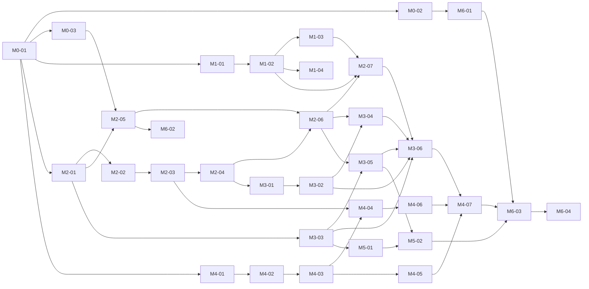

# Backlog — Ordering, Dependencies, Gates

Product: [`../PRODUCT.md`](../PRODUCT.md) · Architecture: [`../PLAN.md`](../PLAN.md) ·
Shared contracts: [`CONVENTIONS.md`](./CONVENTIONS.md)

## Delivery strategy

Vertical value slices, each ending in a **gate**: a scripted + human-verified checkpoint on the
real host. A milestone's gate must pass before the next milestone's gate ticket runs, but
*implementation* tickets from later milestones may start early if their dependencies are met
(see lanes below). Sizes: **S** ≈ small single-concern run, **M** ≈ typical run, **L** ≈ large
run, at the upper bound of what one agent run should attempt.

| # | Milestone | Value delivered | Gate |
|---|-----------|-----------------|------|
| M0 | Foundations | Repo + compose skeleton + host scripts + reverse proxy | G0: stack boots, placeholder page served on port 80 |
| M1 | Model runner | Real local GPU inference, tool-calling verdict | G1: `/v1/chat/completions` streams on GPU; spike verdict recorded |
| M2 | Agentic chat | Chat with a deepagents agent (file tools live) from a browser | G2: browser chat writes a real workspace file |
| M3 | Persistence + files | Threads survive restarts; full file manager UI | G3: restart-persistence + files round-trip |
| M4 | Code execution | Sandboxed `execute_code` with hard isolation | G4: agent runs a script on real files; isolation suite green |
| M5 | Media | Video/audio playback with seek from the files UI | G5: phone-browser seek/scrub |
| M6 | LAN + integration | `homeai.local`, native parity, docs, backup | G5+: full PRODUCT.md scenario from a phone |

## Dependency graph

## Parallel lanes

Independent lanes an agent fleet can work simultaneously (after `M0-01`):

- **Lane A — GPU/model**: M1-01 → M1-02 → M1-03, M1-04
- **Lane B — backend**: M2-01 → M2-02 → M2-03 → M2-04 → M3-01 → M3-02; M3-03 anytime after M2-01
- **Lane C — frontend**: M0-03 → M2-05 → M2-06 → M3-04, M3-05
- **Lane D — sandbox**: M4-01 → M4-02 → M4-03 → M4-05 (only M4-04/M4-06 need other lanes)
- **Lane E — host/docs**: M0-02, M6-01 prep, M1-04, M6-04 drafting

The critical path is **A + B + C converging at M2-07** (first end-to-end value), then
M3 → M4 gates.

## Ordered backlog

| Order | Ticket | Title | Size | Depends on |
|-------|--------|-------|------|------------|
| 1  | [M0-01](./M0-01-repo-scaffold.md) | Repo scaffold, compose skeleton, `.env` contract | M | — |
| 2  | [M0-02](./M0-02-host-setup-scripts.md) | Host setup scripts (workspace, avahi, ufw, GPU doc) | M | M0-01 |
| 3  | [M0-03](./M0-03-caddy-reverse-proxy.md) | Caddy reverse proxy + placeholder frontend | S | M0-01 |
| 4  | [M1-01](./M1-01-model-runner-service.md) | model-runner container (Vulkan llama.cpp) | M | M0-01 |
| 5  | [M1-02](./M1-02-model-fetch.md) | Model fetch script + first real inference | S | M1-01 |
| 6  | [M1-03](./M1-03-tool-calling-spike.md) | **Tool-calling validation spike (risk gate)** | M | M1-02 |
| 7  | [M1-04](./M1-04-quant-benchmark.md) | Quant benchmark, pick default | S | M1-02 |
| 8  | [M2-01](./M2-01-agent-server-skeleton.md) | agent-server skeleton + Dockerfile + compose | M | M0-01 |
| 9  | [M2-02](./M2-02-fake-model-fixture.md) | Fake model-runner test fixture (OpenAI-compat SSE) | M | M2-01 |
| 10 | [M2-03](./M2-03-deepagents-build.md) | deepagents agent build (FilesystemBackend) | M | M2-02 |
| 11 | [M2-04](./M2-04-ws-chat-endpoint.md) | WebSocket chat endpoint (token + tool streaming) | L | M2-03 |
| 12 | [M2-05](./M2-05-expo-scaffold.md) | Expo app scaffold + API/WS client + web export build | M | M0-03, M2-01 |
| 13 | [M2-06](./M2-06-chat-screen.md) | Chat screen (stream rendering, tool status) | L | M2-04, M2-05 |
| 14 | [M2-07](./M2-07-gate-steel-thread.md) | **GATE G1+G2**: browser → agent → real file write | M | M1-02, M1-03, M2-06 |
| 15 | [M3-01](./M3-01-postgres-checkpointer.md) | Postgres + AsyncPostgresSaver + threads table | M | M2-04 |
| 16 | [M3-02](./M3-02-threads-rest.md) | Threads REST (list/create/history/delete) | M | M3-01 |
| 17 | [M3-03](./M3-03-files-api.md) | Files REST (list/upload/download/mutations + guard) | L | M2-01 |
| 18 | [M3-04](./M3-04-frontend-threads.md) | Thread list + history hydration UI | M | M3-02, M2-06 |
| 19 | [M3-05](./M3-05-files-screen.md) | Files screen (browse + all mutations) | L | M3-03, M2-06 |
| 20 | [M3-06](./M3-06-gate-persistence.md) | **GATE G3**: restart persistence + files round-trip | S | M3-02..05, M2-07 |
| 21 | [M4-01](./M4-01-toolbox-image.md) | Exec toolbox image (pre-baked, non-root) | M | M0-01 |
| 22 | [M4-02](./M4-02-exec-manager-api.md) | code-exec-manager (ensure/execute/delete) | L | M4-01 |
| 23 | [M4-03](./M4-03-reaper-compose.md) | Idle reaper + compose wiring (sole socket holder) | M | M4-02 |
| 24 | [M4-04](./M4-04-execute-code-tool.md) | `execute_code` tool in agent | M | M4-03, M2-03 |
| 25 | [M4-05](./M4-05-isolation-suite.md) | Isolation verification suite (scripted) | M | M4-03 |
| 26 | [M4-06](./M4-06-exec-ui.md) | Exec status/output rendering in chat UI | S | M4-04, M2-06 |
| 27 | [M4-07](./M4-07-gate-code-exec.md) | **GATE G4**: agent writes+runs script; isolation green | S | M4-05, M4-06, M3-06 |
| 28 | [M5-01](./M5-01-media-streaming.md) | Range-request media streaming endpoint | M | M3-03 |
| 29 | [M5-02](./M5-02-media-player.md) | MediaPlayer component + files-screen hookup | M | M5-01, M3-05 |
| 30 | [M6-01](./M6-01-lan-mdns-firewall.md) | mDNS + firewall verification, NETWORKING.md | S | M0-02 |
| 31 | [M6-02](./M6-02-expo-go-parity.md) | Expo Go native parity (config + checklist) | S | M2-05 |
| 32 | [M6-03](./M6-03-full-e2e-backup.md) | Full-scenario e2e script + workspace backup | M | M4-07, M5-02, M6-01 |
| 33 | [M6-04](./M6-04-architecture-docs.md) | ARCHITECTURE.md final write-up | S | M6-03 |

## Gate procedure

Gate tickets (M2-07, M3-06, M4-07, M6-03) end with two sections: an automated script under
`scripts/e2e/` that must exit 0, and Tier B items appended to `docs/HOST-CHECKS.md` for the
human (phone/LAN checks). A milestone is **done** when both are checked off by the PM.

## Risk register (why this order)

1. **Tool-calling reliability (M1-03)** is the existential risk: deepagents assumes native
   tool-calling works against llama.cpp's OpenAI-compat endpoint with `--jinja`. It is scheduled
   as the 6th ticket, before any deepagents-dependent gate. If it fails, the fallback decision
   (prompted ReAct loop) is made at M1-03, and M2-03 carries the fallback instructions.
2. **GPU/Vulkan setup (M1-01)** is hardware-specific and can't be de-risked off-host; it starts
   immediately after scaffold, in parallel with backend work that uses the fake model.
3. **Everything UI-facing tests against the fake model (M2-02)**, so frontend/backend lanes are
   never blocked on GPU work and tests stay deterministic.
4. **Code exec (M4)** is intentionally after the persistence gate: it's the highest-blast-radius
   feature, and its isolation suite (M4-05) blocks its gate, not just its happy path.
